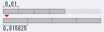

 BMS command memo 

# [BMS command memo (draft)](https://hitkey.nekokan.dyndns.info/ "BMS command memo (EN)")

* latest update: 2014-07-11
* written by hitkey
    
  * web: [https://hitkey.nekokan.dyndns.info/](https://hitkey.nekokan.dyndns.info/ "doubledepth")
  * mail: hitkey0801\[at\]hotmail.com

* moved to markdown my hotoras
  * web: [https://home.hotoras.kr](https://home.hotoras.kr "Homepage (KO)")
  * mail: hotoras03\[at\]gmail.com
  * sns:
    * Twitter (now X): [@hoto_ras](https://x.com/hoto_ras "Twitter account")
    * ActivityPub: [@dohyeon@stella.place](https://stella.place/@dohyeon "ActivityPub account on Stella") [^apub]

[^apub]: You can follow me from any of the social server you're in, if it supports ActivityPub protocol.

  Example: Mastodon, Misskey, Cherry-Pick (Misskey-Powered), Threads (sorta)

* references:
    
    |     |     |
    | --- | --- |
    | about BMS: | [https://en.wikipedia.org/wiki/Be-Music_Source](https://en.wikipedia.org/wiki/Be-Music_Source "Be-Music Source - Wikipedia, the free encyclopedia") |
    | This report referred to: | [https://web.archive.org/web/*/http://wiki.bms.ms/Bms:Spec](https://web.archive.org/web/*/http://wiki.bms.ms/Bms:Spec "Bms:Spec - wiki.bms.ms -") |
    | BMS Format Specification: | [http://bm98.yaneu.com/bm98/bmsformat.html](http://bm98.yaneu.com/bm98/bmsformat.html "BM98Data_format_specification") (1998-11-26) |
    | Basic specification of BML: | [https://nvyu.net/rdm/rby_ex.php](https://nvyu.net/rdm/rby_ex.php "ruv-it! \| support page") |
    | BMS extensions proposed by Sonorous: | [https://cosmic.mearie.org/f/sonorous/bmsexts](https://cosmic.mearie.org/f/sonorous/bmsexts "BMS extensions proposed by Sonorous") (since 2013-07-10) (as reference data) |
    | DTX file format specifications: | [http://dtxmania.net/wiki.cgi?page=qa\_dtx\_spec_e](http://dtxmania.net/wiki.cgi?page=qa_dtx_spec_e "qa_dtx_spec_e - DTXMania powered by YAMAHA Silent Session Drums") (as reference data) |
    | Guide to understand BMS format: | [https://cosmic.mearie.org/2005/03/bmsguide/](https://cosmic.mearie.org/2005/03/bmsguide/ "TokigunStudio: Guide to understand BMS format") (2005-03-22) (as reference data) |
    | Angolmois Internals: | [https://github.com/lifthrasiir/angolmois/blob/master/INTERNALS.md](https://github.com/lifthrasiir/angolmois/blob/master/INTERNALS.md "angolmois/INTERNALS.md at master · lifthrasiir/angolmois · GitHub") (2013-03-09) (as reference data) |
    | about obsolete MGQ notation: | [https://web.archive.org/web/*/http://ivy.pr.co.kr/rdm/jp/extension.htm](https://web.archive.org/web/*/http://ivy.pr.co.kr/rdm/jp/extension.htm "Dear Feeling") (2001-06-21) (as reference data) |
    | LR2 beta3 Skin csv specification revision 5: | [http://right-stick.sub.jp/lr2skinhelp.html](http://right-stick.sub.jp/lr2skinhelp.html "LR2SkinHELP 第五版") (2013-09-29) (as reference data) |
    
* caution:
    
  * This is not what translated specifications. This is only my memo.
  * I used on-line translation service 100%.
  * Since I cannot understand English, I cannot judge whether the result of automatic translation is right.
  * The contents may lead to misunderstandings because the translation could be a bit off.
  * Moreover, my research may not be exact. (Of course, I strove not to write a mistake. But I cannot guarantee that the contents are right. )
  * From the above reason, I do not bear responsibility to this document. Please forgive me.
  * If you have any further questions, please feel free to contact me. If an error is pointed out, I am glad and will correct.
  * Font test: [Segoe UI](#SEGOE-UI), [Helvetica](#HELVETICA), [Helvetica Neue](#HELVETICA-NEUE), [Verdana](#VERDANA), [Lucida Sans Unicode](#LUCIDA-SANS-UNICODE), [Lucida](#LUCIDA), [Arial](#ARIAL),
* update history:
    
  * 2014-07-11: DTXCreator 026 / I added a postscript about apps which supports `[#VOLWAV](#VOLWAV)`.
  * 2014-07-08: Sonorous 0.1.0-pre (2014-07-08)
  * 2014-06-29: HDX v1.05
  * 2014-06-13: BGAEncAdv v0.034
  * 2014-06-10: BGAEncAdv v0.033 / Suspended TechnicalGroove
  * 2014-06-08: HDX v1.04
  * 2014-06-06: Mid2BMS / lr2\_pmsview\_helper
  * 2014-05-25: PMSee-V v2.2.2
  * 2014-05-12: HDX v1.03
  * 2014-04-19: Feeling Pomu 2nd had `[#BGA](#BGAXX)`, `[#POORBGA](#POORBGA)`, `#xxx0A` (LAYER2)
  * 2014-04-17: Angolmois Rust Edition (2014-04-08) / nanasigroove2 beta (Toy Musical 3 Ver.2.2) / PMSee-V v2.2.1′
  * 2014-02-27: [Extended BPM](exbpm-object.htm) / [STOP Sequence](exstop.htm)
  * 2014-02-10: Further retouch to [RLE](#RLE) ([bmpfmt.htm](bmpfmt.htm)) / I added about [big-video](#ADD-2014-02-10)
  * 2014-02-07: I found downloadable MacBeat.
  * 2014-02-04: I corrected the following items: [RLE](#RLE) / [grouping by filename](#DIFFICULTY-GROUPING-BY-FILENAME) (`*.lr`) / [`#BGA` compatibility](#ABOUT-THE-COMPATIBILITY-OF-BGAXX) (bemaniaDX)
  * 2014-02-02: \[old\] mainori-se.sakura.ne.jp/dtxmania/ -> \[new\] dtxmania.net/
  * 2014-01-31: Angolmois Rust Edition (2014-01-26) / Sonorous 0.1.0-pre (2014-01-31)
  * 2014-01-04: HDX v1.02
  * 2013-12-28: HDX v1.01 / bms diff tool
  * 2013-12-06: Fixed link rot (BMS Viewer, in_bm) / LR2SkinHELP
  * 2013-11-18: Sonorous 0.1.0-pre (2013-11-18)
  * 2013-11-17: Sonorous 0.1.0-pre (2013-11-13) / iBMSC 3.0.5
  * 2013-10-18: Sonorous 0.1.0-pre (2013-10-13) / [multi `#SUBTITLE`](#SUBTITLES) / [multi `#COMMENT`](#COMMENTS)
  * 2013-10-11: Sonorous 0.1.0-pre (2013-10-09)
  * 2013-10-07: I added the TechnicalGroove column in `[#DEFEXRANK n](#DEFEXRANK)`. / I had overlooked PMSee-V v2.1.5a (2013-07-15) (sorry... sorry...)
  * 2013-10-06: I added about [video rewinding](#VIDEO-REWINDING).
  * 2013-09-23: Be-Music Helper (beta 4′) / woslicerIII (2013-09-22)
  * 2013-09-18: Be-Music Helper (beta 4) / Sonorous 0.1.0-pre (2013-09-17) / Listing of all the values of `[#OPTION](#OPTION)` ([option.htm](option.htm))
  * 2013-08-20: Angolmois 2.0 e5cea53a2cbd (SDL 2.0.*) (fixed: [`#BGA` compatibility](#ABOUT-THE-COMPATIBILITY-OF-BGAXX))
  * 2013-08-03: `[#DEFEXRANK 0](#DEFEXRANK-0)` / [grouping by subtitle](#DIFFICULTY-GROUPING-BY-SUBTITLE) / [multi `#SUBARTIST`](#SUBARTISTS) / [fractional `#STOP`](#FRACTIONAL-STOP) / [multi `#LNOBJ`](#KEYUP-SOUNDING-AT-LNOBJ) / [`#BGA` compatibility](#ABOUT-THE-COMPATIBILITY-OF-BGAXX)
  * 2013-08-03: \[old\] bit.sparcs.org/%7Etokigun/article/bmsguide.php -> \[new\] cosmic.mearie.org/2005/03/bmsguide/
  * 2013-08-03: HDX v1.00 / Sonorous 0.1.0-pre / BGAEncAdv v0.032 / TechnicalGroove
  * 2013-07-11: I realized that HDX and IIDXv was supporting “[spread canvas](#SPREAD-CANVAS)”.
  * 2013-07-09: I realized that [Indenting](#INDENT-STYLE) of HDX/IIDXv is enhanced. (U+3000)
  * 2013-07-07: I added `＃ENDIF` (U+FF03) into “[Examples of Mistakes](#EXAMPLES-OF-MISTAKES)”.
  * 2013-07-03: uBMplay 1.5.2 / fixed about “[spread canvas](#SPREAD-CANVAS)” (added BM98)
  * 2013-07-02: I added uBMplay into `[#PATH_WAV](#PATH-WAV)`.
  * 2013-07-01: uBMplay 1.5.1 / I corrected URI of woslicerII. (remove “soft/index.html”) / uBMplay 1.5.0 knew `[#OCT/FP](#OCT-FP)`
  * 2013-06-17: I added BmDx and changed the abbreviated name of bemaniaDX.
  * 2013-05-31: Angolmois Rust Edition
  * 2013-05-25: woslicerIII / fixed about “[spread canvas](#SPREAD-CANVAS)”
  * 2013-05-16: `<hgroup>` is gone
  * 2013-05-12: IIDXv 2.14, PMSee-V 2.1.3a
  * 2013-05-07: HDX 0.99 / `[#99902:1](#M999L1)` / multiple `[#xxxA6](#CHANGEOPTIONXX)` / fixed a mistake about default value of `[#RANK n](#RANK)`
  * 2013-04-12: PMSee-V 2.1.3
  * 2013-04-01: uBMplay 1.5.0
  * 2013-03-16: Angolmois 2.0 77ce3b6e2761 / I corrected the item of `[#ExtChr](#EXTCHR)`.
  * 2013-03-12: Angolmois 2.0 798422870970 (fixed: `[#LNTYPE 2](#LNTYPE-2)`)
  * 2013-02-09: Angolmois 2.0 alpha 2 9880e98d15f8
  * 2013-01-18: Angolmois got alpha-blending
  * 2013-01-17: I added the reference about the escape of a character string into “[Comment syntax](#COMMENT-SYNTAX)”.
  * 2013-01-17: HDX 0.98, PMSee-V 2.1.2, nanasi2 1.0, IIDXv 2.13, PMChr-V 4.0.2, Angolmois 2.0 alpha 2 pre
  * 2012-10-13: HDX 0.97, PMSee-V 2.0.2, nanasi2 0.4, fixed some broken links
  * 2012-09-14: HDX 0.96, PMSee-V 2.0.1a, PMChr-V 4.0.0
  * 2012-08-09: nanasi2 0.3
  * 2012-08-08: iBMSC 3.0.4
  * 2012-08-06: HDX 0.94, iBMSC 3.0.3 / I added BMSV and nBMplay into “[FREE ZONE](#FREE-ZONE)”.
  * 2012-07-03: HDX 0.93
  * 2012-06-30: PMSV 1.10.5, nanasi2 0.2, IIDXv 2.12, HDX 0.92, `[#ELSEIF](#ELSEIF)`, [Indent style](#INDENT-STYLE), [Comment syntax](#COMMENT-SYNTAX), [Keyup-sounding](#KEYUP-SOUNDING-AT-ENDPOINT-OF-LNTYPE1)
  * 2012-04-27: PMSV 1.10.4, PMCV 3.1.0, nanasi2 0.1, SMB 1.03
  * 2012-03-25: ruv-it! 2.0 b5p7 test #7
  * 2012-03-18: Be-Music Helper (beta 3)
  * 2012-02-10: I fixed a lot of bugs about HTML of this document.  
  * 2012-01-28: I corrected the item of `[#TOTAL](#TOTAL)`. (thanks to kisama)
  * 2012-01-23: I forgot to reflect update of iBMSC 3.0. I added about that.
  * 2012-01-16: I set the permalink to all the headings, and also added some items.
  * 2012-01-15: I updated this document. Since there were too many corrected parts, I cannot remember them.
  * 2011-10-24: I [Japanized](cmdsJP.htm "BMS command memo (JP)") this document. My gestalt collapsed.
  * 2011-10-16: I HTMLized this document. File size swelled up fourfold.
  * 2011-09-21: I finished writing this document. I merely wrapped the plain text in the &lt;pre&gt; tag only.
  * 2011-09-12: I became feeling of writing this document. I began to write.

* * *

## [TOC](#TOC)

* [BMS apps](#BMS-APPS)
* [Memo about BMS Format Specification](#MEMO-ABOUT-BMS-FORMAT-SPECIFICATION)
    
  * [About the minimum requirements which specification indicates:](#ABOUT-THE-MINIMUM-REQUIREMENTS-WHICH-SPECIFICATION-INDICATES)
  * [About detailed implementing which specification does not indicate:](#ABOUT-DETAILED-IMPLEMENTING-WHICH-SPECIFICATION-DOES-NOT-INDICATE)
  * [Behavior in general implementation:](#BEHAVIOR-IN-GENERAL-IMPLEMENTATION)
* [About filename extensions of musical score file of BMS Format](#ABOUT-FILENAME-EXTENSIONS-OF-MUSICAL-SCORE-FILE-OF-BMS-FORMAT)
    
  * [Outline:](#OUTLINE)
  * [BMS:](#BMS)
  * [BME:](#BME)
  * [BML:](#BML)
  * [PMS:](#PMS)
* [Trends in use of commands](#TRENDS-IN-USE-OF-COMMANDS)
    
  * [major extended command:](#MAJOR-EXTENDED-COMMAND)
  * [extended command used occasionally:](#EXTENDED-COMMAND-USED-OCCASIONALLY)
  * [extended command useful at test play:](#EXTENDED-COMMAND-USEFUL-AT-TEST-PLAY)
* [&lt;HEADER&gt;](#HEADER)
    
  * [#PLAYER](#PLAYER)
  * [#RANK](#RANK)
        
    * [#RANK 4](#RANK-4)
    * [Relative #RANK](#RANK-RELATIVE)
  * [#DEFEXRANK](#DEFEXRANK)
        
    * [#DEFEXRANK 0](#DEFEXRANK-0)
  * [#EXRANKxx](#EXRANKXX)
  * [#TOTAL](#TOTAL)
  * [#VOLWAV](#VOLWAV)
        
    * [changing BGM volume](#CHANGING-BGM-VOLUME)
    * [changing KEY volume](#CHANGING-KEY-VOLUME)
  * [#STAGEFILE](#STAGEFILE)
  * [#BANNER](#BANNER)
  * [#BACKBMP](#BACKBMP)
  * [#CHARFILE](#CHARFILE)
  * [#PLAYLEVEL](#PLAYLEVEL)
        
    * [#PLAYLEVEL 0](#PLAYLEVEL-0)
    * [#PLAYLEVEL string](#PLAYLEVEL-STRING)
  * [#DIFFICULTY](#DIFFICULTY)
        
    * [grouping by filename](#DIFFICULTY-GROUPING-BY-FILENAME)
    * [grouping by subtitle](#DIFFICULTY-GROUPING-BY-SUBTITLE)
  * [#TITLE](#TITLE)
        
    * [implicit substring (#TITLE)](#TITLE-IMPLICIT-SUBSTRING)
    * [implicit subtitle](#TITLE-IMPLICIT-SUBTITLE)
  * [#SUBTITLE](#SUBTITLE)
        
    * [Multiplex #SUBTITLEs](#SUBTITLES)
  * [#ARTIST](#ARTIST)
  * [#SUBARTIST](#SUBARTIST)
        
    * [Multiplex #SUBARTISTs](#SUBARTISTS)
  * [#MAKER](#MAKER)
  * [#GENRE](#GENRE)
        
    * [#GENLE](#GENLE)
    * [implicit substring (#GENRE)](#GENRE-IMPLICIT-SUBSTRING)
  * [#COMMENT](#COMMENT)
        
    * [Multiplex #COMMENTs](#COMMENTS)
  * [#TEXTxx](#TEXTXX)
  * [#SONGxx](#SONGXX)
  * [landmine](#LANDMINE)
  * [#PATH_WAV](#PATH-WAV)
  * [#BPM](#BPM)
        
    * [changing BPM (basic format)](#CHANGING-BPM-BASIC-FORMAT)
  * [#BPMxx](#BPMXX)
  * [#EXBPMxx](#EXBPMXX)
  * [#BASEBPM](#BASEBPM)
  * [#STOPxx](#STOPXX)
  * [#STP](#STP)
  * [#LNTYPE 1](#LNTYPE-1)
        
    * [Keyup sounding at endpoint of LN (#LNTYPE 1)](#KEYUP-SOUNDING-AT-ENDPOINT-OF-LNTYPE1)
  * [#LNTYPE 2](#LNTYPE-2)
  * [#LNOBJ](#LNOBJ)
        
    * [Keyup sounding at endpoint of LN (#LNOBJ)](#KEYUP-SOUNDING-AT-LNOBJ)
  * [#OCT/FP](#OCT-FP)
  * [#OPTION](#OPTION)
  * [#CHANGEOPTIONxx](#CHANGEOPTIONXX)
  * [#WAVxx](#WAVXX)
        
    * [Multiplex definition](#WAVXX-MULTIPLEX-DEFINITION)
    * [about WAV:](#WAVXX-ABOUT-WAV)
    * [about OGG:](#WAVXX-ABOUT-OGG)
    * [about minor formats:](#WAVXX-ABOUT-MINOR-FORMATS)
    * [Alternative Search:](#WAVXX-ALTERNATIVE-SEARCH)
    * [Emphasizing:](#WAVXX-EMPHASIZING)
  * [#WAVCMD](#WAVCMD)
  * [#EXWAVxx](#EXWAVXX)
  * [#CDDA](#CDDA)
  * [#MIDIFILE](#MIDIFILE)
  * [#BMPxx](#BMPXX)
        
    * [Darkening by empty #BMP](#BMPXX-DARKENING-BY-EMPTY-BMP)
    * [LAYER](#BMPXX-LAYER)
    * [Adjustment](#BMPXX-ADJUSTMENT)
    * [Image file formats](#BMPXX-IMAGE-FILE-FORMATS)
    * [Video file defining to #BMP](#BMPXX-VIDEO-FILE-DEFINING-TO-BMP)
  * [#EXBMPxx](#EXBMPXX)
  * [#BGAxx](#BGAXX)
        
    * [About the compatibility of #BGA](#ABOUT-THE-COMPATIBILITY-OF-BGAXX)
  * [#@BGAxx](#ATBGAXX)
  * [#POORBGA](#POORBGA)
  * [#SWBGAxx](#SWBGAXX)
  * [#ARGBxx](#ARGBXX)
  * [#VIDEOFILE](#VIDEOFILE)
  * [#VIDEOf/s](#VIDEOFPS)
  * [#VIDEOCOLORS](#VIDEOCOLORS)
  * [#VIDEODLY](#VIDEODLY)
  * [#MOVIE](#MOVIE)
  * [#SEEKxx](#SEEKXX)
  * [#ExtChr](#EXTCHR)
  * [MATERIALS](#MATERIALS)
  * [#MATERIALSWAV](#MATERIALSWAV)
  * [#MATERIALSBMP](#MATERIALSBMP)
  * [#DIVIDEPROP](#DIVIDEPROP)
  * [#CHARSET](#CHARSET)
        
    * [Support for Unicode](#CHARSET-SUPPORT-FOR-UNICODE)
  * [%URL](#P-URL)
  * [%EMAIL](#P-EMAIL)
* [&lt;CONTROL FLOW&gt;](#CONTROL-FLOW)
    
  * [#RANDOM](#RANDOM)
        
    * [#IF](#IF)
    * [#ELSEIF](#ELSEIF)
    * [#ELSE](#ELSE)
    * [#ENDIF](#ENDIF)
            
      * [#RONDAM](#RONDAM)
      * [#END IF](#END-IF)
      * [EXAMPLES-OF-MISTAKES](#EXAMPLES-OF-MISTAKES)
    * [#SETRANDOM](#SETRANDOM)
    * [#ENDRANDOM](#ENDRANDOM)
  * [#SWITCH](#SWITCH)
        
    * [#CASE](#CASE)
    * [#SKIP](#SKIP)
    * [#DEF](#DEF)
    * [#SETSWITCH](#SETSWITCH)
    * [#ENDSW](#ENDSW)
  * [Indent style](#INDENT-STYLE)
  * [Comment syntax](#COMMENT-SYNTAX)
* [&lt;CHANNEL&gt;](#CHANNEL)
    
  * [Channel Mapping Table](#CHANNEL-MAPPING-TABLE)
  * [KEYMAP Table](#KEYMAP-TABLE)

* * *

## [BMS apps:](#BMS-APPS)

The abbreviation which this document uses for convenience is as follows. (It may differ from a formal abbreviation. )

| The name and version | Abbr | Description |
| --- | --- | --- |
| Body (obsolete): |     |     |
| BM98 & BM98 kikuchan version 330 revision 42 | BM98 | [https://hitkey.nekokan.dyndns.info/bm98.htm](https://hitkey.nekokan.dyndns.info/bm98.htm "BM98 Kikuchan Version 3.30 Revision #4.2") |
| BM98 Kikuchan Version 3.32β Drink Edition | BM98de | [http://www.uranus.dti.ne.jp/~kikuchan/bm98/](http://www.uranus.dti.ne.jp/%7Ekikuchan/bm98/ "きくちゃんのページ 2nd - BM98") |
| music game quest ver2.18 | MGQ | [https://web.archive.org/web/*/http://www.geocities.co.jp/Playtown/4702/*](https://web.archive.org/web/*/http://www.geocities.co.jp/Playtown/4702/* "Internet Archive Wayback Machine") |
| Delight Delight Reduplication Ver.0.50 beta5 | DDR | [https://delight.airytail.co/download.html](https://delight.airytail.co/download.html "Download - Delight Delight Reduplication Support Page") |
| rhythm-it 1.72a | RDM | [https://nvyu.net/rdm/download3.php](https://nvyu.net/rdm/download3.php "ruv-it! \| support page") |
| Mixwaver 1.6 Final & MixWaver\]\[ 1.2 | MW  | [http://mixwaver.s18.xrea.com/html/dl_mw.html](http://mixwaver.s18.xrea.com/html/dl_mw.html "Download - MixWaver Official Support Page") |
| BmDx Millennium Edition M6 ([old document](https://web.archive.org/web/*/http://www.interq.or.jp/ski/sakura/BmDxA.html "Internet Archive Wayback Machine")) | BmDx | [https://web.archive.org/web/*/http://www.interq.or.jp/ski/sakura/otoge/otoge_bmdx.html](https://web.archive.org/web/*/http://www.interq.or.jp/ski/sakura/otoge/otoge_bmdx.html "Internet Archive Wayback Machine") |
| bemaniaDX Vision.3 APPEND Vision.4 Skin version 0.95 | bemaniaDX | [https://web.archive.org/web/20070518162219/http://bemaniadx.s3.xrea.com/download.html](https://web.archive.org/web/20070518162219/http://bemaniadx.s3.xrea.com/download.html "■ bemaniaDX Download Site ■") |
| unofficial nazobmplay rev.798 | nazo | [https://manbow.nothing.sh/nazobmplay/download.html](https://manbow.nothing.sh/nazobmplay/download.html "nazoBMplay 非公式ダウンロードサイト") |
| unofficial nazobmplay rev.798 + Glasopal 20080313 | nazoZZ | [https://hitkey.nekokan.dyndns.info/glasopal.html](https://hitkey.nekokan.dyndns.info/glasopal.html "Glasopal ミラーページ") |
| BM2DXEmu a20 | DXEmu | [http://www.charatsoft.com/software/bm2dxemu/index.html](http://www.charatsoft.com/software/bm2dxemu/index.html "■CharatSoft.com » SOFTWARE » BM2DXEmu α") |
| MacBeat 0.9.8.3 | Mac | http://harinezumi.s14.xrea.com/download/MacBeat0983.sit.bin |
| Aqua'n Beats 1.0.3 | Aqua | [http://aquan-beats.matrix.jp/](http://aquan-beats.matrix.jp/ "Aqua'nBeats") |
| nanasigroove ver.1.552 | nanasi | [http://d11x.sakura.ne.jp/asdf/?p=13](http://d11x.sakura.ne.jp/asdf/?p=13 "ナナシグルーヴ » A.S.D.F.") |
| forgetalia++ (2009-04-15) | fgt++ | http://cerebralmuddystream.hp.infoseek.co.jp/forgetalia++/index.html (closed) |
| Body (current): |     |     |
| LunaticRave2 100201 | LR2 | [https://web.archive.org/web/20110210225009/http://www.lr2.sakura.ne.jp/index2.html](https://web.archive.org/web/20110210225009/http://www.lr2.sakura.ne.jp/index2.html "縮小運営中") (for now, the de facto standard in Japan) |
| ruv-it! 2.0 b5p7 test #7 (2012-03-19) | ruvit | [https://nvyu.net/rdm/](https://nvyu.net/rdm/ "ruv-it! \| support page") (for now, the de facto standard in South Korea) |
| nanasigroove2 beta (Toy Musical 3 Ver.2.2) | nanasi2 | [http://d11x.sakura.ne.jp/asdf/](http://d11x.sakura.ne.jp/asdf/ "A.S.D.F") |
| forgetalia# (2011-04-16) | fgt# | https://cerebralmuddystream.nekokan.dyndns.info/soft/forgetalia_sp.zip |
| Feeling Pomu Second Ver 0.8001 | pomu2 | [https://pmcc.nekokan.dyndns.info/pmcc2/download.html](https://pmcc.nekokan.dyndns.info/pmcc2/download.html "Colorful Channel official website ++ download") |
| charatbeatHDX VIOLET (v1.05) | HDX | [http://www.charatsoft.com/software/charatbeatHDX/index.html](http://www.charatsoft.com/software/charatbeatHDX/index.html "■CharatSoft.com » SOFTWARE » charatbeatHDX VAIOLET") |
| Angolmois 2.0 e5cea53a2cbd | Angolmois | [https://mearie.org/projects/angolmois/](https://mearie.org/projects/angolmois/ "Angolmois \| mearie.org Projects") |
| Angolmois Rust Edition (2014-04-08) | Angolmois | [https://github.com/lifthrasiir/angolmois-rust](https://github.com/lifthrasiir/angolmois-rust "lifthrasiir/angolmois-rust · GitHub") |
| Sonorous 0.1.0-pre (2014-07-08) | Sonorous | [https://cosmic.mearie.org/f/sonorous/](https://cosmic.mearie.org/f/sonorous/ "Sonorous") |
| Editor: |     |     |
| BMS Creator 2.0b1 | BMSC | [http://tixlab.com/software/bmsc.shtml](http://tixlab.com/software/bmsc.shtml "BMS Creator") |
| beditor 1.3.1 | beditor | [https://web.archive.org/web/*/http://macbeat.at.infoseek.co.jp/data/*](https://web.archive.org/web/*/http://macbeat.at.infoseek.co.jp/data/* "Internet Archive Wayback Machine") |
| GDA Creator Professional Edition Ver.0.24 | GDAC2 | [https://www.asahi-net.or.jp/~nm4j-tyn/gdac2/](https://www.asahi-net.or.jp/%7Enm4j-tyn/gdac2/ "GDA Creator Professional Edition") |
| GDAC2 lane-script for nanasigroove-extended-command | 774gsc | http://asdf.bms.ms/soft/nanasi/774gsc.zip (download is impossible now) |
| BMx Sequence Editor 1.3.8 | BMSE | [http://ucn.tokonats.net/software/bmse/](http://ucn.tokonats.net/software/bmse/ "UCN-Soft - Software » BMSE") |
| BMx Sequence Editor dttvb-1.3.8 (2011-11-16T18:36:00 ver.) | BMSE | [https://github.com/dtinth/UCN-BMSE](https://github.com/dtinth/UCN-BMSE "dtinth/UCN-BMSE · GitHub") (visualization of LN) |
| iBMS BMS Creator 3.0.5 Delta | iBMSC | [https://web.archive.org/web/20140819164923/http://www.cs.mcgill.ca/~ryang6/iBMSC/](https://web.archive.org/web/20140819164923/http://www.cs.mcgill.ca/%7Eryang6/iBMSC/ "iBMSC - Home") |
| DTXCreator 026 (July 7th, 2014) | DTXC | [https://en.osdn.jp/projects/dtxmania/releases/](https://en.osdn.jp/projects/dtxmania/releases/ "Download Files List - DTXMania - OSDN") |
| Viewer (obsolete): |     |     |
| BMS Viewer 2.0 | BMSV | [https://web.archive.org/web/*/http://www.h3.dion.ne.jp/~cpp/download/bmview/index.html](https://web.archive.org/web/*/http://www.h3.dion.ne.jp/%7Ecpp/download/bmview/index.html "BMS Viewer - ていくいっと れいずぃ！") |
| BME(BMS) Viewer 0.04 | BMEV | [http://www.din.or.jp/~k-uraki/game/tools.html](http://www.din.or.jp/%7Ek-uraki/game/tools.html "Game Support Tools - うらこく") |
| nBMplay v0.26a | nBMplay | [https://www.nothing.sh/download/](https://www.nothing.sh/download/ "Index of /download - area[nothing]: Really Simple Site") |
| in_bm 1.17 (WAview) | WAview | [https://web.archive.org/web/*/http://nickle.ath.cx/~softlab/in_bm/](https://web.archive.org/web/*/http://nickle.ath.cx/%7Esoftlab/in_bm/ "in_bm公開ページ") (plug-in of Winamp ([https://www.winamp.com/](https://www.winamp.com/ "Winamp Media Player - MP3, Video, and Music Player - Winamp")) |
| o2play 2009-09-12 | o2play | [http://rlnoparo.ys168.com/](http://rlnoparo.ys168.com/ "rlnoparo.ys168.com") |
| Viewer (current): |     |     |
| uBMplay 1.5.2 | uBMplay | [http://ucn.tokonats.net/software/ubmplay/](http://ucn.tokonats.net/software/ubmplay/ "UCN-Soft - Software » uBMplay") |
| PMSee-V v2.2.3 | PMSee-V | [https://sakukoba.ninja-x.jp/ponila/](https://sakukoba.ninja-x.jp/ponila/ "ポニラボ") |
| BMIIDXView2010 v2.14 | IIDXv | [http://www.charatsoft.com/software/bmview/index.html](http://www.charatsoft.com/software/bmview/index.html "■CharatSoft.com » SOFTWARE » BMIIDXView2010") |
| Others (obsolete): |     |     |
| otama Ver.0.991 | otama | [https://www.asahi-net.or.jp/~VG5M-OBT/otama.html](https://www.asahi-net.or.jp/%7EVG5M-OBT/otama.html "otama") (bullet curtain) |
| NINJA AGENT GALLI ver1.03 | GALLI | [https://web.archive.org/web/20160311123053/http://ninjaactionteam.sakura.ne.jp/sakuhin_bmsplayer.html](https://web.archive.org/web/20160311123053/http://ninjaactionteam.sakura.ne.jp/sakuhin_bmsplayer.html "忍者放送協会") (action game) |
| BMS Printer Ver.0.01 Pre-Release | bmsPRN | [https://delight.airytail.co/download.html](https://delight.airytail.co/download.html "Download - Delight Delight Reduplication Support Page") |
| bms2wav 0.07b / 0.07c | bms2wav | http://homepage2.nifty.com/ma~/ (download is impossible now) |
| bme2wav BETA 13 | bme2wav | [http://childs.squares.net/program/bme2wav/index.html](http://childs.squares.net/program/bme2wav/index.html "BME2WAV - CHILD'S SQUARE") |
| BmsToAvi 0.03c | bms2avi | [http://www32.tok2.com/home/digitalapeman/Tools/BmsToAvi/BmsToAvi.html](http://www32.tok2.com/home/digitalapeman/Tools/BmsToAvi/BmsToAvi.html "BmsToAvi") |
| BGAEncoder 0.2a | BGAenc | [http://titans-server.ddo.jp/~murasin/](http://titans-server.ddo.jp/%7Emurasin/) (download is impossible now) |
| in_bm 2.01 | in_bm2 | [https://web.archive.org/web/*/http://nickle.ath.cx/~softlab/in_bm/](https://web.archive.org/web/*/http://nickle.ath.cx/%7Esoftlab/in_bm/ "in_bm公開ページ") (plug-in of [Winamp](https://www.winamp.com/ "Winamp Media Player - MP3, Video, and Music Player - Winamp")) |
| BMS/BME/EMS plugin for KbMediaPlayer version 1.0r13 | bmse.kpi | KbMedia Player Version 2.63a contains this  [http://hwm5.gyao.ne.jp/kobarin/index.htm](http://hwm5.gyao.ne.jp/kobarin/index.htm "Kobarinのホームページ") |
| Others (current): |     |     |
| bmx2wav 1.3.3 | bmx2wav | [http://childs.squares.net/program/bmx2wav/index.html](http://childs.squares.net/program/bmx2wav/index.html "BMX2WAV - CHILD'S SQUARE") |
| PMChr-V v4.0.2 | PMChr-V | [https://sakukoba.ninja-x.jp/ponila/](https://sakukoba.ninja-x.jp/ponila/ "ポニラボ") |
| woslicerII (wav-file slicer) | woslicerII | [https://cerebralmuddystream.nekokan.dyndns.info/](https://cerebralmuddystream.nekokan.dyndns.info/ "脳性濁流") |
| woslicerII (bug-fix version? 2012-09-14) | woslicerII | [https://twitter.com/wosderge/status/246852579550699522](https://twitter.com/wosderge/status/246852579550699522 "Twitter / wosderge:") |
| woslicerIII ~(requires .NET Framework 4.5 (Windows Vista or later))~ | woslicerIII | [https://cerebralmuddystream.nekokan.dyndns.info/](https://cerebralmuddystream.nekokan.dyndns.info/ "脳性濁流") |
| BMx Outliner (for now, `#RANDOM` / `#SWITCH` viewer) | outliner | [https://hitkey.nekokan.dyndns.info/bmxoutliner.htm](https://hitkey.nekokan.dyndns.info/bmxoutliner.htm "BMx Outliner") (web apps) |
| Starry Music Beat ver1.03 | SMB | [https://itunes.apple.com/jp/app/starry-music-beat/id481749987?mt=8](https://itunes.apple.com/jp/app/starry-music-beat/id481749987?mt=8 "App Store - Starry Music Beat") (for iOS) |
| BGAEncAdvance Ver0.034 | BGAEncAdv | [https://yaruki0.net/programs/bgaencadv.html](https://yaruki0.net/programs/bgaencadv.html "Nageyari Software > プログラム > BGAEncAdvance") |
| bms diff tool | diff | [https://stairway.sakura.ne.jp/smalltools/minibmsplay/diff.htm](https://stairway.sakura.ne.jp/smalltools/minibmsplay/diff.htm "bms diff tool") (web apps) |
| lr2\_pmsview\_helper | LR2PMS | [https://twitter.com/misty_ls04/status/473058415636279296](https://twitter.com/misty_ls04/status/473058415636279296 "【人柱求む】") |
| to be tested: |     |     |
| o2mania 1.2.0 | o2mania | [http://www.o2mania.com/](http://www.o2mania.com/ "O2MANIA-DJMAX劲乐团单机版模拟器") |
| MyO2 2011-06-01 | MyO2 | (Since it seems that I received warning, I do not indicate URI.) |
| D3beat ver1.1 ([jubeat](https://en.wikipedia.org/wiki/Jubeat "Jubeat - Wikipedia, the free encyclopedia") style / Windows7 or later) | D3beat | [http://www.nicovideo.jp/mylist/29296483](http://www.nicovideo.jp/mylist/29296483 "プログラミング ‐ ニコニコ動画(原宿)") |
| Invisible Object to Landmine Object Converter | 3-4toD-E | [https://nekokan.dyndns.info/~otlovers/guidance/guidance_4b.html](https://nekokan.dyndns.info/%7Eotlovers/guidance/guidance_4b.html "Obj Tech Lovers \| Guidance chapter4-7") |
| Sp2Dp ver_110622 | SP2DP | http://www.geocities.jp/o6o\_o9o\_o6o/soft/ (download is impossible now) |
| BMSE ClipBoard Object Data Format to NoteDrop Converter | BM-ND | [http://bmse-notedrop.jgate.de/](http://bmse-notedrop.jgate.de/ "bmse-notedrop") (web apps) |
| Be-Music Helper (beta 4′) ~(Windows Vista or later)~ | bmhelper | [https://excln.github.io/bmhelper.html](https://excln.github.io/bmhelper.html "Lazy Notes") |
| Mid2BMS | Mid2BMS | [http://mid2bms.web.fc2.com/](http://mid2bms.web.fc2.com/ "Mid2BMS BMS Improved Development Environment") |
| \[tentative name\] \[suspended\] TechnicalGroove | techGrv | [https://web.archive.org/web/*/https://dl.dropboxusercontent.com/u/19134729/otogeokiba.html](https://web.archive.org/web/*/https://dl.dropboxusercontent.com/u/19134729/otogeokiba.html "おとげせいさくちゅう") |

latest collection: 2014-07-11

* * *

## [Memo about BMS Format Specification](#MEMO-ABOUT-BMS-FORMAT-SPECIFICATION)

### [About the minimum requirements which specification indicates:](#ABOUT-THE-MINIMUM-REQUIREMENTS-WHICH-SPECIFICATION-INDICATES)

* The following is a summary of specification:

  * This file format was devised by Urao Yane and NBK in 1998.
  * Anyone can use this format freely.
  * The line which begins with `#` is the command line. All the rest are ignored (use for comments).
  * The command lines are case-insensitive.
  * The command lines have two kinds, the header sentence and the channel sentence.
  * This BMS file is compiled at runtime, so we can order any lines freely.
    * Quotation person notes: The header can be described anywhere in BMS.
    * Quotation person notes: The header is not necessarily described in front of the channel sentence.

* However, the details of specification are implementation-dependence.
  * For example, some implementations are case-sensitive in particular cases. e.g., `#LNOBJ XX`
  * There are also implementations that can not recognize any lowercase &lt;HEADER&gt;. (O2play)

### [About detailed implementing which specification does not indicate:](#ABOUT-DETAILED-IMPLEMENTING-WHICH-SPECIFICATION-DOES-NOT-INDICATE)

* The header sentence uses one half-width space as delimiter which divides the header and the value.

  * `#header value` = `#` \+ `header` \+ `␣` \+ `value`
  * Some implementations can also use a tab character as a delimiter.
  * Some implementations permit continuous white-space characters as one delimiter.
  * Some implementations permit the indent which used white-space characters.
  * Some implementations which do not support those features may make a mistake in the parsing of BMS.

* The channel sentence uses one half-width colon as delimiter which divides the channel and the value.

  * `#xxxCH:00112233` = `#` \+ `xxx` \+ `CH` \+ `:` \+ `00` \+ `11` \+ `22` \+ `33`
  * `xxx`: number of measure \[000-999\]
  * `CH`: the channel of the target to operate
  * `00`, `11`, `22`, `33`: The index which consists of the alphanumeric character of two characters corresponding to each object.

  |     |     |     |
  | --- | --- | --- | 
  | early: hexadecimal number | 16*16 (256) | \[0-9A-Fa-f\]\[0-9A-Fa-f\] | 
  | pre-modern: limited base36 | 16*36 (576) | \[0-9A-Fa-f\]\[0-9A-Za-z\] | 
  | modern: base36 | 36*36 (1296) | \[0-9A-Za-z\]\[0-9A-Za-z\] |
  
  * The value which consists of some “indexes” divides a measure at an equal interval.
  * If four indexes are described, measure will be equally divided into four. It means having specified the rhythm “four quarter notes”.
  * `00` is a musical rest symbol.
  * The header corresponding to other indexes is dependent on a channel. It may be the definition of `#WAVxx` or `#BMPxx` or others.

* The musical score file is the plain text file substantially. If the filename extension `TXT` is changed into `BMS`, BMS apps will recognize musical score files.
  * The character encoding of BMS file is not indicated by specification. This fact causes the problem on which DBCS is garbled. ([mojibake](https://en.wikipedia.org/wiki/Mojibake "Mojibake - Wikipedia, the free encyclopedia"))
  * Most Japanese BMS files are written by Shift_JIS. [https://en.wikipedia.org/wiki/Shift_JIS](https://en.wikipedia.org/wiki/Shift_JIS "Shift JIS - Wikipedia, the free encyclopedia")
  * Many Japanese BMS apps do not support multilingual encoding.
    * When the value of BMS command contains DBCS, the value may be garbled ([mojibake](https://en.wikipedia.org/wiki/Mojibake "Mojibake - Wikipedia, the free encyclopedia")).  
    However, when OS is Japanese version Windows, DBCS of Shift_JIS is displayed correctly as it happens.
    * When a filename and a directory name contain DBCS, BMS apps may malfunction. But in winJP, as it happens, the DBCS path of Shift_JIS succeeds.
    * In winJP, the example with which BMS using [JIS (ISO-2022-JP)](https://en.wikipedia.org/wiki/ISO/IEC_2022 "ISO/IEC 2022 - Wikipedia, the free encyclopedia") or [EUC-KR](https://en.wikipedia.org/wiki/Extended_Unix_Code "Extended Unix Code - Wikipedia, the free encyclopedia") brought malfunction to LR2 and BMX2WAV is known.

  * The only character set safe for all implementations is ASCII (ANSI). We should not use DBCS at least to a filename and a directory name.

  * ruvit, iBMSC, IIDXv (2.13+), HDX (0.98+), Sonorous, BGAEncAdv, and TechnicalGroove are supporting multilingual encoding.

    * However, it does not guarantee that a character string is displayed correctly.
    * ~The garbled characters problem will not be avoided until UTF-16 becomes mainstream of BMS.~
    * ~Even if UTF-16 spreads, this problem is not solved completely.~
    * YEN-SIGN problem, WAVE-DASH problem, WON-SIGN problem, GB_18030, etc...

    

### [Behavior in general implementation:](#BEHAVIOR-IN-GENERAL-IMPLEMENTATION)

* When the same header duplicates, the side near EOF is adopted. For example:
    
  | remarks | sample BMS code |
  | --- | --- |
  | (line number 100) | `#TITLE ABC` |
  | (line number 200) | `#TITLE DEF` |
    
  The value of `#TITLE` of this BMS is “DEF”.
    
  * This rule is applied to all the headers except `#ExtChr`, `#STP`, `#WAVCMD`, `#OPTION`, and control flow.
  * This rule may not be applied to `#SUBTITLE`, `#SUBARTIST`, `#COMMENT`, and `#LNOBJ`.
  * This rule is applied also to the channel `#xxx02` (length of measure).
  * However if `#xxx02` duplicates, ruvit (b5p3 and below) will adopt the first line. (fixed in b5p4)

* However, the following commands are exceptions and a little complicated processing is required.

  * These can describe two or more same commands:

    * `#ExtChr`: \[BM98\] Extended Character
    * `#STP`: \[bemaniaDX\] STOP sequence
    * `#WAVCMD`: \[MacBeat\] pseudo-MOD effect (about MOD: [https://en.wikipedia.org/wiki/MOD_%28file_format%29](https://en.wikipedia.org/wiki/MOD_%28file_format%29 "MOD (file format) - Wikipedia, the free encyclopedia"))
    * `#OPTION`: \[nanasigroove\] forced OPTION
    * `#SUBTITLE`: \[nanasigroove\] explicit subtitle / \[_limited Sonorous: allowed Multiplex definition_\]
    * `#SUBARTIST`: \[LunaticRave\] helpers' name / \[_limited TechnicalGroove and Sonorous: allowed Multiplex definition_\]
    * `#COMMENT`: \[feelingPomu\] caption on selecting screen / \[_limited Sonorous: allowed Multiplex definition_\]
    * `#LNOBJ`: \[Rhythm-it\] Termination of LONGNOTE / \[_limited TechnicalGroove: allowed Multiplex definition_\]
  * Control flow is more special. In BMS notation, only the command shown below constitutes a block structure.
    * `#RANDOM` or `#SETRANDOM` 
      * `#IF`
      * `#ELSEIF`
      * `#ELSE`
      * `#ENDIF`

      `#ENDRANDOM`

    * `#SWITCH` or `#SETSWITCH`

      * `#CASE`
      * `#SKIP`
      * `#DEF`

      `#ENDSW`

* When the same channel in the same &lt;measure&gt; duplicates, both are compounded.

  * However, this behavior is not applied to `#xxx01` (BGM channel), `#xxx02` (length of &lt;measure&gt;), and `#xxxA6` ([`#CHANGEOPTION`](#CHANGEOPTIONXX)).
  * The multiple BGM lines must be interpreted as multiple BGM lines. They must not be merged.
  * When two or more `#xxx02` channel lines compete, the line of the side near EOF is adopted.
  * Dynamic option change channels have the same character as BGM channels, in order to enable change of two or more options simultaneously.
* Priority is given to a side with a large line number. But `00` does not overwrite an old place. For example:

  | remarks | sample BMS code | comment |
  | --- | --- | --- |
  | (line number 100) | `#00113:11111111` | // `1100110011001100` |
  | (line number 200) | `#00113:0022332255224400` | // channel `13` of `#001` overlapped |
  | (line number 300) | `#00113:0066` | // channel `13` of `#001` overlapped |
  | parsing result: | `#00113:1122332266224400` | // all 3 lines are merged |

  This is BM98k's behavior prepared in order to make a complicated rhythm easy to write.

  * This technique **which divides and describes a line** (on the assumption that it is finally merged) enables very interesting expression.
  * The work which finished it most exhaustively is **オートメーション工場**(http://www.comeup.info/bofoon2007/automation.zip)
  * The work which finished it most unobtrusively is **Netzwerkgenen** ([https://manbow.nothing.sh/event/event.cgi?action=More_def&num=39&event=76](https://manbow.nothing.sh/event/event.cgi?action=More_def&num=39&event=76 "【低速BMS限定イベント『easymotion』 詳細情報】 No.39 \"Netzwerkgenen / Yosk!\""))

* But unfortunately, the half of implementations do not meet this requirements specification. ( ... _Is this really requirements specification?_ )

  * Implementations which do not support duplication of channel lines may not be unable to count the number of musical notes correctly.
  * pomu2 has the function to change the arrangement of a musical score automatically.

    But this function will not operate normally, when channel lines are duplicated.
        
    (the example which duplicated the original musical score 5 times: [https://hitkey.nekokan.dyndns.info/100418\_duplicate\_channel_pomu2.png](https://hitkey.nekokan.dyndns.info/100418_duplicate_channel_pomu2.png))

  * LR2 has a function similar to pomu2 and it has the similar bug. LR2 cannot process duplication of land-mine channels well.

* BMS parser may have to read the file in which three kinds of line feed codes are intermingled. (CRLF, CR, LF)

  * For example: [Sofa $15 -> $1](https://web.archive.org/web/*/http://soflan.hp.infoseek.co.jp/mrym.zip)
* BMS parser may need to read EOF which does not sandwich a newline character.

  * For example: `#08401:ZZ[EOF]`

  We will find many inline-EOF more than we expected.
    
* When an unjust value is given to a channel line, specification has not defined how it should interpret.

  | sample BMS code | remarks |
  | --- | --- |
  | `#00111:0011文字2233` | // mixing of DBCS |
  | `#00112:0011223` | // data length which is not a multiple of 2 |
  | `#00113:+-;$%&'()/` | // the special character which cannot be used for `#WAV`-index |
  | #00114:1100...(over 500000 characters)...011 | // too long a character String |
  | `#00115:11  ;comment` | // DTX's inline-comment (GDAC2 cannot be parsed correctly) |
  | `#00102:12.375f` | // The option flag (for explicitly specifying the floating-point type) in IIDXv and HDX |
  | #00121:  FFFFFF  OOOOOO  OOOOOO  NNNNNN     #00122:  FF      OO  OO  OO  OO  NN  NN     #00123:  FFFFFF  OO  OO  OO  OO  NN  NN     #00124:  FF      OO  OO  OO  OO  NN  NN     #00125:  FF      OOOOOO  OOOOOO  NN  NN | // Shift_JIS art ([https://en.wikipedia.org/wiki/Shift\_JIS\_art](https://en.wikipedia.org/wiki/Shift_JIS_art "Shift_JIS art - Wikipedia, the free encyclopedia")) |
    
  Some implementations (nazo, uBMplay, LR2, etc) try these interpretations. The method is unknown. The definition of an appropriate interpretation is also unknown.
    
* BMS parser may have to read the following header sentences.

  | sample BMS code | remarks |
  | --- | --- |
  | `#stopA 192` | // zero suppression of the index of a definition slot |
  | `#stop11 -192` | // the value of a negative number |
  | `#stop22␣` | // an empty definition slot with delimiter |
  | `#stop33` | // the omission of the delimiter which divides a command and a value |
  | `#if⇥   4` | // delimiter by a Tab character |
  | `#bpm 2.147484e+0.9` | // exponential notation |
  | `#bpm99 12.375f` | // The option flag in IIDXv and HDX (BMSE hangs-up) |
  | `#WAV60 ura_63.wav` | // actual filename is `ura_63..wav`  (http://www.comeup.info/bofoon2007/automation.zip) |
  | `#bga01⇥ fz␣512␣␣256␣␣768␣␣384␣␣0␣␣␣64␣␣big.bmp` | // the layout which uses two or more tab characters or half-width spaces |
  | `#bmp字 big.bmp` | // DBCS index of a definition slot |
  | #random 10     ⇥   #if 1     ⇥   ⇥   #wavZZ foo.wav     ⇥   #else     ⇥   ⇥   #wavZZ bar.wav     ⇥   #endif     #endrandom | // the indent by two or more tab characters or half-width spaces |

  Some implementations permit the above value as a valid thing.

  However, another implementation considers that these are invalid values.

  Specification has not defined what kind of value is invalid.

* Modern implementation is supporting 1295 (1296) kinds of slots.

  The value of each header is defined to the index of \[01-ZZ\] (or \[00-ZZ\]).
    
* &lt;measure&gt; is expressed by the 3 number of digits. General implementation is supporting \[`#000`-`#999`\].

* Some exceptions and notes:

  | apps | remarks |
  | --- | --- |
  | BMSV | \[000-511\] |
  | DDR | \[000-998\] |
  | bemaniaDX | \[000-399\] |
  | GALLI | \[000-399\] |
  | BGAenc | \[000-249\] |
  | BMEV | BMEV will be forced to terminate, if the musical score which has the contents only in `#000` is opened. |
  | RDM | RDM cannot scroll the musical score which has the contents only in `#000`. |
  | GDAC2 | GDAC2 is overflowed by pasting objects over `#170`. (fixed in Ver.0.20) |
  | LR2 | Supposing visible (or long-note) objects exist in the head of `#000`, LR2 will insert the empty &lt;measure&gt; of the same length as `#000` just before `#000`.  (This is one of the methods for avoiding “perplexing a user at the time of a game start”. )  Although this function is convenient, if an object exists in `#000` and `#999`, a musical score does not finish normally. |
  | pomu2 | As long as sound (key-sound) is sounded, pomu2 does not make a musical score finish.  However, if sound is still sounded even if a musical score passes over `#999`, pomu2 will do forced termination. |
  | otama | The document about otama ([https://www.asahi-net.or.jp/~VG5M-OBT/otamadoc.html](https://www.asahi-net.or.jp/%7EVG5M-OBT/otamadoc.html "otama document")) has the following description: Measure's maximum number is 1024.  However, this description is mysterious. `#1024xx` will cause a bug. |
  | MyO2 | 382\. \[ニコニコ動画\] 組曲 is done forced termination, before a musical score finishes. Is this unrelated to &lt;measure&gt;?  The following is quotation of an error message. Since character was garbled partially, it omitted.  >     TypeError: Error #1010: A term is undefined and has no properties. >             at ::scorenum/()[E:\popstage_5key\com\scorenum.as:44] >             at ::scorenum/setNum() >             at ::o2jam/()[E:\popstage_5key\com\o2jam.as:2951] >             at ::o2jam/()[E:\popstage_5key\com\o2jam.as:2630] >             at ::o2jam/()[E:\popstage_5key\com\o2jam.as:3056] |
    

* * *

## [About filename extensions of musical score file of BMS Format](#ABOUT-FILENAME-EXTENSIONS-OF-MUSICAL-SCORE-FILE-OF-BMS-FORMAT)

### [Outline:](#OUTLINE)

* Typical filename extensions are as follows.
> caution: Since there are various views about the origin of these filename extensions, I cannot have responsibility. These are trivial names rather than abbreviations.

  * BMS: Be-Music Script ([hatena](http://d.hatena.ne.jp/keyword/bms "bmsとは - はてなキーワード"), [wiki\[ko\]](https://ko.wikipedia.org/wiki/Be-Music_Script "Be-Music Script - 위키백과, 우리 모두의 백과사전")) | Source ([wiki\[en\]](https://en.wikipedia.org/wiki/Be-Music_Source "Be-Music Source - Wikipedia, the free encyclopedia")) | Source file ([spec](http://bm98.yaneu.com/bm98/bmsformat.html "BM98Data_format_specification"), [wiki\[ja\]](https://ja.wikipedia.org/wiki/BMS_%28%E9%9F%B3%E6%A5%BD%E3%82%B2%E3%83%BC%E3%83%A0%29 "BMS (音楽ゲーム) - Wikipedia")) | Data Format '98 ([bm98after](http://bm98.yaneu.com/bm98/bm98after.html "今後のBM98活動のあり方について"), [wiki\[ja\]](https://ja.wikipedia.org/wiki/BMS_%28%E9%9F%B3%E6%A5%BD%E3%82%B2%E3%83%BC%E3%83%A0%29 "BMS (音楽ゲーム) - Wikipedia"))
  * BME: Be-Music Extend format
  * BML: Be-Music Longnote format
  * PMS: Po-Mu Script | feeling-PoMu Script (?)
* In recent years, these filename extensions only exist mostly for backward compatibility.
* Implementations without the channels which a musical score needs is filtered by a filename extension.
* Since modern implementation was supporting all this, the necessity for filtering faded.
* If it is modern implementation, we may change the filename extension of all the musical scores into BMS.

  (But in 9KEYS, we have to change the suffix into PMS (*.pms).

  fgt++/fgt# will display a musical score as BMS-DP (10KEYS), when not doing so. Similarly, LR2 will only display BME-SP type 9KEYS as BME-SP. )

* However, the filename extension is useful when searching musical score files in Windows Explorer.
  * “5K is BMS.”
  * “7K is BME.”
  * “LN is BML.”
  * “9K is PMS.”

  For those who know the context of BMS, it is easy to understand this naming.

  (These are intelligible summaries although these include misunderstanding. )
    
* There is a format derived from BMS besides these. Please refer to [http://itkhps.web.fc2.com/bmsk.html](http://itkhps.web.fc2.com/bmsk.html "BMS拡張子表") for details.

  * MGQ: 24KEYS BMS which uses LONG-NOTE channel. “Music Game Quest” came up with pseudo-KEYBOARDMANIA.
  * MBM: MacBeat MOD. The BMS musical score using the `#WAVCMD` must change a filename extension into MBM.
  * EMS: 24KEYS BMS based on AngelicPianizm type. KbMediaPlayer (bmse.kpi) is supporting this format still now.
  * KMS: 24KEYS BMS based on KeyMani type.
  * BAS: BMS-2 Format (BM-A4 & beat arranger extension)
  * PHX: PHOENIX type (unknown for details)
  * MGF: beatmaster \[standard\] type (unknown for details)
  * BMB: beatmaster \[bms\] type (unknown for details)
  * PMB: beatmaster \[pms(Do-Re-Mi Mania)\] type (unknown for details)
  * D2B: beatmaster \[D2R\] type (unknown for details)
  * DEE: (unknown for details)

  Seeing of almost all these were lost in recent years.

  However, the following formats accomplish original evolution and still in the process of evolution now.

  * **DTX**: DTXMania (the developed type of DrumMania)
  * GDA: BandJam (like GuitarFreaks & DrumMania)
  * G2D: SessionStream (extended GDA)
  * GFS: Guitar Friends 98

  Please refer to official site for the details of DTX series: [http://dtxmania.net/wiki.cgi?page=qa\_dtx\_spec_e](http://dtxmania.net/wiki.cgi?page=qa_dtx_spec_e "qa_dtx_spec_e - DTXMania powered by YAMAHA Silent Session Drums")
    
* The details of typical filename extensions of musical score file are described in the following sections.

### [BMS:](#BMS)
The origin of BMS was started as imitation of beatmania. ([https://en.wikipedia.org/wiki/Beatmania](https://en.wikipedia.org/wiki/Beatmania "Beatmania - Wikipedia, the free encyclopedia"))

It had five keys (x2) and one turntable (x2).

historical circumstances:

| |
| --- |
| 1997-12-10: beatmania started operation. |
| 1998-05-04: Urao Yane showed the draft of “**Be-Music Data Format**” to NBK. This is the foundation of today's BMS format. |
| 1998-05-05: NBK created the musical score file of HOUSE-music based on the Urao Yane's draft, and submitted it to Urao Yane. |
| 1998-06-07: At the offline gathering held in the penny arcade “CIRCO PORTO”, Urao Yane exhibited BM98 ver 1.00. |
| 1998-06-08: Urao Yane created [his own homepage](http://bm98.yaneu.com/ "BM98'S ROOMつう"), and BM98 ver 1.03 was released on the World Wide Web. |
| 1998-06-28: Kazutoshi Takata released **BMS Viewer** Version0.8. |
| 1998-07-10: Urao Yane stopped public release of BM98 temporarily[^bm981]. |
| 1998-10-20: TIX released **BMS Creator** v0.02.02. ([update history](http://www.doits.jp/mediamaximum/contents/bm98/onlinemanual/version.html "6.2.1 改版履歴")) ... We were able to be released from the text-editor at last. |
| 1998-11-26: Urao Yane exhibited [BMS Format Specification](http://bm98.yaneu.com/bm98/bmsformat.html "BM98Data_format_specification"). |

[^bm981]: Document which Urao Yane himself wrote about these circumstances: [The manuscript published at GameLabo (books sold on April 16, 1999)](http://bm98.yaneu.com/bm98/gamelab9904.txt "The manuscript published at GameLabo (books sold on April 16, 1999)")

  Since various reasons caused confusion, Urao Yane stopped the release of BM98 eternally in 1999: “[About the state of BM98 future activity](http://bm98.yaneu.com/bm98/bm98after.html "今後のＢＭ９８活動のあり方について")”

|     |     |
| --- | --- |
| origin | BM98 |
| support | all the implementations of BMS |
| header | `#PLAYER n`, `#GENRE string`, `#TITLE string`, `#ARTIST string`, `#BPM n`, `#MIDIFILE midiFilename`, `#PLAYLEVEL n`, `#RANK n`, `#VOLWAV n`, `#WAVxx audioFilename`, `#BMPxx imageFilename`, `#TOTAL n`, `#RANDOM n`, `#IF n`, `#ENDIF`, `#ExtChr SpriteNum BMPNum startX startY endX endY [offsetX offsetY [x y]]` |
| channel | `#xxx01-06`, `#xxx11-17`, `#xxx21-27`, `#xxx31-36`, `#xxx41-46` |

The details about headers are in another section.

about the details of channels:

*  *  *

`#xxx01`: BGM

The file defined as `#WAVxx` is placed as audio-objects which should sound automatically.

Only this channel can describe multiple lines to the same measure. `#xxx01` is not merged.

*  *  *

`#xxx02`: MEASURE-LENGTH

`#xxx02` operates Meter. [https://en.wikipedia.org/wiki/Metre_%28music%29](https://en.wikipedia.org/wiki/Metre_%28music%29 "Meter (music) - Wikipedia, the free encyclopedia")

* The length of measure is specified with an integer or a floating-point.
    
  * The value 1 is 4/4 meter. `#xxx01:11223344` Length is equivalent to four quarter-notes.
  * The value 2 is 8/4 meter. `#xxx01:1122334411223344` Length is equivalent to eight quarter-notes.
  * The value 0.75 is 3/4 meter. `#xxx01:112233` Length is equivalent to three quarter-notes.
  * The value 0.015625 is 1/64 meter. Length is equivalent to only one [hemidemisemiquaver](https://en.wikipedia.org/wiki/Sixty-fourth_note "Sixty-fourth note - Wikipedia, the free encyclopedia").

    1/64 is the minimum length that BMSE can edit.
        
  * The value 0.01 is the length equivalent to 1% of usual quadruple measure.
        
    BMSE rounds this value 0.01, because BMSE handles the length as multiples of 0.01625.
        
    
        
  * Since BMSE and beditor relates length with a musical note and handles it, it is easy to write a musical score by a musical view. That is, BMSE and beditor are good at edit of [unusual time signatures](https://en.wikipedia.org/wiki/List_of_musical_works_in_unusual_time_signatures "List of musical works in unusual time signatures - Wikipedia, the free encyclopedia").
  * Since BMSC and GDAC2 handles length as simple length, they are easy to write a musical score by the percentage. That is, they are good at edit of a scroll speed change unrelated to music.
         
  | BPM | length of measure | ratio = afterBPM / standardBPM | 
  | --- | --- | --- | 
  | 121 | 1.008333333333333 | 121/120 (BMSE cannot interpret correctly) | 
  | 120 | 1   | 120/120 (BMSE can interpret correctly) | 
  | 119 | 0.991666666666666 | 119/120 (BMSE cannot interpret correctly) |
        
  In the situation which does not change actual BPM of music, the stage effects which change only the scroll speed of a musical score are commonly called ソフラン ([soft landing](https://www.youtube.com/watch?v=n7wVTsTUdp4 "SOFT LANDING ON THE BODY(7keys)20110517 - YouTube")) in Japan. The joke BMS about this can download at a [joke site](http://yoruiro2s.s362.xrea.com/iidxcontroller/bms/index.html "beatmaniaIIDX soflan style UNOFFICIAL SITE").
        
  * iBMSC (3.0 or later) is a hybrid of both. The rhythm which we cannot edit does not exist any longer theoretically.
* In BMS, the value of `#xxx02` acts only on the `#xxx`.

  If music is triple measure completely, it is necessary to specify `#xxx02` to all the measures.
    
* In DTX, the value of `#xxx02` becomes effective until another `#yyy02` appears.

  If music is triple measure completely, what is necessary is to specify `#00002:0.75` only once.
    
* In BMS, the default value 1 is implicitly applied to the &lt;measure&gt; on which this channel was omitted.
* If `#99902` exists, nazo will not finish a musical score until scroll reaches `#999`.
    
  * If `#xxx02` is described behind the end point of music even if music has already finished, nazo will have misunderstanding as if the object which has not been processed yet remained.
  * In BMSE, the “Beat” tab's “All” button Selects all `#000`-`#999`.
  * If 3/4 is specified from this state, all `#000`-`#999` will be changed into 3/4 meter.
  * For example, this function must be very convenient when editing the musical score of triple measure.
  * However, because nazo is foolish, we cannot entrust work to this function.
    
    | `#TITLE test` | Apps which continue for 33 minutes |
    | --- | --- |
    | #BPM 120     #00111:01     #99902:1 | nBMplay, BMEV, DDR, RDM, nazo, IIDXv, HDX, Angolmois |
    
* Although BM98 was implementing this channel, it was not shown in specifications.
    
  Probably owing to it, the concept of Meter did not spread to some games.
    
*  *  *

`#xxx03`: BPM

\[01-FF\] placed as an object is interpreted as the integer BPM of \[1-255\]. `00` is a musical rest symbol.

*  *  *

`#xxx04`: BGA-BASE

The file defined as `#BMPxx` is placed as image-objects which will be displayed during the usual play.

*  *  *

`#xxx05`: Extended Object

The object defined by `#ExtChr` is placed. Only BM98 supports this.

*  *  *

`#xxx06`: BGA-POOR

The file defined as `#BMPxx` is placed as image-objects which will be displayed if note is overlooked.

*  *  *

`#xxx11`: 1P-side KEY

1The file defined as `#WAVxx` is placed as audio-objects which should be performed by player.

*  *  *

`#xxx12`: 1P-side KEY2

ditto. That is, `#xxx1n` is a lane for musical note symbols which should be performed.

*  *  *

`#xxx13`: 1P-side KEY3

ditto. The musical score for 1P is displayed on the left-hand side of a screen.

*  *  *

`#xxx14`: 1P-side KEY4

ditto. KEYs are five buttons which a keyboard type input device has.

*  *  *

`#xxx15`: 1P-side KEY5

ditto. The player must hit the KEY corresponding to directions of a musical score.

*  *  *

`#xxx16`: 1P-side SCRATCH

ditto. `#xxx16` is a lane for notes which should be performed by rotating a turntable.

*  *  *

`#xxx17`: 1P-side FREE-ZONE

* `#xxx17` sets **the section which can scratch a turntable freely**.
    
  * The section from “the position which placed the object” to “the length of one quarter note” becomes one FREE-ZONE.
  * If a new object is placed in `#xxx17` before a FREE-ZONE closes, the length of the FREE-ZONE will be extended.
  * If the section set by `#xxx17` contains the SCRATCH objects of `#xxx16`, SCRATCH objects will be displayed overlying a FREE-ZONE.
        
        #00611:0011000000000000
        #00614:1400001400000000
        #00616:0000000000160000
        #00617:0000000017000000
        
    
        
  * Whatever the length, one FREE-ZONE is counted as one note which should be performed.
  * Whatever the number, the turntable objects in a FREE-ZONE are not counted to the note which should be performed.
  * When there are one or more turntable objects in one FREE-ZONE, the judgment branches to three kinds.
        
    1.  When they are all performed to the best timing, “the best score to one note” is obtained.
    2.  When a turntable is not once scratched in the FREE-ZONE section, a score is not obtained.
    3.  Other case means one note was performed to the timing which is not bad. A so-so score is obtained.
  * When a turntable object does not exist in one FREE-ZONE, the judgment branches to two kinds.
        
    1.  When a turntable is not once scratched in the FREE-ZONE section, a score is not obtained.
    2.  Other case means one note was performed to the timing which is not bad. A so-so score is obtained.
        
    When FREE-ZONE without turntables exists in a musical score, “a perfect result” is not obtained by any means.
        
  * How are they related about the sound assigned to `#xxx16`, the sound assigned to `#xxx17`, and the sound actually sounded? Although I must have investigated about the affair before, I cannot remember the result.
  * [The same rendering as beatmania](https://www.youtube.com/watch?v=TxBCnbX5QEw "beatmania - u gotta groove - YouTube") is expected in implementation which supports the FREE-ZONE.
  * Only BM98, BMSC, BMSV, nBMplay, Aqua (?), and fgt (the first version) are supporting this specification.
        
    * Too complicated specification requires extremely hard work of programmers.
    * It is difficult to make FREE-ZONE live together with the concept of score.
    * FREE-ZONE was removed in beatmania 3rdMIX: 1998-09-28
  * ~I am interested in modern FREE-ZONE. What kind of specification should it define?~
        
    * ~It has channels about itself like long-note, and will set the section by the starting point and the end point.~
    * ~FREE-ZONE must be applicable also to the line of not only turntables but keys.~
    * ~FREE-ZONE must be separated as objects unrelated to the count of the score and notes.~
        
      ~However, the better format will appear. Because all the objects should be able to have not a point but the section.~
        
* In recent years, the channel `#xxx17` is hardly used as FREE-ZONE.
    
  * nanasi and Angolmois use this channel for FOOT-PEDAL objects.
  * nanasi, pomu2, and Angolmois use this channel as one of the buttons of 18KEYS (PMS-DP).
  * LR2, PMSee-V, pomu2, and Angolmois use this channel as one of the buttons of 9KEYS (BME-type-PMS).

*  *  *

`#xxx21-27`: 2P-side Visible object

Musical note symbols which a right-hand side player should perform.

`21-25` are keyboard controls, `26` is a turntable, and `27` corresponds to a FREE-ZONE.

*  *  *

`#xxx31-36`: 1P-side Invisible object

The invisible object is not displayed, is not judged and is not added to a score.

This is for changing into another sound the sound assigned to the key.

* For the ad lib performance by a player.
* For Easter eggs.
* If two invisible objects sandwich one visible object, it can jeer, when the timing of a player is out of order.
* By placing empty invisible objects, it is possible to make a player mute. For example, in a quiet scene, it is useful.
* In Angolmois, the explosion sound which cannot usually be changed can be changed to some extent by putting an Invisible object and a landmine object on the same position.

*  *  *

`#xxx41-46`: 2P-side Invisible object

* Because of the property, the FREE-ZONE cannot have invisible objects.
* Therefore, the channels `#xxx37` and `#xxx47` are not supported. (In BM98, it becomes compile error)
* But implementation which supports `#xxx17` as one of the keys instead of FREE-ZONE is supporting `#xxx37`.
* nanasi and pomu2 which support 18KEYS are supporting `#xxx47` as invisible objects.
* Angolmois can customize all the `#xxx[1-6][1-Z]` by the “--key-spec” option as playable lane. Therefore, Angolmois supports all the `#xxx[30-4Z]` as Invisible objects.
* Some implementations have bugs about invisible objects.
    
  * pomu2: When the LIGHT option of a DOUBLE series is applied, the score can exceed theoretical perfect one.
  * ditto: Application of the AutoPlay mode will sound invisible objects.
  * RDM and the old version of ruvit: Invisible objects are ignored.
  * ditto: If a player performs ad lib in the position where invisible objects exist, it will be judged as if it was not able to process visible objects. That is, the groove gauge will decrease.

### [BME:](#BME)

beatmaniaIIDX had seven keys (x2) and one turntable (x2). ([https://en.wikipedia.org/wiki/Beatmania_IIDX](https://en.wikipedia.org/wiki/Beatmania_IIDX "Beatmania IIDX - Wikipedia, the free encyclopedia"))

historical circumstances:

1999-02-26: beatmaniaIIDX started operation.

In order to support 7KEYS, Project2DX which is an extended format of BMS was proposed by Urami.

* This format uses channel `#xxx21` as “1P-side KEY6 in 7KEYS mode”.
* This format uses channel `#xxx22` as “1P-side KEY7 in 7KEYS mode”.
* By using the `#ExtChr`, musical scores change the visual item of BM98 directly. That is, 5K-DP is displayed like 7K-SP.
* This is pseudo-7KEYS by which the musical score side changes the display of the client side. Substantially, it is completely the same as BMS.

Project2DX had many problems.

* `#ExtChr` is a BM98 proprietary extension. When BMS apps other than BM98 appeared one after another, this format faced the problem of portability.
* The musical score of each needed to have the information for Sevenize, respectively. Although this is fit for customization, it is only a stopgap.
* The specification of `#ExtChr` was only a minimum memo. ~The way to Sevenize was prepared only for the programmers.~
* ~This format cannot support the musical score for the Double Play of 7KEYS.~
    
  Although it was a fact that DP was supported, I failed in finding the details about it.
    

FlashTerminal which is an extended format of BMS was proposed by Tomohiro Fujii.

* The method of using the reservation channels of BMS for 7KEYS was devised. (`#xxx18-19`, `#xxx28-29`)
* I do not know the other details about this format.

In order to support 7KEYS completely, BME which is an extended format of BMS was proposed by TIX.

* BME is the format which made it possible to unify the channel of FlashTerminal and BMS, and to edit it by BMSC.
* If the conventional implementation supports extended channels, it is necessary to newly change a design.
* The rule which changes a filename extension into BME was specified so that implementation which does not change a design might not read “the musical score file which is using the extended channels”.

originally:

**Strict BME does not include the feature which BMSC does not support.** (via [http://nekomimi.name/66_log2006.html#06/02/14](https://web.archive.org/web/20111114061552/http://nekomimi.name/66_log2006.html#06%2F02%2F14 "ねこことねこみまの日記【2006年のログ】"))

When the musical score contains the command which cannot be edited by BMSC, it is unsuitable to use BME as a filename extension.

For example: `#STOPxx n`, `#BPMxx n`, `#WAV01-FZ`, `#BMP00-FZ`, `#BGA00-ZZ`, `#xxx51-69`, etc.

However, BME is less unsatisfactory than BMS. Because the above-mentioned command is an “extended” command in a broad sense.

supplement by a quotation person[^bmesup1]

[^bmesup1]: The conclusion of a previous column is: “The act which forces sharp distinction of BMS and BME is no longer meaningful.”

  I agree with his opinion. It is because the extended command is already natural.

  And it is because implementation which does not support an extended command is no longer used.

  Furthermore, BMSC did not support `#RANDOM` which is a fundamental command.

  “Strict BME” does not have the perfect upward compatibility to BMS. I judged that the adherence to the origin and strictness was meaningless.

  By the way, I am not opposed to using BME properly as a pronoun of 7KEYS. Although it is not strict, it is more useful than “strict BME”.

origin: BMSC

support: all the BMS implementations other than BM98, BM98k, BMSV

header

In addition to the commands of BMS, most implementations are supporting the following extended commands.

(It is unrelated to regulation of BME that these are supported.)

| name & value | summary | BMSC | origin |
| --- | --- | --- | --- |
| `#STAGEFILE imageFilename` | splash screen 640x480 | Yes | BM98k extend |
| `#BPMxx n` | over255 and/or decimal fraction | No  | bemaniaDX extend |
| `#BGAxx BMPnum x1 y1 x2 y2 dx dy` | partial trim & display | No  | BM98de extend |

Since many implementations did not support `#MIDIFILE` and `#ExtChr`, they became a de facto non-standard command.

channel

In addition to the channels of BMS, most implementations are supporting KEY6 and KEY7.

| number | object to change | BMSC | origin |
| --- | --- | --- | --- |
| `#xxx07` | BGA-LAYER | Yes | BM98k extend: image objects overlying `#xxx04` |
| `#xxx08` | Extended BPM | No  | bemaniaDX extend: real number BPM objects defined by `#BPMxx` |
| `#xxx18-19` | 1P-side Visible KEY6 / KEY7 | Yes | FlashTerminal extend |
| `#xxx28-29` | 2P-side Visible KEY6 / KEY7 | Yes | FlashTerminal extend |
| `#xxx38-39` | 1P-side Invisible KEY6 / KEY7 | Yes | FlashTerminal extend |
| `#xxx48-49` | 2P-side Invisible KEY6 / KEY7 | Yes | FlashTerminal extend |

Since many implementations did not support `#xxx[1-4]7`, they became a de facto non-standard command.

### [BML:](#BML)

EZ2DJ had five keys (x2), one turntable (x2), two effector-buttons (x2), one footpedal (x2), and the feature of Long-Note. ([https://en.wikipedia.org/wiki/EZ2DJ](https://en.wikipedia.org/wiki/EZ2DJ "EZ2DJ - Wikipedia, the free encyclopedia"))

about Long-Note[^bmlsup1]

[^bmlsup1]: On BMS scene of Japan, generally the Long-Note is abbreviated as LN. This document follows that custom.

  LN is a note which needs to hold an input state for a definite period of time which was specified. For example, press and hold the key.

  The start point and the end point are set to each LN. In many games, each LN is displayed just like a long stick as a variable-length note.

  Action required of a player is dependent on the context of the game which a musical score imitates.

  Although LN is the operations which hold an input state, another game may require the operation which repeats an input at high speed.

  The another name and the feature about LN may be given in the original game. Some typical kinds are as follows:

  | formal name | the first appearance | remarks |
  | --- | --- | --- |
  | Long Notes | 1999-04-20: Ez2DJ THE 1st TRACKS | Do keydown at starting point and hold it.  [Keyup at end point ~is unnecessary.~ was needed at first, but no longer needed.](https://note.com/wgc_tencho/n/nc7306a39a192 "EZ2DJの歩み｜WGC_TENCHO｜note") |
  | Long Notes | 2000-02-06: KEYBOARDMANIA | Do keydown at starting point and hold it. Keyup at end point is necessary. |
  | Keep-kun (キープ君) | 2000-04-20: pop'n music MICKEY TUNES | Not variable-length note but fixed-length note is displayed.  Pushed note is displayed like a Progress-bar. This is a required time gauge. |
  |  | 2001-02-21: Taiko no Tatsujin | All the objects that have length are objects which should be hit repeatedly.  This is not a symbol which divides one action into keydown-keep-keyup.  This is a symbol of countless keydown action. This is like a cookie-cutter.  (Probably since this time, about each long obj, names correspond to natures.) |
  | freeze arrows | 2001-10-19: DDRMAX -DDR 6thMIX- | Hold treading on a panel. Putting leg up at end point is unnecessary.  [While it is less than quarter note, even if we change step, freeze arrows don't break off.](http://mp.i-revo.jp/user.php/rjmwurxs/entry/4.html "【DDR用語の基礎知識】『フリーズアロー』")  Probably, the judgment is eased in consideration of the operation of “treading on a panel”.  (In a sense, this is the combination of press&hold and continuous-hits.) |
  | one rotating scratch | 2002-01-31: beatmania 7thMIX | Rotating 360 degrees of turntables, by the time it reaches an end point must be completed.  The more the angle turned in the section is close to 360 degrees, the more a score.  Stopping rotation exactly at end point is unnecessary. |
  | Analog Notes | 2006-01-14: DJMAX Portable | Continue turning the analog pad of PSP. While the input continues, a combo increases.  It is necessary to continue an input until it arrives at end point. |
  | Holding Long Note | 2008-10-31: DJMAX TECHNICA | Hold finger on the circular note until the time line passes the blue line at the end of the note. |
  | Dragging Long Note | 2008-10-31: DJMAX TECHNICA | Drag the circular note along the path while keeping it on the time line. |
  | Chain Note | 2008-10-31: DJMAX TECHNICA | Hit all notes in the path when time line passes over them. |
  | Repeat Note | 2008-10-31: DJMAX TECHNICA | Keep pressing the circular note each time the time line is on a little purple line that is part of this note. |
  | Charge Notes | 2009-10-21: beatmaniaIIDX 17 SIRIUS | Do keydown at starting point and hold it. Keyup at end point is necessary. |
  | Backspin Scratch | 2009-10-21: beatmaniaIIDX 17 SIRIUS | Do rotating at starting point and keep it. Backspin at end point is necessary. |
  | \-\-\-\- | touch-device series | under investigation |

  BMS apps other than \[nanasi, HDX, Angolmois\] are not judged an end point of LN. That is, keyup at end point is unnecessary.

  * However, I think that this behavior is not suitable to UI of “expressing a rhythm as a point and relating a point with action”.
  * In my personal opinion, if a game system does not force keyup, LN should not display an end point explicitly --- the appearance contrary to intuition should avoid.

  LN brings about confusion about how to count notes. This is troublesome for programmers and noters and musical score collectors.

  * In some games, LN is counted as one note. That is, LN section (the pair which consists of a start point and an end point) is one note.
  * In some games, a start point and an end point are counted as a respectively separate note.

historical circumstances:

1997-12-10: beatmania started operation. ([https://en.wikipedia.org/wiki/Beatmania](https://en.wikipedia.org/wiki/Beatmania "Beatmania - Wikipedia, the free encyclopedia"))

1998-09-28: pop'n music started operation. ([https://en.wikipedia.org/wiki/Pop'n_Music](https://en.wikipedia.org/wiki/Pop%27n_Music "Pop'n Music - Wikipedia, the free encyclopedia"))

1998-11-18: Dance Dance Revolution Internet Ranking Version started operation. ([https://en.wikipedia.org/wiki/Dance\_Dance\_Revolution](https://en.wikipedia.org/wiki/Dance_Dance_Revolution "Dance Dance Revolution - Wikipedia, the free encyclopedia"))

1999-02-16: GUITARFREAKS started operation. ([https://en.wikipedia.org/wiki/Guitar_Freaks](https://en.wikipedia.org/wiki/Guitar_Freaks "Guitar Freaks - Wikipedia, the free encyclopedia"))

1999-02-26: beatmaniaIIDX started operation. ([https://en.wikipedia.org/wiki/Beatmania_IIDX](https://en.wikipedia.org/wiki/Beatmania_IIDX "Beatmania IIDX - Wikipedia, the free encyclopedia"))

1999-04-20: Ez2DJ THE 1st TRACKS -R U Ready to Insida DJ Box?- started operation. ([https://en.wikipedia.org/wiki/EZ2DJ](https://en.wikipedia.org/wiki/EZ2DJ "EZ2DJ - Wikipedia, the free encyclopedia"))

1999-07-10: drummania started operation. ([https://en.wikipedia.org/wiki/DrumMania_XG](https://en.wikipedia.org/wiki/DrumMania_XG "DrumMania XG - Wikipedia, the free encyclopedia"))

1999-09-24: pop'n stage started operation. ([https://ja.wikipedia.org/wiki/Pop'n_stage](https://ja.wikipedia.org/wiki/Pop'n_stage "Pop'n stage - Wikipedia, the free encyclopedia"))

2000-02-06: KEYBOARDMANIA started operation. ([https://en.wikipedia.org/wiki/Keyboardmania](https://en.wikipedia.org/wiki/Keyboardmania "Keyboardmania - Wikipedia, the free encyclopedia"))

2000-06-21: Dance Maniax started operation. ([https://en.wikipedia.org/wiki/Dance_Maniax](https://en.wikipedia.org/wiki/Dance_Maniax "Dance Maniax - Wikipedia, the free encyclopedia"))

2000-09-12: ParaParaParadise started operation. ([https://en.wikipedia.org/wiki/Para\_Para\_Paradise](https://en.wikipedia.org/wiki/Para_Para_Paradise "Para Para Paradise - Wikipedia, the free encyclopedia"))

2001-02-21: 太鼓の達人 started operation. ([https://en.wikipedia.org/wiki/Taiko\_no\_Tatsujin](https://en.wikipedia.org/wiki/Taiko_no_Tatsujin "Taiko no Tatsujin - Wikipedia, the free encyclopedia"))

Many formats derived from BMS appeared and disappeared at this time. Probably, the idea which imitates LN was also contained in those some.

In order to express the musical score of all the above games comprehensively, MGQ which is an extended format of BMS was proposed by quest in 2001.

* This format extended the channel number to the hexadecimal number. It is because KEYBOARDMANIA has 24KEYS (x2).
* This format newly reserved the channels for LN. It is because some games featured LN.
* This format defined the notation of LN. However, LN of MGQ form was un-intuitive and difficult to write.

2001-09-29: In order to solve the problem of MGQ, NvyU proposed LN of RDM form. Moreover, it was implemented to RDM 1.21.

* This became a de-facto standard of LN in the present. This is notation which simplified MGQ.
* This notation uses `#xxx51-69` among the channels which MGQ proposed.
* All the implementations that support LN are implementing this notation.
* RDM in those days needed to specify 1 or 2 to `#LNTYPE`, in order to distinguish notation of RDM-LN and MGQ-LN.

2002-02-22: RDM 1.61 also supported the notation of `#LNOBJ xx` as RDM type #2.

* `#LNOBJ xx` is the command which simplified LN of RDM form further. `#LNOBJ xx` does not need the channel `#xxx51-69` any longer.
* The object of the index specified as `#LNOBJ` is defined as an end point symbol of LN.
* The object which is just before that by putting an end point on the channel `#xxx11-29` is interpreted as a LN start point.
* Implementation which does not support `#LNOBJ xx` interprets LN end point as a usual note. The file name extension BML was prepared as a filter so that implementation which does not support `#LNOBJ xx` might not misread a musical score.
* It is recommended that the musical score which uses `#LNOBJ xx` changes a filename extension into BML.
* **Strict BML means the musical score which contains only `#LNOBJ xx` as LN.**
    
  **LN of the channel `#xxx51-69` of a RDM notation is not included in definition of BML.**
    
* If the filename extension is changed into BMS or BME, strict BML can be edited by BMSC. (If all the indexes are hexadecimal numbers. )
    
    Originally, BML is the format defined in order to edit LN by BMSC. Therefore, **strict BML can become a subset of BME.**
    

2003-08-17: RDM 1.7 defined `#LNTYPE 1` as a default value.

* Thereby, the `#LNTYPE` declaration became unnecessary any longer. `#LNTYPE 2` is required only when using MGQ-LN.
* Only the BMS implementation which supports both MGQ-LN and RDM-LN needs the `#LNTYPE` command in a real meaning.
    
    (For now: RDM, ~MGQ,~ WAview, in_bm2, ruvit, Angolmois)
    
* Quotation from [ruv-it! | support page](https://nvyu.net/rdm/rby_ex.php "ruv-it! | support page") (free translation by a quotation person):
    
    > RDM and ruvit are continuing support of MGQ-LN for two reasons.
    > 
    > 1.  Because MGQ is a pioneer of LN.
    > 2.  Because RDM (1.2 and below) was temporarily using it.
    > 
    > Most implementations do not support MGQ-LN any longer. If possible, please do not use MGQ-LN any longer.
    

Some of implementations which do not support `#LNOBJ xx` read the musical score whose filename extension is BML.

* This is strictly a violation of the BML specification, but useful to the implementations which do not know the channel `#xxx51-69`.
* **`#LNOBJ` is BML** \-\-\- it is strictly right. However, that rightness is not so useful any longer nowadays.
* **LN is BML** \-\-\- it is misunderstanding. But it is simple and intelligible and practical.

strict BML:originRDMsupportRDM, nazo, nazoZZ, bme2wav, LR2, nanasi, ruvit, fgt++, fgt#, pomu2, uBMplay, PMSee-V, bmx2wav, iBMSC (3.0 or later), Angolmoischannelsame as BMEheader

| name & value | summary | origin | remarks |
| --- | --- | --- | --- |
| `#LNOBJ xx` | using `#WAVxx` as LN end point symbol | RDM extend | we should specify index by uppercase. (for compatibility) |

loose BML:originWAviewsupport

RDM, nazo, nazoZZ, bme2wav, LR2, nanasi, ruvit, fgt++, fgt#, pomu2, uBMplay, PMSee-V, bmx2wav, iBMSC, Angolmois

~DDR (only DDR mode),~ WAview, in_bm2, BMSE, IIDXv, HDX, O2play, Aqua (?)

* DDR is supporting not `#LNOBJ xx` but RDM-notation `#xxx51-69` in ARROW mode.
* Since DDR does not meet requirements specification of BML, DDR does not support the filename extension BML. (= DDR is strictly based on regulation)

channel

In addition to the channels of BME.

| number | object to change | origin | remarks |
| --- | --- | --- | --- |
| `#xxx51-59` | 1P-side LN Object | MGQ extend | It is implementation-dependent whether `#xxx57` and `#xxx67` are supported. |
| `#xxx61-69` | 2P-side LN Object | MGQ extend | `#LNTYPE 1`:: RDM-notation:  It will be a LN start point if the index which is not `00` is found.  It will be a LN end point if the index which is not `00` is found next.  `#LNTYPE 2`:: MGQ-notation:  LN section will be opened when indexes other than `00` are found.  LN section will be filled up with indexes other than `00`.  LN section will be closed when the next `00` is found. |

headersame as BME

### [PMS:](#PMS)

pop'n music had nine colorful buttons, and dancing characters. ([https://en.wikipedia.org/wiki/Pop'n_Music](https://en.wikipedia.org/wiki/Pop%27n_Music "Pop'n Music - Wikipedia, the free encyclopedia"))

historical circumstances:

1998-09-28: pop'n music started operation.

2000-04-28: doremimania was released by Koutaro Izumi as a trainer which imitated KEYBOARDMANIA.

* This software proposed and implemented the suffix **PMS** as proprietary extension.
* In my guess, this PMS is an abbreviation of Piano-Music-Script. This notation completely differs from BMS. They are separate formats.
* Therefore, compatibility is not between “PMS which doremimania supports” and “PMS which is the subsets of BMS”.
* We are not concerned here with doremimania-PMS. (proxy for distribution of doremimania: [https://web.archive.org/web/*/http://www.geocities.co.jp/Athlete-Athene/7809/frojectd.html](https://web.archive.org/web/*/http://www.geocities.co.jp/Athlete-Athene/7809/frojectd.html "-FrojectD-"))

2000-09-05: In order to support 9-buttons (9KEYS), Nekomi released **feeling pomu** 1.41 Test5. (ふぃーりんぐぽみゅ)

* This software specializes in 9BUTTONS. The musical score of BMS or BME is automatically spread on nine lines at the time of a game start.
* This software proposed and implemented **PMS** which is the subsets of BMS format. PMS is a musical score which specializes in 9BUTTONS.
* PMS is the filename extension for displaying the channel `#xxx11-15` and `#xxx22-25` of BMS as pseudo-pop'n-music.
* Although the suffix PMS had already existed as proprietary extension of doremimania, it is unrelated to pomu-PMS.

2002-09-23: **feeling pomu second** Ver 0.60 was released as an upgrade version of feeling pomu. (ふぃーりんぐぽみゅせかんど)

* On the support page, Nekomi is abbreviating “feeling pomu” as “**ぽみゅ**” and “feeling pomu second” as “**みゅに**”.
* pomu2 supported LN of both RDM-notation `#xxx51-69` and `#LNOBJ xx`, and supported the filename extension BML.
* More than PMS is a filter, it is required in order to force 9BUTTONS mode. It is because **9KEYS is BMS-DP** substantially.
    
  * The method of distinguishing between BMS-DP and 9KEYS does not exist other than the filename extension.
  * Therefore, as for the musical score which specializes in 9KEYS, filename extension must be changed into PMS.
  * Furthermore, implementation which supports PMS must be able to interpret LN, even if a filename extension is not BML.
* pomu2 also proposed and implemented 18BUTTONS (PMS-DP). This is the original feature which does not exist in the arcade versions.
    
  * 18KEYS uses all the channels `#xxx11-29` as objects which should be hit. **18KEYS is BME-DP** substantially.
  * Therefore, as for the musical score which specializes in 18KEYS, filename extension must be changed into PMS.

2009-09-16: LR2 beta3 090916 extended “the channels which should be interpreted when the filename extension of a musical score is PMS”.

* In short, LR2 interprets not only BMS-DP but **BME-SP** as appropriate PMS.
* pomu2 is supporting this mapping from the beginning. nanasi interprets this mapping as foot pedal mode.
* LR2 (beta3 090916 and above) can be called from editor-apps. But when 9KEYS musical score under edit is previewed, LR2 does not apply the 9KEYS display.
    
    2014-02-05: The method of solving this problem was proposed by Misty.ls04. ([https://twitter.com/misty_ls04/status/431288455231193088](https://twitter.com/misty_ls04/status/431288455231193088 "Twitter / misty_ls04:"))
    
    2014-06-01: “lr2\_pmsview\_helper” for solving this problem was released by Misty.ls04. See [my article](https://hitkey.nekokan.dyndns.info/diary1406.php#D140606).
    

originpomusupport

|     |     |
| --- | --- |
| 9KEYS (BMS-DP): | pomu2, WAview, in_bm2, LR2, nanasi, fgt++, fgt#, GDAC2, BMSE, uBMplay, PMSee-V, bmx2wav, iBMSC (3.0+), Angolmois (2.0a2 or later) |
| 9KEYS (BME-SP): | pomu2, LR2, GDAC2 (774gsc), PMSee-V, bmx2wav, Angolmois (2.0a2 or later) |
| 18KEYS (BME-DP): | pomu2, nanasi, GDAC2 (774gsc), bmx2wav, Angolmois (2.0a2 or later, by `--key-spec`) |

headerIn order to maintain compatibility, specifying `#PLAYER 3` to PMS is recommended.channel

|     | 1   | 2   | 3   | 4   | 5   | 6   | 7   | 8   | 9   | remarks |
| --- | --- | --- | --- | --- | --- | --- | --- | --- | --- | --- |
| 9KEYS (BMS-DP): | `11` | `12` | `13` | `14` | `15` | `22` | `23` | `24` | `25` | standard PMS |
| 9KEYS (BME-SP): | `11` | `12` | `13` | `14` | `15` | `18` | `19` | `16` | `17` | not known or well known |
| 18KEYS (BME-DP): | `11` | `12` | `13` | `14` | `15` | `18` | `19` | `16` | `17` | 1P-side (left) |
| `21` | `22` | `23` | `24` | `25` | `28` | `29` | `26` | `27` | 2P-side (right) |

* Invisible `#xxx31-49` and LN `#xxx51-69` and Landmine `#xxxD1-E9` follow mapping of visible-object channels.
* `#xxxX7` which was channels for FREE ZONE is used.
    
  * BMSE: Since BMSE throws away `#xxxX7`, edit is difficult.
  * GDAC2 + 774gsc: For now, this is the best choice. But the response of GDAC2 is not good.
        
        [https://hitkey.nekokan.dyndns.info/bmse\_help\_full/Capture/bmse\_header\_player3_pms4.png](https://hitkey.nekokan.dyndns.info/bmse_help_full/Capture/bmse_header_player3_pms4.png)
        
  * BMSC: Edit can be begun most quickly. Because BMSC is the only editor which supports FREE ZONE.
        
        
        

* * *

## [Trends in use of commands](#TRENDS-IN-USE-OF-COMMANDS)

### [major extended command:](#MAJOR-EXTENDED-COMMAND)

| command line | remarks | origin |
| --- | --- | --- |
| channel |     |     |
| `#xxx07` | BGA-LAYER | BM98k |
| `#xxx08` | BPM-change « `#BPMxx n` | bemaniaDX |
| `#xxx09` | STOP-sequence « `#STOPxx n` | DDR |
| `#xxx51-~5F~59` | 1P-side LN (RDM-notation) « `#LNTYPE 1` (omissible except O2mania) | MGQ |
| `#xxx61-~6F~69` | 2P-side LN (RDM-notation) « `#LNTYPE 1` (omissible except O2mania) | MGQ |
| header |     |     |
| `#BPMxx n` | definition of real number BPM » `#xxx08` | bemaniaDX |
| `#STOPxx n` | definition of STOP sequence (1 corresponds 1/192 of measure as 4/4 meter) » `#xxx09` | DDR |
| `#LNOBJ xx` | definition of LN end point symbol (RDM-type #2) « `#WAVxx filename` | RDM |
| `#WAV[01-ZZ] filename` | index extended to Base36 | bemaniaDX |
| `#BMP[00-ZZ] filename` | index extended to Base36 | nanasi |
| `#WAVxx oggfilename` | definition of Ogg to `#WAVxx`, and Alternative search of the homonymous files from which only a suffix differs | DDR |
| `#BMPxx videofilename` | definition of Video to `#BMPxx`, and Alternative search which excepted the suffix of files | LR  |
| `#SUBTITLE string` | Note: This is a command different from “implicit subtitle (bemaniaDX extend)”. | nanasi |
| `#SUBARTIST string` | waveform-slicer, movie-maker, noter, etc. | LR  |
| `#DIFFICULTY [1-5]` | difficulty kind of musical score | nanasi |
| `#STAGEFILE imagefilename` | splash in loading | BM98k |
| `#BANNER imagefilename` | display banner | nanasi |

### [extended command used occasionally:](#EXTENDED-COMMAND-USED-OCCASIONALLY)

| command line | remarks | origin |
| --- | --- | --- |
| channel |     |     |
| `#xxx99` | TEXT-change « `TEXTxx "string"` | pomu |
| `#xxxA0` | RANK-change « `#EXRANKxx n` | nanasi |
| `#xxxD1-D9` | 1P-side landmine object « `#WAV00 soundfilename` | nanasi |
| `#xxxE1-E9` | 2P-side landmine object « `#WAV00 soundfilename` | nanasi |
| header |     |     |
| `#WAV00 soundfilename` | definition of sound of landmine explosion » `#xxxD1-E9` | nanasi |
| `#BACKBMP imagefilename` | definition of background of musical score | DDR |
| `#EXRANKxx n` | definition of judge-range-value » `#xxxA0` | nanasi |
| `#CHARFILE charfilename` | imitation of pop'n music character | pomu |
| `#COMMENT "string"` | text displays on the song select list | pomu |
| `#TEXTxx "string"` | text displays on playing | pomu |
| `#LNTYPE 1` | RDM-notation LN (O2mania requires this declaration) » `#xxx51-69` | RDM |
| `%URL string` | BMSC automatically added | BMSManager |
| `%EMAIL string` | BMSC automatically added | BMSManager |

### [extended command useful at test play:](#EXTENDED-COMMAND-USEFUL-AT-TEST-PLAY)

| command line | remarks | origin |
| --- | --- | --- |
| header |     |     |
| `#PATH_WAV path` | definition of source directory | ~GDAC2~ BMEV |
| `#SETRANDOM n` | generates a constant | pomu2 |
| `#SETSWITCH n` | generates a constant | nanasi |

* * *

## [&lt;HEADER&gt;](#HEADER)

### `[#PLAYER [1-4]](#PLAYER)`

|     |     |
| --- | --- |
| origin: | BM98 |
| support: | mostly |

* The number of players is defined.
* When this command is omitted, `1` is applied as a default.

* As a matter of fact, this value is not the number of players but a choice of game mode. The relation is as follows:
    
    | command | summary | gauges | abbreviated name | remarks |
    | --- | --- | --- | --- | --- |
    | `#PLAYER 1` | 1P  | 1 guage | Single Play, 1P, SP | default |
    | `#PLAYER 2` | 1P + 2P | 2 guages | Couple Play, 2P | In recent years, this mode is not supported mostly. |
    | `#PLAYER 3` | 1P + 2P for 1P | 1 guage | Double Play, DP | Modern apps is implementing “CENTER DOUBLE”. |
    | `#PLAYER 4` | 1P vs 2P | 2 guages | Battle Play | Only BM98 (BM98k) is supporting. |
    
* `#PLAYER 2` is the mode which plays the musical score for Double Play by two players simultaneously. This resembles an ensemble or a duet.
    
  * “Couple Play” was deleted in beatmaniaIIDX 19 Lincle (2011-09-15).
  * Instead, **“FREE PLUS”** mode which plays “two pieces of musical scores for Single Play” simultaneously by two players was established newly.
  * For example, a left-hand side player plays [“DIAVOLO (SP-HYPER)”](http://textage.cc/score/19/diavolo.html?1H900 ""TRANSCENDENTAL ETUDES" DIAVOLO"), and a right-hand side player plays [“DIAVOLO (SP-ANOTHER)”](http://textage.cc/score/19/diavolo.html?2AC00 ""TRANSCENDENTAL ETUDES" DIAVOLO").
* “Battle Play” performs two “Single Play” simultaneously.
    
  * This is the mode in which two players perform the same SP musical score simultaneously, and compete for a score.
  * Therefore, if there is a musical score of `#PLAYER 1`, it can cover with the play option by the client-side.
        
        It is not necessary to prepare a musical score specially special for “Battle Play”.
        
  * Since specification was meaningless, all the software after BM98 closed support of `#PLAYER 4`.
  * `#PLAYER 2` is the mode which can be covered by a client-side similarly.

* The play screen of beatmania's “Single Play” is the 3-column static layouts.
    
    \+\-\-\-\-\-\-\-\-\+ \+\-\-\-\-\-\-\-\-\+ +--------+
    |1P side | |movie   | |2P side |
    |notes   | |display | |notes   |
    \+\-\-\-\-\-\-\-\-\+ \+\-\-\-\-\-\-\-\-\+ +--------+
    
  * Left column: display screen of 1P-side musical score
  * Center column: movie screen
  * Right column: display screen of 2P-side musical score
    
    As for beatmania of the arcade, this display layout is adopted as a conclusion of the physical design of a device.
    
* However, at BMS, there is not necessarily necessity which adopts this layout.
    
  * It is because PC keyboard is not designed so that two persons can operate it simultaneously.
  * The play style for which two people use one PC keyboard simultaneously is not welcomed any longer.
  * That is, “Couple Play” and “Battle Play” are no longer welcomed. Instead, the on-line battle is beginning to spread.
* BM98, BM98de, DDR, bemaniaDX, DDR, and fgt++ are implementing this 3-column static layout as it is. Some skins of LR2 are also the same.
    
    But this layout will not almost be seen in other implementations.
    
* By these reasons, `#PLAYER 2` and `#PLAYER 4` are implementation-depending.
    
  * For example, bemaniaDX interprets `#PLAYER 2` and `#PLAYER 4` as `#PLAYER 3`.
* The beatmania type apps are implementing “Double Play” surely. It is `#PLAYER 3`.
    
  * It is because DP is in game mode which is very popular in beatmania.
  * The layout of DP which 1P-side musical score and 2P-side musical score do not adjoin may be commonly called “TWIN MIX PLAY (TMP)”.
        
    * Since early beatmania series was not supporting “CENTER DOUBLE”, DP was very difficult.
  * The play screen of “CENTER DOUBLE” is the layout which 1P-side musical score and 2P-side musical score adjoin.
        
        \+\-\-\-\-\-\-\-\-\+ \+\-\-\-\-\-\-\-\-\+ \+\-\-\-\-\-\-\-\-\+        ┌┐\+\-\-\-\-\-\-\-\-\+ +--------+┌┐ 
  |1P side | |2P side | |movie   |        └┘|1P side | |2P side |└┘ 
  |notes   | |notes   | |display |   or   ┌┐|notes   | |notes   |┌┐
        \+\-\-\-\-\-\-\-\-\+ \+\-\-\-\-\-\-\-\-\+ \+\-\-\-\-\-\-\-\-\+        └┘\+\-\-\-\-\-\-\-\-\+ +--------+└┘
        
        The movie screen is displayed on spaces other than musical scores.
        
        Some implementations can display the movie by multi-views. ([https://www.youtube.com/watch?v=FtQ8woowZiM](https://www.youtube.com/watch?v=FtQ8woowZiM "beatmania IIDX 18 Resort Anthem - Class 皆伝(DP) - YouTube"))
        
  * “CENTER DOUBLE” appeared for the first time by beatmania complete MIX 2. (2000-01-27)
        
        Therefore, some old BMS implementations are not supporting “CENTER DOUBLE”.
        

* Since `#PLAYER` does not bind channels, `#PLAYER 1` and the channels `#xxx21-29` can be written side by side.
    
    | for example: | in nazobmplay: | remarks |
    | --- | --- | --- |
    | #PLAYER 1     #00111:1100000000000000     #00121:2100000000000000     #00122:0022000000000000     #00123:0000230000000000     #00124:0000002400000000     #00125:0000000025000000     #00128:0000000000260000     #00129:0000000000002700     #00126:000000000000002S |  | In implementation which depends for the rendering on the `#PLAYER` command, a problem occurs.  Since it is `#PLAYER 1`, “Single Play” is applied as game mode.  However, naive implementation will also display the 2P-side objects.  This bug of rendering is intentionally caused by some humorous musical scores.  How to count the objects which player should hit is implementation-dependent. |
    
* Modern implementation does not trust `#PLAYER` any longer.
    
  * LR2, nanasi, ruvit, and pomu2 disregard `#PLAYER` and guess actual play mode by the parsed channels.
  * Since this method does not make a naive mistake, it is better than dependent on `#PLAYER`.
  * However, the method of guessing play mode by channels may not work.
        
    * When the musical score is using only the channel `#xxx16`, it has a possibility that the following all corresponds:
            
            5KEYS, 7KEYS, 10KEYS, 14KEYS, 9KEYS (if the filename extension is PMS), 18KEYS...
            
            Implementation cannot judge which is the play mode which noter desires.
            
    * When the channel `#xxx21-29` is not used but only `#xxx41-49` or `#xxx61-69` is used:
            
            Although visible objects do not exist in 2P-side of this musical score, noter wants the rendering to be carried out as DP.
            
            But old ruvit was interpreting this musical score as SP. (fixed in b5p6)
            
  * For the moment, BMS format does not have the method of solving these problems theoretically.
        
    * Therefore, LR2 and ruvit are processing the exceptional musical score by hardcode individually.
    * Next-generation format will adopt notation which can specify play mode in detail in order to solve this problem theoretically.
    * It will use identifiers like the `#OCT/FP` command as flags.
* In recent years, `#PLAYER` only exists for backward compatibility.

### `[#RANK [0-3]](#RANK)`

|     |     |
| --- | --- |
| origin: | BM98 |
| support: | mostly |

* definition of judgment level.
* When this command is omitted, ~`3` is applied as a default.~
    
    |     |     |
    | --- | --- |
    | Un-applying: | BMSC, HDX (unsupported `#RANK`), |
    | Apply `0`: | nBMplay, GDAC2, |
    | Apply `2`: | BM98, BM98de, MW, nazo, DDR, nanasi, LR2, ruvit, Angolmois, uBMplay, TechnicalGroove, |
    | Apply `3`: | BMSE, iBMSC, |
    
* The label related with a value is defined by specification.
    
    | name & value | label | range in LR2 | remarks |
    | --- | --- | --- | --- |
    | `#RANK 0` | VERY HARD | \+\- 8ms | &-( |
    | `#RANK 1` | HARD | +-15ms | :-( |
    | `#RANK 2` | NORMAL | +-18ms | :-) |
    | `#RANK 3` | EASY | +-21ms | :-D |
    
* Each ranges of judgment level are implementation-dependent. The judgment system is also implementation-dependent.
    
    | judment system | support | remarks |
    | --- | --- | --- |
    | per unit pixel | Early implementations | Judgment width is dependent on the scroll speed of a musical score.  The judgment becomes severe as BPM goes up. The judgment becomes loose as BPM falls. |
    | per unit time | DDR, uBMplay, pomu2, LR2, ... | Whatever the BPM, judgment width is always invariable. |
    | dynamic pixel | nanasi, ruvit, fgt++, ... | Whenever BPM is changed, suitable judgment width is re-calculated. |
    
* A part of implementations disregard `#RANK`.
    
  * D3beat disregards `#RANK` specification of a musical score and applies compulsorily the judgment difficulty which each user set up.
        
        Since this is probably inconvenient when `#RANK` is applied to a touch device as it is.
        
  * O2mania ~disregards `#RANK` specification of a musical score and applies compulsorily the judgment difficulty which each user set up.~
        
        It seems that, as for a judgment level, only 3 kinds (Easy, Normal, Hard) exist. “Very Hard” is not found.
        

#### `[#RANK 4](#RANK-4)`

|     |     |
| --- | --- |
| origin: | nanasi |
| support: | nanasi, ~ruvit~, fgt++, iBMSC (3.0+), Angolmois, Sonorous, TechnicalGroove |

* nanasigroove specification gave a label called VERY EASY to the value `4`.
* `#RANK 4` is a judgment still looser than `#RANK 3`.
* Although ruvit is supporting `#DEFEXRANK` and `#EXRANK`, `#RANK 4` is not supporting.
    
  * In a song selection list, if the case of `#RANK 3` or `#DEFEXRANK` is compared with the case of `#RANK 4`, that is clear.
  * It seems that ruvit applies a NORMAL judging (`#RANK 2`) as a default value when `#RANK` of an invalid value is loaded.

#### [Relative `#RANK`](#RANK-RELATIVE)

|     |     |
| --- | --- |
| origin: | fgt |
| support: | fgt, Angolmois, TechnicalGroove |

* According to the help file of forgetalia, the initial value of a judgment level is “the value plus 2 of `#RANK`”. (?)
* Furthermore, it is written there that specification like `#RANK 6` or `#RANK -1` is possible. (??)
* However, I was not able to understand this specification. Quotation from help file of forgetalia:
    
    > `#EXRANK` と `#RANK` の区別はしていません。 ジャッジの値でどちらかを決めています。
    > 
    > また、通常時の判定幅は (`#RANK+2`) となっています。 つまり、`#RANK 6` とも `#RANK -1` ともできるわけです…。
    
    It was difficult for me to translate this mysterious Japanese into English.
    
* Relative `#RANK` of Angolmois 2.0 alpha 2 differs from forgetalia a little. Quotation from [INTERNALS.md:](https://github.com/lifthrasiir/angolmois/blob/master/INTERNALS.md#game-settings "angolmois/INTERNALS.md at master · lifthrasiir/angolmois · GitHub")
    
    `±{BAD:144, GOOD:84, GREAT:48, COOL:14.4} / (1.5 - #RANK-value * 0.25)` milliseconds
    
    But, Angolmois `#RANK` system is certainly ill-designed however, so it may change without a notice.
    
* In TechnicalGroove, `#RANK` is an alias of `#DEFEXRANK` and exists only for backward compatibility.
    
  * “`25 * #RANK-value + 50`” is applied as a value of `#DEFEXRANK`. Including decimal fraction value. No limit.
  * The Perfect GREAT range of “`#DEFEXRANK 100`” is `±16` milliseconds (The value `±1` is equivalent to `±0.16` milliseconds).

### `[#DEFEXRANK n](#DEFEXRANK)`

|     |     |
| --- | --- |
| origin: | nanasi |
| support: | nanasi, ruvit (2.0b3+), fgt++, iBMSC (3.0 / not `#DEFEXRANK` but `#EXRANK`), Sonorous, TechnicalGroove, |

* Judgment difficulty can be defined in detail than `#RANK [0-3]`.
* The initial value of a judgment is specified at percentage. The value `100` corresponds to `#RANK 2` (label: NORMAL).
* A decimal fraction can also be specified as a value.
* When multiple `#RANK` and `#DEFEXRANK` are found, the line nearest to EOF is adopted.
* When this command is omitted, `#RANK` is applied as a default value.
* When both `#DEFEXRANK` and `#RANK` are omitted, `#RANK 2` is applied.
* In nanasi, the zone and label of the value are associated as follows, and a corresponding icon is displayed on a song selection list:
    
    |     | label | standard | corresponds on nanasi | corresponds on fgt++ | corresponds on TechnicalGroove | remarks |
    | --- | --- | --- | --- | --- | --- | --- |
    |  | OVER HARD | -   | `#DEFEXRANK ↑` | `#DEFEXRANK ↑` | `#DEFEXRANK ↑` | the label which only nanasi has |
    |  | VERY HARD | `#RANK 0` | `#DEFEXRANK 48` | `#DEFEXRANK 60` | `#DEFEXRANK 50` |     |
    |  | MORE HARD | -   | `#DEFEXRANK ↕` | `#DEFEXRANK ↕` | `#DEFEXRANK ↕` | the label which only nanasi has |
    |  | HARD | `#RANK 1` | `#DEFEXRANK 64` | `#DEFEXRANK 80` | `#DEFEXRANK 75` |     |
    |  | LITTLE HARD | -   | `#DEFEXRANK ↕` | `#DEFEXRANK ↕` | `#DEFEXRANK ↕` | the label which only nanasi has |
    |  | NORMAL | `#RANK 2` | `#DEFEXRANK 100` | `#DEFEXRANK 100` | `#DEFEXRANK 100` | **reference value** (= 100%) |
    |  | LITTLE EASY | -   | `#DEFEXRANK ↕` | `#DEFEXRANK ↕` | `#DEFEXRANK ↕` | the label which only nanasi has |
    |  | EASY | `#RANK 3` | `#DEFEXRANK 120` | `#DEFEXRANK 120` | `#DEFEXRANK 125` | ~default value when judgments are not specified~ |
    |  | MORE EASY | -   | `#DEFEXRANK ↕` | `#DEFEXRANK ↕` | `#DEFEXRANK ↕` | the label which only nanasi has |
    |  | VERY EASY | `#RANK 4` | `#DEFEXRANK 160` | `#DEFEXRANK 140` | `#DEFEXRANK 150` | only nanasi ~and ruvit~ and fgt++ support this |
    |  | OVER EASY | -   | `#DEFEXRANK ↓` | `#DEFEXRANK ↓` | `#DEFEXRANK ↓` | the label which only nanasi has |
    |  | RANDOM | -   | `#EXRANKxx n` | `#EXRANKxx n` | `#EXRANKxx n` | when dynamic judgment changes exist |
    
* Since the HI-SPEED option does not exist in fgt++, a judgment is considered to be defined a little loosely.
* In ruvit support page, I failed in investigating details, but the following description was found: “the range differs from nanasi slightly”
* For example, when `#DefExRank 199.97` is specified, this musical score is started with “199.97% of judgment width of the NORMAL (`#RANK 2`)”.
* Although iBMSC 3.0 has a textbox of `#EXRANK`, this is `#DEFEXRANK` in fact.
    
    When we use this, outputted BMS must be opened by a text editor and `#EXRANK` must be rewritten to `#DEFEXRANK`.
    

#### `[#DEFEXRANK 0](#DEFEXRANK-0)`

|     |     |
| --- | --- |
| origin: | TechnicalGroove |
| support: | ~TechnicalGroove~ |

* The judgment of non-SCRATCH lanes which should be performed is changed into “All or Nothing”.
* If a judgment system has five ranks \[Perfect GREAT, GREAT, GOOD, BAD, POOR\], only \[Perfect GREAT, BAD, POOR\] appear.
* Furthermore, “Perfect GREAT” of key-lanes permit only **1 frame**.
* This is in same judgment mode as GAMBOL (Another) \[beatmaniaIIDX\].
* ditto: `#EXRANK[01-ZZ] 0`

### `[#EXRANK[01-ZZ] n](#EXRANKXX)`

|     |     |
| --- | --- |
| channel: | `#xxxA0` |
| origin: | nanasi |
| support: | nanasi, ruvit (2.0b3+), fgt++, Sonorous, TechnicalGroove |

* changing correctness which a play should fill in arbitrary positions.
* A judgment is not affected, when a command is omitted, or when a definition is empty.
* | for example | remarks |
    | --- | --- |
    | #RANK 2     #EXRANKaa 48     #EXRANKcc 100     #114a0:aa0000cc | In `#114`, judgment is changed into the same width as “VERY HARD” in nanasi.  In the timing by which the 4th quarter note of `#114` is counted, judgment is changed into the same width as “NORMAL”. |
    
* In nanasi, “RANDOM” is given as a label of judgment difficulty to the musical score in which `#EXRANK` was described.
    
    Moreover, an icon special to a song selection list is displayed.
    

### `[#TOTAL n](#TOTAL)`

|     |     |
| --- | --- |
| origin: | BM98 |
| support: | mostly |

* When all the objects are processed by the best judgment, a gauge total amount increases to “`n`”.
* The increasing rate of a gauge is computed from this value.
* Although most implementations should support the value of a decimal fraction, I am not checking details.
* Although this command is not written to English-language edition BMS specification, it is written to the help file of BM98.
    
  * Is this implicit requirements specification? Or isn't it implicit requirements specification?
  * Although I cannot judge that, BMS player softwares of Japan are implementing `#TOTAL` mostly. (Excluding HDX)
* For example, when `#TOTAL 200` is specified, a gauge increases to a maximum of 200%.
    
    
    
  * If the initial value of a gauge is 20%, a gauge will be 220%.
  * A gauge will increase 0.5% per best judging, if the total of the object which should be hit is 400. (200 divided by 400 is 0.5)
* Since this is the rate of increase of a gauge, of course, an actual gauge does not exceed 100%.
* When `#TOTAL` is omitted, it is not prescribed by specification how it should act.
    
  * In BM98, the value which added 200 to the total of visible objects is applied as a default value.
  * This behavior is not certain in whether it is “specification of BMS format”, and whether it is “proprietary extension of BM98”.
        
        Not all the implementations are so although most implementations are based on the interpretation of BM98. For example:
         
  | body | default | 
  | --- | --- | 
  | bm98 | `200+NOTES` | 
  | bemaniaDX | `200` | 
  | LR2 | `160`? (Note: NORMAL Gauge) | 
  | ruvit | `160`? (Note: NORMAL Gauge) | 
  | nanasi | `350` | 
  | fgt++ | `100+NOTES/8` (min: `#TOTAL 125`) | 
  | nazo | `100+NOTES`? (min: `#TOTAL 130`?) | 
  | TechnicalGroove | `**0**` |
        
  * Since the default values which apply differ according to software, **omitting `#TOTAL` is not recommended.**
* There is also an argument about a suitable calculation formula.
    
  * The gauge increasing rate of beatmaniaIIDX is said to be “`7.605*NOTES/(0.01*NOTES+6.5)`”.
  * (But in IIDX, `260` is applied when a value of `#TOTAL` becomes smaller than `260`. )
  * However, another opinion also exists and DJMAX and O2Jam will become another argument.
* In a part of implementations, when a negative number is specified as a value of `#TOTAL`, if a note is hit correctly, a groove-gauge will decrease.
    
  * nazo, nazoZZ, PMSee-V, ... (Although implementation of the same kind besides these may exist, I am not investigating about that.)
* This section described “the NORMAL gauge of beatmania / beatmaniaIIDX”. But, the following gauges exist in the present beatmaniaIIDX:
    
    | name | the first appearance | remarks |
    | --- | --- | --- |
    | NORMAL gauge | 1997-12-10: beatmania | It is a stage clearance, if this gauge has reached a fixed quantity when one stage (musical piece) is completed. |
    | EXPERT gauge | 1998-09-28: beatmania 3rdMIX | It is a stage clearance, if the gauge started from 100% and remains one or more scales at the time of the end of a stage. This is what is called a [Life bar](https://en.wikipedia.org/wiki/Health_%28gaming%29 "Health (gaming) - Wikipedia, the free encyclopedia"). (Although EXPERT mode existed from the 1st, it is from 3rdMIX that the EXPERT gauge was introduced. ) |
    | HARD gauge | 2001-09-28: beatmaniaIIDX 6th style | One of the options which players apply arbitrarily. A life bar with a large pace of decrease. In EXPERT mode, compared with usual, a gauge decreases easily and it becomes difficult to increase. |
    | EX-HARD gauge | 2011-09-15: beatmaniallDX 19 Lincle | ditto, but more decrease. A decoration is conferred to the surviving player. |
    | HAZARD gauge | 2008-12-19: beatmaniaIIDX 16 EMPRESS | It is set to STAGE FAILED when a combo is not connected. |
    | Grade gauge | 2002-03-27: beatmaniaIIDX 7th style | The life bar specially customized for Grade-authorization mode. |
    | EX-Grade gauge | 2011-09-15: beatmaniallDX 19 Lincle | ditto, but more decrease. This option is applied by inputting a specific command. |
    
    These are the different contexts, respectively.
    
* `#TOTAL` is the command implemented on August 10, 1998. A life bar type gauge does not exist yet at this time.

### `[#VOLWAV n](#VOLWAV)`

|     |     |
| --- | --- |
| origin: | BM98 |
| support: | BM98k, DDR, WAview, bemaniaDX, Mac, Aqua, KbMedia, PMSee-V, BMSC, BMSE, TechnicalGroove |

* All the sounds that a musical score uses are sounded with `n`% of original's.
* The volume of the original file is equivalent to `#VOLWAV 100`.
* When this command is omitted, `100` is applied as a default.
* Since `#VOLWAV` is very dependent on implementation or hardware, we should not trust this.
* For now, this command is called what cannot be recommended.
* `#VOLWAV 200`
    
    The file which this musical score uses is sounded with 200% of original's.
    

#### [changing BGM volume](#CHANGING-BGM-VOLUME)

|     |     |
| --- | --- |
| channel: | `#xxx97` |
| range: | `[01-FF]` |
| origin: | fgt |
| support: | fgt (In fgt++/fgt#, this channel is removed. Obsolete? ) |

* The volume of BGM is dynamically changed on the level of 255.
* The integral value of \[1-255\] can be defined by a hexadecimal number. `00` is [musical rest symbol](https://en.wikipedia.org/wiki/Rest_%28music%29 "Rest (music) - Wikipedia, the free encyclopedia").
    
    | For example | remarks |
    | --- | --- |
    | #00197:003C     #00497:FF | BGM volume is changed into 60 in the position of the center of `#001`. (3C = 60)  BGM volume returns to the volume of originals' at the forefront of `#004`. (FF = 255) |
    

#### [changing KEY volume](#CHANGING-KEY-VOLUME)

|     |     |
| --- | --- |
| channel: | `#xxx98` |
| range: | `[01-FF]` |
| origin: | fgt |
| support: | fgt (In fgt++/fgt#, this channel is removed. Obsolete? ) |

* The volume of KEY SOUND (the object which players should perform) is dynamically changed on the level of 255.
* The integral value of \[1-255\] can be defined by a hexadecimal number. `00` is [musical rest symbol](https://en.wikipedia.org/wiki/Rest_%28music%29 "Rest (music) - Wikipedia, the free encyclopedia").
    
    | For example | remarks |
    | --- | --- |
    | #00198:003C     #00498:FF | KEY volume is changed into 60 in the position of the center of `#001`. (3C = 60)  KEY volume returns to the volume of originals' at the forefront of `#004`. (FF = 255) |
    

### `[#STAGEFILE imagefilename](#STAGEFILE)`

|     |     |
| --- | --- |
| origin: | BM98k |
| support: | mostly |

* The graphics file of 640x480 displayed at the time of file loading is defined. In short, this is splash screen.
* This command is omissible.
* When this command is omitted, it is expected that the default load screen of each implementation will be displayed.
    
    |     |     |
    | --- | --- |in nazobmplay:
    | when `#STAGEFILE` is specified: | [https://hitkey.nekokan.dyndns.info/bmse\_help\_full/Capture/bmse\_header\_stagefile1.gif](https://hitkey.nekokan.dyndns.info/bmse_help_full/Capture/bmse_header_stagefile1.gif) |
    | when `#STAGEFILE` is not specified: | [https://hitkey.nekokan.dyndns.info/bmse\_help\_full/Capture/bmse\_header\_stagefile2.gif](https://hitkey.nekokan.dyndns.info/bmse_help_full/Capture/bmse_header_stagefile2.gif) |
    

### `[#BANNER imagefilename](#BANNER)`

|     |     |
| --- | --- |
| origin: | nanasi |
| support: | nanasi, pomu2, LR2, fgt++, iBMSC (3.0+), PMSee-V (2.0.0+), Sonorous, TechnicalGroove(parsing-only), |

300x80

* The graphics file of 300x80 used on a song selection list, a result screen, etc,, is specified.
* It is possible to specify the relative path (only low rank path) from “the directory where a BMS file exists”.
* ~It is also possible to specify MATERIALS (&lt;path&gt;filename).~ nanasi removed support of MATERIALS.
* The length of a path character string shall be a maximum of 260 bytes.
* ~In nanasi, when this command is omitted, “banner.bmp” is searched from “the directory of a BMS file, the same level, or a low level”, and this is applied when it exists.~
    
    (There was no such thing. It seems to already have been removed. )
    

### `[#BACKBMP imagefilename](#BACKBMP)`

|     |     |
| --- | --- |
| origin: | DDR |
| support: | DDR, nanasi, LR2 (conditional), pomu2 (conditional), iBMSC (3.0+), Sonorous(parsing-only), TechnicalGroove(parsing-only), |

* In original specification, the graphics file of 640x480 displayed on the background of a play screen is specified.
    
  * DDR and nanasi are based on original specification.
* If a definition is given in the skin of a body-side, LR2 and pomu2 can use this command.
    
  * In “OVER ACTiVE DX+” which is a skin for LR2, it is used as a definition for title pictures in many cases.
  * e.g. [https://www.youtube.com/watch?v=5Q8pAA9O8Aw](https://www.youtube.com/watch?v=5Q8pAA9O8Aw "[LR2] OVER ACTiVE DX+ 2.50 DEMO / the fifth act / Hate+ - YouTube")
  * Aside from `#STAGEFILE`, the graphics file of the middle of the screen which shows the information about music before a play is `#BACKBMP`.
  * With this command, it makes it possible to ornament a musical score with arbitrary fonts and arbitrary layouts.
  * But, this is the behavior which is not in specification and the size of a graphics file is dependent on each skin.
  * [“OVER ACTiVE DX+”'s `#BACKBMP` specification](http://right-stick.sub.jp/backbmp/index.html ".REDのskin置き場 BACKBMPについて")

### `[#CHARFILE characterfilename.chp](#CHARFILE)`

|     |     |
| --- | --- |
| origin: | pomu |
| support: | pomu2, PMChr-V, Sonorous(parsing-only), TechnicalGroove(parsing-only), |

* The character file similar to pop'n music.
* I am sorry, I am ignorant about this specification.
* For now, `#CHARFILE` is a pomu2 proprietary extension. However, the next-generation version LunaticRave may support `#CHARFILE`.

|     |     |
| --- | --- |
| For example: | [https://www.youtube.com/watch?v=14skmXXCjOQ](https://www.youtube.com/watch?v=14skmXXCjOQ "Feeling PoMu - YouTube") |
| sample download: | [https://pmcc.nekokan.dyndns.info/pmcc2/download.html](https://pmcc.nekokan.dyndns.info/pmcc2/download.html "Colorful Channel official website ++ download") |
| official guidance: | [https://web.archive.org/web/*/http://m-nekomi.cool.ne.jp/newpage/mu2/Make2.htm](https://web.archive.org/web/*/http://m-nekomi.cool.ne.jp/newpage/mu2/Make2.htm "続！てきとうなキャラ作成講座") |
| unofficial guidance: | [https://web.archive.org/web/20140103231405/http://storyof.namidaame.com/yy_pce.htm](https://web.archive.org/web/20140103231405/http://storyof.namidaame.com/yy_pce.htm "シュークリーム分が") |
| charfile viewer: | PMChr-V.zip: [https://sakukoba.ninja-x.jp/ponila/](https://sakukoba.ninja-x.jp/ponila/ "ポニラボ") |

### `[#PLAYLEVEL n](#PLAYLEVEL)`

|     |     |
| --- | --- |
| origin: | BM98 |
| support: | mostly |

* The definition of the difficulty which should be displayed on a song selection list.
* It is implementation-dependent how difficulty is displayed. The following is the example.
    
  * Difficulty is expressed by some star marks (★★★★☆☆☆) in some implementations based on the context of beatmania.
  * Difficulty is expressed by 12 steps of bar graphs in some implementations based on the context of the latest beatmaniaIIDX.
  * Difficulty is expressed by 99 steps of integral values in some implementations based on the context of DrumMania.
        
        (Note: It is expressed in 1000 steps by `xx.yy` type now. )
        
* Usually, an integral value is defined.
* In BM98, when this command is omitted, `3` is applied as a default.
    
    Although this is not the behavior specified by specification, a great portion of implementation has followed this.
    
* The standard of the difficulty which each level should express is not indicated in specification. It seems context-dependent.

#### `[#PLAYLEVEL 0](#PLAYLEVEL-0)`

|     |     |
| --- | --- |
| origin: | BM98 |
| support: | so-so |

* In some apps, the value `0` is displayed as special difficulty.
* For example, BM98 displays question mark instead of star marks.
* By BMS by which `#RANDOM` or `#SWITCH` was plotted, since difficulty is changed sharply, the example to which the value `0` was set also exists.
* The value `0` may be specified as a certain kind of a symbol.

#### `[#PLAYLEVEL string](#PLAYLEVEL-STRING)`

|     |     |
| --- | --- |
| origin: | nanasi |
| support: | nanasi, iBMSC (3.0+), TechnicalGroove, (investigation is insufficient) |

* A character string can be specified as the value of `#PLAYLEVEL`. e.g. `#PLAYLEVEL 安心`
* Categorization of difficulty can also be detailed as shown in `#PLAYLEVEL 12.4`.

### `[#DIFFICULTY [1-5]](#DIFFICULTY)`

|     |     |
| --- | --- |
| origin: | nanasi |
| support: | nanasi, LR2, iBMSC (3.0+), Sonorous, TechnicalGroove, |

* We can sort and filter musical scores using this meta-information.
* In the implementation which supports this command, it is expected that “filtering a song selection list at the kind of musical score” will be possible.
* This command is omissible.
* When this command is omitted, filtering by the classification or the difficulty of a musical score cannot be expected.
* Even if filtering does not function, simple sort by a play level or alphabetical order may be possible.
* For example:
    
    | filename | add description | remarks |
    | --- | --- | --- |
    | himiko\_1p\_beginner.bms | `#DIFFICULTY 1` | the musical score of low difficulty (EASY/BEGINNER/LIGHT/etc.) |
    | himiko\_1p\_normal.bms | `#DIFFICULTY 2` | the musical score of standard difficulty (NORMAL/STANDARD/etc.) |
    | himiko\_1p\_hyper.bms | `#DIFFICULTY 3` | the musical score of high difficulty (HARD/HYPER/etc.) |
    | himiko\_1p\_another.bms | `#DIFFICULTY 4` | the musical score of quite a high difficulty (EX/ANOTHER/etc.) |
    | himiko\_1p\_blackanother.bms | `#DIFFICULTY 5` | so-called the fucking musical score (糞譜面\[kusofumen\]) or INSANE (発狂\[hakkyou\]) /etc) |
    
* Another example:
    
    | filename | add description | remarks |
    | --- | --- | --- |
    | astro_EZ.bms | `#DIFFICULTY 1` | EASY |
    | astro_NM.bms | `#DIFFICULTY 2` | NORMAL |
    | astro_HD.bms | `#DIFFICULTY 3` | HARD |
    | astro_MX.bms | `#DIFFICULTY 4` | MAXIMUM |
    | astro_SC.bms | `#DIFFICULTY 5` | SUPER-CRAZY |
    
* In Japan, **kusofumen** forms the special genre.
    
  * The directivity which raises the density of a musical note. So-called **INSANE** (発狂).
        
        [bms難易度表](https://nekokan.dyndns.info/%7Elobsak/genocide/ "GENOCIDE - bms難易度表 -") (BMS difficulties review) is one of this type of the typical examples, and it is very popular.
        
        This is a huge database of the musical scores classified by many users' active argument.
        
        Various musical scores are proposed, argued about them and classified.
        
        In a rumor, IR-playcount of the musical score recorded on this table increases to usual 100 or more times.
        
  * There are also many sites derived from the difficulty table. The site which makes a speciality of LN/turntables/etc. e.g.:
        
    * [ロングノートBMSを推進する会](http://ukita2.web.fc2.com/ "ロングノートBMSを推進する会"): (It means “The society which promotes Longnote BMS” )
    * [発狂DP難易度表](http://dpbms.at-ninja.jp/ "あ！"): “Insane DPBMS Difficulty Table”
    * [Overjoy](http://achusi.main.jp/overjoy/ "One more lovely"): They are called the **Gorilla Human**.
  * The player which loves tricks, such as stop-sequences, change of BPM, and the forced option of popnmusic flavor, also exists.
  * The type which points out the blind spot in the specification of a BMS format, also exists.
        
        Directivity, such as a certain kind of humor and joke, is also included. [kusofumen lovers](https://web.archive.org/web/*/http://soflan.hp.infoseek.co.jp/) is one of the typical examples.
        
* `#DIFFICULTY` is frequently used, in order to mainly unify the form of BMS included in a package etc. For example:
    
    |     |     |
    | --- | --- |
    | BMS Starter Pack 2009 | [http://www.yamajet.com/bmssp/](http://www.yamajet.com/bmssp/ "BMS Starter Pack 2009") |
    | Toy Musical Series | [http://toymusical.net/](http://toymusical.net/ "Toy Musical Series Gateway") |
    | Colorful Canvas & Colorful Channel | [https://pmcc.nekokan.dyndns.info/pmcc2/download.html](https://pmcc.nekokan.dyndns.info/pmcc2/download.html "Colorful Channel official website ++ download") |
    
* According to [my investigation](https://hitkey.nekokan.dyndns.info/diary1405.php#D140529), in the BMS event “[sen-goku 3rd](http://scytheleg.sakura.ne.jp/tempyou/event/sen-goku3/)”, more than half of the registered works used this command.

#### [grouping by filename](#DIFFICULTY-GROUPING-BY-FILENAME)

|     |     |
| --- | --- |
| origin: | pomu2 |
| support: | pomu2 |

* By naming filenames in accordance with the defined rule, an executable file recognizes the group of difficulty.
    
    |     |     |     |
    | --- | --- | --- |\[The suffix to a base name by hyphen-minus and fixed lowercase keywords\]
    | filename | corresponds on: | group |
    | --- | --- | --- |
    | pmsname**-n**.pms | `#DIFFICULTY 2` | **N**ORMAL |
    | pmsname**-h**.pms | `#DIFFICULTY 3` | **H**YPER |
    | pmsname**-ex**.pms | `#DIFFICULTY 4` | **EX**TRA |
    | pmsname**-p**.pms | `#DIFFICULTY 5` | **P**LUS |
    
* If my memory is exact, the application with the function similar to this exists besides pomu2. ~But I cannot remember it now.~
    
    Possibly that may be the `*.lr` file of Lunatic Rave. Although I did not know in detail about that, [the page which is reproducing details](https://web.archive.org/web/20140819141616/http://forums.outphase.com/showthread.php?t=514&page=12 "a new bms player "LunaticRave" - Page 12 - outphase.com") was able to be found.
    

#### [grouping by subtitle](#DIFFICULTY-GROUPING-BY-SUBTITLE)

|     |     |
| --- | --- |
| origin: | TechnicalGroove |
| support: | ~TechnicalGroove~ |

* When all the following conditions are fulfilled, virtual `#DIFFICULTY` value is set automatically.
    
  * Effective `#DIFFICULTY` command does not exist.
  * `[#SUBTITLE](#SUBTITLE)` or [implicit subtitle](#TITLE-IMPLICIT-SUBTITLE) exists.
  * A subtitle contains one of the following keywords (case-insensitive).
    
    | Grouping | Keywords |
    | --- | --- |
    | `#DIFFICULTY 1` | “Easy”, “Beginner”, “Light”, “Simple”, “5Button”, “\[B\]”, “(B)” |
    | `#DIFFICULTY 2` | “Normal”, “Standard”, “\[N\]”, “(N)” |
    | `#DIFFICULTY 3` | “Hyper”, “Hard”, “Extend”, “\[H\]”, “(H)” |
    | `#DIFFICULTY 4` | “Maniac”, “Extra”, “EX” |
    | `#DIFFICULTY 5` | “Insane”, “Another”, “Plus”, “\[A\]”, “(A)” |
    
* TechnicalGroove is also supporting `#DIFFICULTY 6` or more positive integral value. (But deprecated.)
* TechnicalGroove is also supporting `#DIFFICULTY 0`. However, the meaning of the value `0` is not clarified.

### `[#TITLE string](#TITLE)`

|     |     |
| --- | --- |
| origin: | BM98 |
| support: | mostly |

* defining the title of the music.
* When this command is omitted, it is not prescribed by specification how implementation should act.
    
  * For example, nanasi will do a forced termination, if BMS by which this command was omitted is draganddropped to an executable file.
* Specification has not specified the maximum of the length of a text.
    
  * Example of too long a title: [http://dee.manbow.org/event/event.cgi?action=More_def&num=127&event=60](http://dee.manbow.org/event/event.cgi?action=More_def&num=127&event=60 "【詳細情報】 No.127 zhyming-zhyming - [left field/breakbeats] SUPER ULTRA HYPER SPECIAL GOLDEN GORGEOUS MARVELOUS STRONG ECCENTRIC / Coco")
  * In BMSE, at least 10000 or more characters can be inputted. But other apps cannot necessarily display this.
        
        [https://hitkey.nekokan.dyndns.info/bmse\_help\_full/Capture/textlength43679.txt](https://hitkey.nekokan.dyndns.info/bmse_help_full/Capture/textlength43679.txt)
        
  * DDR will do a forced termination, if it exceeds 500 bytes. (It is indicated on the document)
* In some implementations, texts are trimmed. (nanasi, LR2, etc..)
    
  * For example, “`#TITLE    ABC   `” will be displayed on a screen as “ABC”.
  * BMSE does not trim texts. The editor which does not perform change which noter does not plan is desirable.
* When a text contains a multi-byte character, the problem of a character encoding may occur.
    
  * ruvit, iBMSC, IIDXv, HDX, Sonorous, BGAEncAdv, and TechnicalGroove are supporting some character sets other than ASCII.
  * Moreover, the next-generation version of LR2 has adopted not ASCII but UTF-16LE (with BOM) as a default character set.
  * For example, such apps can define values, such as `#TITLE LOVE♡SHINE`.
  * I am not knowledgeable about the multilingual support situations of other apps.
  * In the HTML5 specification (Working Draft), support for the UTF-7 and UTF-32 character sets has been removed. ([https://www.w3.org/TR/2008/WD-html5-20080122/](https://www.w3.org/TR/2008/WD-html5-20080122/ "HTML 5"))
        
        > Authors should not use JIS_X0212-1990, x-JIS0208, and encodings based on EBCDIC.
        > 
        > Authors should not use UTF-32. Authors must not use the CESU-8, UTF-7, BOCU-1 and SCSU encodings. \[CESU8\] \[UTF7\] \[BOCU1\] \[SCSU\]
        
        UTF-7 and UTF-32 may become an obstacle when assuming the case where a BMS file is used in a web application.
        

#### [implicit substring (`#TITLE`)](#TITLE-IMPLICIT-SUBSTRING)

|     |     |
| --- | --- |
| origin: | DDR |
| support: | DDR |

* When a character string special to value of `#TITLE` or value of `#GENRE` is found,
    
    the label corresponding to each is displayed on song select list and play screen.
    
* The display of the label to a play screen is performed only in the Arrow-mode.
* The value is case-insensitive.
    
    | substring to search: | label: |
    | --- | --- |
    | Basic, Light | Basic |
    | Another, Trick, Standard | Another |
    | Maniac, SSR, Heavy | SSR |
    
* When the song title contains these words, it is clear that this function does not work well.
* Label “Basic” is applied at the time of keyword duplication.

#### [implicit subtitle:](#TITLE-IMPLICIT-SUBTITLE)

|     |     |
| --- | --- |
| origin: | bemaniaDX |
| support: | bemaniaDX, nazo, nazoZZ, LR2, TechnicalGroove |

* When the text defined as a value of `#TITLE` contains delimiter characters, that part is interpreted as a subtitle.
* In a song selection list, a load screen, etc., it is expected that a subtitle will be displayed in a form different from the main title.
    
    | example | remarks |
    | --- | --- |
    | `#TITLE main-sub-` | hyphen-minus ([https://www.fileformat.info/info/unicode/char/002d/index.htm](https://www.fileformat.info/info/unicode/char/002d/index.htm "Unicode Character 'HYPHEN-MINUS' (U+002D)")) |
    | `#TITLE main～sub～` | ~wave dash ([https://en.wikipedia.org/wiki/Wave_dash](https://en.wikipedia.org/wiki/Wave_dash "Wave dash - Wikipedia, the free encyclopedia"))~ fullwidth-tilde ([https://en.wikipedia.org/wiki/Tilde#Japanese](https://en.wikipedia.org/wiki/Tilde#Japanese "Tilde - Wikipedia, the free encyclopedia"))? |
    | `#TITLE main(sub)` | parenthesis (bemaniaDX is also supporting the fullwidth-parenthesis ??) |
    | `#TITLE main[sub]` | bracket |
    | `#TITLE main` | less than / greater than |
    | `#TITLE main␣␣sub` | halfwidth-space *2 or more (bemaniaDX only?) |
    | `#TITLE main"sub"` | straight double quote (LR2 and TechnicalGroove only) |
    
* The problem is that this specification has not defined the priority of delimiters.
* When two or more kinds of delimiter characters are intermingled, an interpretation is implementation-dependent.
    
    |     |     |     |
    | --- | --- | --- |For example: `#TITLE while(1) { LOVE -- }`
    | implementation | maintitle | subtitle |
    | --- | --- | --- |
    | bemaniaDX | `while` | `(1) { LOVE -- }` |
    | nazo / nazoZZ | `while(1) { LOVE ` | `-- }` |
    | LR2 | `while(1) { LOVE -- }` | (empty) |
    
* About the problem of a text with a difficult interpretation, specification does not give a hint.
* Moreover, the method of deterring this troublesome behavior does not exist.
* `#SUBTITLE` command was proposed in order to solve these problems probably.

### `[#SUBTITLE string](#SUBTITLE)`

|     |     |
| --- | --- |
| origin: | nanasi |
| support: | nanasi, LR2, iBMSC (3.0+), Sonorous, TechnicalGroove, diff |

* The implicit subtitle of `#TITLE` did not work in many cases.
* In such a case, if a `#SUBTITLE` is defined explicitly, it will succeed.
* It can omit, when not using `#SUBTITLE`.
* In LR2 and TechnicalGroove, an implicit subtitle of `#TITLE` is adopted when `#SUBTITLE` is omitted.
* In LR2, when `#SUBTITLE` and an implicit subtitle contend, an implicit subtitle string is not displayed.

#### [Multiplex `#SUBTITLE`s](#SUBTITLES)

|     |     |
| --- | --- |
| origin: | Sonorous |
| support: | Sonorous |

* Two or more subtitles can be defined. The example which compared parsing result is the following:
    
    | BMS code | Sonorous | LR2, nanasi, iBMSC |
    | --- | --- | --- |
    | #TITLE title     #SUBTITLE (5keys)     #SUBTITLE [Beginner]     #ARTIST artist | title     (5keys)     [Beginner]     artist | title          [Beginner]     artist |
    

### `[#ARTIST string](#ARTIST)`

|     |     |
| --- | --- |
| origin: | BM98 |
| support: | mostly |

* Definition of Artist.
* What is “Artist”? It is not indicated in specification.

### `[#SUBARTIST string](#SUBARTIST)`

|     |     |
| --- | --- |
| origin: | LR2 |
| support: | LR2, nanasi, iBMSC (3.0+), Sonorous, TechnicalGroove, diff |

* We may use this command, in order to display the BGA creator, a noter, and other cooperators.
* In the implementation which supports this command, it is expected that `#SUBARTIST` will be displayed in a different form from `#ARTIST`.
* When this command is omitted, only `#ARTIST` is adopted.

#### [Multiplex `#SUBARTIST`s](#SUBARTISTS)

|     |     |
| --- | --- |
| origin: | TechnicalGroove |
| support: | TechnicalGroove, Sonorous |

* Two or more helper names can be defined. The example which compared parsing result is the following:
    
    | BMS code | TechnicalGroove | LR2, nanasi, iBMSC |
    | --- | --- | --- |
    | #TITLE title     #ARTIST artist     #SUBARTIST MOVIE: m     #SUBARTIST NOTER: n     #SUBARTIST TESTR: t | title     artist     MOVIE: m     NOTER: n     TESTR: t | title     artist               TESTR: t |
    

### `[#MAKER string](#MAKER)`

|     |     |
| --- | --- |
| origin: | bemaniaDX |
| support: | bemaniaDX, Sonorous(parsing-only), TechnicalGroove(parsing-only) |

* When a music composer differs from a BMS maker, we may define a BMS maker's name. This value is meta-information.
* This value is not displayed from the start of a game to an end.

### `[#GENRE string](#GENRE)`

|     |     |
| --- | --- |
| origin: | BM98 |
| support: | mostly |

* Definition of the genre of music.
* When this command is omitted, an empty value is set.

#### `[#GENLE string](#GENLE)`

|     |     |
| --- | --- |
| origin: | uBMplay |
| support: | uBMplay, Sonorous, TechnicalGroove |

* In order to cope with typo.

#### [implicit substring (`#GENRE`)](#GENRE-IMPLICIT-SUBSTRING)

|     |     |
| --- | --- |
| origin: | DDR |
| support: | DDR |

* When a character string special to value of `#TITLE` or value of `#GENRE` is found,
    
    the label corresponding to each is displayed on song select list and play screen.
    
* The display of the label to a play screen is performed only in the Arrow-mode.
* The value is case-insensitive.
    
    | substring to search: | label: |
    | --- | --- |
    | Basic, Light | Basic |
    | Another, Trick, Standard | Another |
    | Maniac, SSR, Heavy | SSR |
    
* Label “Basic” is applied at the time of keyword duplication.

### `[#COMMENT "string"](#COMMENT)`

|     |     |
| --- | --- |
| origin: | pomu |
| support: | pomu2, nanasi, PMSee-V, BM-A4, beat arranger, iBMSC (3.0+), Sonorous, TechnicalGroove(parsing-only) |

* This text is displayed on a song select list.
* A double quote is needed in order to express a null character sequence.
* But, a musical score without a double quote also exists in a part of old BMS. (e.g. はーとのしっぽ: http://necoco.2-d.jp/bms/nm28_nm07.zip)
* Therefore, a developer should not be premised on a double quote in parsing.
* This command is omissible.

#### [Multiplex `#COMMENT`s](#COMMENTS)

|     |     |
| --- | --- |
| origin: | Sonorous |
| support: | Sonorous |

* Two or more comments can be defined. The example which compared parsing result is the following:
    
    | BMS code | Sonorous | LR2, nanasi, iBMSC |
    | --- | --- | --- |
    | #TITLE title     #COMMENT Legacy comment     #COMMENT "Current comment" | title     Legacy comment     Current comment | title          Current comment |
    

### `[#TEXT[00-ZZ] "string"](#TEXTXX)`

|     |     |
| --- | --- |
| channel: | `#xxx99` |
| origin: | pomu |
| support: | pomu2, nanasi, Sonorous(parsing-only), ~TechnicalGroove(skin-dependent)~ |

* Arbitrary texts are displayed at the arbitrary times.
* In nanasi, `#TEXT00` is displayed when a mistake is made. (pomu2 is not supporting `#TEXT00`.)
    
    | For example | remarks |
    | --- | --- |
    | #TEXT00 "MISS!!"     #TEXTaa "SIROMARU eats only the bread crust"     #TEXTbb ""     #10099:aabbaabb | A text blinks in `#100`. |
    
    In practice, the same result is brought even if it deletes the line of `#TEXTbb ""`.
    

### `[#SONG[01-ZZ] "string"](#SONGXX)`

|     |     |
| --- | --- |
| channel: | `#xxx99` |
| origin: | pomu |
| support: | pomu2, Sonorous(parsing-only), ~TechnicalGroove(skin-dependent)~ |
| caution: | This command is obsolete. We should not use this command any more. |

* Outdated, although it is a command equivalent to `#TEXT[01-ZZ]`.
* **`#SONG[01-ZZ]` is obsolete.** Use of `#TEXT[01-ZZ]` is recommended now.
* Priority is given to the contents of `#TEXT[01-ZZ]` when the same index overlaps in `#TEXT[01-ZZ]` and `#SONG[01-ZZ]`.
* Sonorous ~and TechnicalGroove~ does not distinguish `#TEXT` and `#SONG`. Priority is given to the line near EOF when an index overlaps.

### [landmine](#LANDMINE)

|     |     |
| --- | --- |
| header: | `#WAV00 soundfilename` |
| channel: | `#xxxD1-E9` |
| origin: | nanasi |
| support: | nanasi, LR2, fgt++, GDAC2+774gsc, PMSee-V (v1.11.0+), Angolmois, uBMplay (1.5.0+), Sonorous, TechnicalGroove |

* The object in which a gauge will decrease if it touches.
    
  * e.g. ガバディ (GABBAR-D): [https://www.youtube.com/watch?v=fnkWsyvvOrw](https://www.youtube.com/watch?v=fnkWsyvvOrw "ToyMusical PlayMovie - ガバディ[H] - YouTube")
  * Although a hearing is difficult, “_dosukoi_” is sounded if a red object prickly with prickles is touched.
  * _Dosukoi_ is sumo exclamation. 【doθkói】
* The file assigned to `#WAV00` sounded when a landmine explodes.
    
  * Landmines do not explode in PMSee-V.
* When channel `#xxxD1-E9` is used without assigning to `#WAV00`:
    
  * nanasi, LR2, and uBMplay sound an implementation's own explosion sound file.
  * fgt++ and Angolmois do not have a default explosion sound file. Therefore, if landmine is touched, a gauge will decrease, without an explosion sounding.
* The amount of gauge reduction is defined by `[01-ZZ]`.
    
  * The gauge of a value/2 decreases.
  * `ZZ` is made “STAGE FAILED / GAMEOVER” compulsorily.
    
    | For example | remarks |
    | --- | --- |
    | #WAV00 explode.wav     #001D3:0000001E | The landmine which does plundering a gauge -25% is placed. // 1E (base36) = 50 (decimal) |
    
* Since LR2 which is “a de facto standard in a BMS scene of Japan” supported landmine, it is calmly in fashion.
* The feature of landmine is the ability to **force keyup to players.** This capability will use cruel power by combining with LN or a characteristic pattern.
* **Usually, the explosion sound of a landmine cannot be changed.** However:
    
    | For example | remarks |
    | --- | --- |
    | #wav00 bomb.wav     #wav11 visible.wav     #wav33 invisible.wav          #00111:00000011     #00131:33     #001D1:1E | * If an invisible object is piled up, another sound may be able to be reproduced. * However, this behavior is implementation-dependent and has neither compatibility nor certainty. * Although it is dependent on timing, it is possible at Angolmois and LR2. * nanasi reproduces both an invisible object and a landmine object. |
    

### `[#PATH_WAV path](#PATH-WAV)`

|     |     |
| --- | --- |
| origin: | ~GDAC2~ BMEV (?) |
| support: | ~GDAC2,~ BMEV, WAview, in_bm2, uBMplay, IIDXv, Angolmois, Sonorous, BGAEncAdv, TechnicalGroove |

* The path of the directory where ~wav~ files exist can be defined.
* (Probably a relative path cannot be specified. )
* It assumes being used by the test play function of BMS-editor apps.
    
    | For example | remarks |
    | --- | --- |
    | #PATH_WAV C:\WINDOWS\Media     #WAV01 onestop.mid     #WAV02 chimes.wav     #WAV03 chord.wav     #BMP01 ..\..\img\koala.bmp | The prefix of path is specified.  Reference file of `#WAV01` is “C:\\WINDOWS\\Media\\onestop.mid”.  Reference file of `#WAV02` is “C:\\WINDOWS\\Media\\chimes.wav”.  Reference file of `#WAV03` is “C:\\WINDOWS\\Media\\chord.wav”.  Reference file of `#BMP01` is “C:\\img\\koala.bmp”. |
    
* When we release BMS, we should comment out `#PATH_WAV`.
* In WAview, in_bm2, and uBMplay (1.5.1 and below), a delimiter is required as a suffix of a value. For example:
    
    `#PATH_WAV C:\WINDOWS\Media**\**`
    

### `[#BPM n](#BPM)`

|     |     |
| --- | --- |
| origin: | BM98 |
| support: | mostly |

* The definition of Beat-Per-Minute of music. This is used as an initial value of the scroll speed of a musical score.
* When this command is omitted, `130` is applied as a default. But if it is a decent musical score, `#BPM` should not omit.
    
  * Although BMS specification defines `130` as the default value, some implementations do not meet BMS specification.
  * nanasi applies `150`.
  * fgt++ applies `30`.
  * nazo, nazoZZ, BMSC, BMSE, iBMSC, and BMSV apply `120`.
  * fgt#, pomu2, nBMplay, and o2play apply `0`. That is, a musical score does not scroll.
  * In the case of LR2, the display slot of BPM continues turning at high speed. That is, a musical score does not scroll.
* In almost all implementation, not only an integer but a decimal fraction can be specified to the value `n`.
    
  * However, the following softwares are excluded : BMSV, BMS2WAV, otama, Galli, KbMediaPlayer (bmse.kpi), fgt

#### [changing BPM (basic format)](#CHANGING-BPM-BASIC-FORMAT)

|     |     |
| --- | --- |
| channel: | `#xxx03` |
| range: | `[01-FF]` |
| origin: | BM98 |
| support: | mostly |

* The integral value of \[1-255\] can be defined by a hexadecimal number. `00` is [musical rest symbol](https://en.wikipedia.org/wiki/Rest_%28music%29 "Rest (music) - Wikipedia, the free encyclopedia").
    
    | For example | remarks |
    | --- | --- |
    | #00103:00FE | BPM is changed into 254 in the position of the center of `#001`. (FE = 254) |
    
* In BMSE, both are saved when the place on which the channel `#xxx03`'s object was put is loaded with the channel `#xxx08`'s object.
    
    | For example | remarks |
    | --- | --- |
    | #BPM01 256     #00103:00FF     #00108:0001 | It is implementation-dependent how this is interpreted. |
    
* In iBMSC, both are saved, but it warns kindly: 

### `[#BPM[01-ZZ] n](#BPMXX)`

|     |     |
| --- | --- |
| channel: | `#xxx08` |
| origin: | bemaniaDX version 0.72.0768 (2000-07-15) |
| index range: |     |
| `[01-99]`: | bemaniaDX (origin) // decimal index only, but `#xxx08:_[01-2R]_` |
| `[01-73]`: | BGAEnc (origin) // 255 base-36 indexes, but `#xxx08:_[01-FF]_` |
| `[01-FF]`: | MGQ (origin), BM98de (`#BPM_01_` has a bug), DDR, RDM, MW (`#BPM_FF_` has a bug), nazo, Mac?, ~Aqua?~, GALLI, WAview, ~BGAEnc~, KbMedia, nazoZZ, O2mania |
| `[01-FZ]`: | BMEV (origin) |
| `[01-ZZ]`: | nanasi (origin), LR2, fgt++, fgt#, ruvit, pomu2, uBMplay, PMSee-V, BMSE, iBMSC, DTXC, bme2wav, bmx2wav, Aqua (?), IIDXv, HDX, Angolmois, Sonorous, BGAEncAdv, TechnicalGroove, diff, in_bm2, O2play, |

* BPM is changed in arbitrary positions. (Hereafter, I abbreviate this “extended BPM change command” as “exBPM”, in this document.)
* This command mainly defines the value of a decimal fraction, or the value of over255BPM. That is, the **real number BPM** is defined.
    
    | For example |
    | --- |
    | #BPMII 256     #BPMzz 155.5     #00108:IIzzIIzz |
    
* BMSE cannot reuse the scroll-object given a definition. A previous example will be rewritten as follows, if saved by BMSE.
    
    | For example |
    | --- |
    | #BPM01 256     #BPM02 155.5     #BPM03 256     #BPM04 155.5     #00108:01020304 |
    
  * Therefore, in BMSE, the exBPM object can read and write only 1295 pieces at the maximum.
  * When setting 1295 kinds of values infinitely, we have to use the means which is not BMSE.
  * (Channel 03 can be infinitely read and written, although a value is limited to 255 kinds. )
* BMSE tries whether it can do and to support all of `[01-FF]`, and `[01-FZ]`, and `[01-ZZ]` by following methods.
    
  * BMSE defines the index of `#BPMxx` by `[01-FF]`, if the used real number BPM change object is less than 255 pieces.
  * BMSE defines the index of `#BPMxx` by `[01-ZZ]`, if the used real number BPM change object is 256 or more pieces.
* The definition slot of iBMSC is ~restricted to 255 pieces~ can be changed into 1295 pieces at “General Options”.
    
    And, iBMSC can reuse the scroll-object given a definition.
    
* When a negative number is defined as a value, the direction of scrolling is reversed in some implementations. ([https://www.youtube.com/watch?v=R4S7BKEB0vs](https://www.youtube.com/watch?v=R4S7BKEB0vs "DPU9 - YouTube"))
* Since the range of a value is not defined by specification, the interpretation of negative BPM is implementation-dependent.
    
    |     |     |
    | --- | --- |
    | reverse: | bemaniaDX, BM98de, RDM, nazo, nazoZZ, O2mania, LR2, ruvit, fgt++, fgt#, uBMplay, PMSee-V, ~IIDXv~, Angolmois, Sonorous |
    | original: | bme2wav, bmx2wav |
    | ignore: | KbMedia, GALLI (only minus sign is ignored), ~LR2 (partial)~, nanasi, pomu2 |
    | apply `130`: | DDR, WAview, in_bm2 |
    | apply `0`: | iBMSC, DTXC |
    | editable: | BMSE |
    | finish: | BGAEncAdv~, TechnicalGroove~ ~(All the audio objects which exist behind a negative BPM object are sounded simultaneously.)~ |
    
  * BPM of a negative number is the stage effect originating in the bug of ~nazo~ bemaniaDX, and is not requirements specification.
  * In ruvit and fgt++ and Angolmois and Sonorous, even if scrolling is reversed, it can move to a results display screen as usual.
  * In other software which supports negative BPM, the ESC key may have to be pressed. (cannot escape from a musical score)
  * ~Although LR2 does not support BPM of a negative number fundamentally, famous kusofumen is exceptionally hardcoded.~
        
        (e.g. Sofa $15 -> $1, U9, etc. )
        
  * Although there is no duty to implement reverse scrolling, a possibility that the value of a negative number will be specified should be taken into consideration.
* See also: [Extended BPM - BMS Command](https://hitkey.nekokan.dyndns.info/exbpm-object.htm)

### `[#EXBPM[01-ZZ] n](#EXBPMXX)`

|     |     |
| --- | --- |
| channel: | `#xxx08` |
| origin: | nanasi |
| support: | nanasi, pomu2, PMSee-V, Sonorous, BGAEncAdv, TechnicalGroove, HDX |

* Equivalent to `#BPMxx n`
* This is an alias for avoiding the bug of BMSC.
* BMSC will mix up `#BPMxx n` and `#BPM n`, and will parse BMS by the mistaken interpretation.

### `[#BASEBPM n](#BASEBPM)`

|     |     |
| --- | --- |
| origin: | LR  |
| support: | LR (In LR2, support for the `#BASEBPM` has been removed ?)~, TechnicalGroove~ |

* BPM used as the standard of the speed which scrolls is defined.
* Scroll speed is determined from the “greatest value among BPM change objects”, or the value of `#BASEBPM`.
    
  * LR2 has an optional function in which a HI-SPEED option can be set up automatically.
  * When using this function, usually, a HI-SPEED option is determined based on “greatest value among BPM change objects”.
  * However, for example, in “the musical score which accelerates only the very short section suddenly”, this function will bring about a disappointing result.
  * In that case, `#BASEBPM` can define “an expedient alternative standard”.

### `[#STOP[01-ZZ] n](#STOPXX)`

|     |     |
| --- | --- |
| channel: | `#xxx09` |
| origin: | DDR Ver.0.50 beta2 2001-12-24 |
| index range: |     |
| `[01-99]`: | pomu2 (origin) // decimal index only, but `#xxx09:_[01-2R]_` |
| `[01-73]`: | RDM (origin) // 255 base-36 indexes, but `#xxx09:_[01-FF]_` |
| `[01-73]`: | fgt (origin) // 255 base-36 indexes, but `_[41, 45-4F, 4H]_` have bugs |
| `[01-FF]`: | DDR (origin), nazo, nazoZZ, GALLI, WAview, PMSee-V, ~pomu2?, O2mania~ |
| `[01-ZZ]`: | nanasi (origin), LR2, ruvit, fgt++, fgt#, BMSE, uBMplay, in_bm2, bme2wav, BGAenc, bmx2wav, iBMSC, IIDXv, HDX, Angolmois, Sonorous, BGAEncAdv, TechnicalGroove, diff |

* DDR-type STOP sequence is defined.
* STOP sequence is an object which stops scrolling of a musical score for a definite period of time.
* Progress of the defined time will resume scrolling of a musical score.
* ~Let the resolution of general implementation be the unit 1.~
* ~That is,~ Let the “a musical note having the time value of 1/192 of a whole note” in 4/4 meter be the unit 1.
* That is, `192nd note * 1 === #STOPxx 1`
* This value must not be subject to the influence of the channel `#xxx02` (command which changes the length of measure).
    
    It is because a “musical note” is a unit which is unrelated to the length of measure.
    
    | For example | remarks |
    | --- | --- |
    | #STOP11 96     #STOP22 96     #00109:0011     #00202:0.5     #00209:0022 | The value `96` is `192nd note * 96`.  In `#001` and `#002`, time to stop is the same.  The old version of WAview and the old version of pomu had a bug for which stop time depends on channel `#xxx02`. |
    
* Since it is based on a musical note, time to stop is dependent on “the value of BPM at the time of stopping”.
    
    | Scrolling stops for 1 second: | Scrolling stops for 0.5 second: | Scrolling stops for 0.25 second: |
    | --- | --- | --- |
    | #BPM 60     #STOP33 48     #00109:33 | #BPM 120     #STOP44 48     #00109:44 | #BPM 240     #STOP55 48     #00109:55 |
    
* When two or more objects are located in the same time line, a STOP object needs to be evaluated latest.
    
  * When a STOP object and a voice object are put on the same timing, a sound is sounded first and then scrolling is stopped.
  * When a STOP object and a BPM object are put on the same timing, BPM is changed first and then scrolling is stopped.
* Although almost all implementations have followed this behavior, ~only pomu2~ some implementations may bring a different result from others.
* Theoretically, stop time is boundlessly extensible if small BPM and big STOP are combined.
    
     BPM `1.250001` \+ STOP `2147483647`
    
     STOP time: about 68-years 35-days 2-hours 50-minutes (However, apps other than uBMplay will do forced termination.)
    
* When the value of a negative number is defined, some implementations skip scrolling of a musical score.
    
    |     |     |
    | --- | --- |
    | skip: | ~RDM~, nazo, nazoZZ, fgt, fgt++, fgt#, pomu2, uBMplay, IIDXv, HDX, Angolmois (Rust), BGAEnc |
    | warn: | PMSee-V |
    | slide: | bme2wav, bmx2wav |
    | apply `-1`: | LR2 (few skip), RDM |
    | apply `0`: | DDR, iBMSC |
    | apply `0.1`: | nanasi |
    | ignore: | ~LR2, nanasi,~ WAview, in_bm2, ruvit, Angolmois (C), Sonorous |
    | forced termination: | ~ruvit~ |
    | apply absolute value: | BGAEncAdv, TechnicalGroove |
    
* Some implementations parse the value of decimal fraction.
    
    |     |     |
    | --- | --- |
    | apply fractional value: | ~RDM,~ ruvit, nanasi, fgt#, iBMSC, IIDXv, HDX, BGAEncAdv, TechnicalGroove |
    | integerized (skip fraction): | DDR, WAview, in_bm2, bme2wav, LR2, fgt++, Angolmois, Sonorous, RDM, BGAEnc, GALLI, pomu2, PMSee-V |
    | integerized (rounding off): | nazo, nazoZZ, uBMplay, BMSE |
    | sharply out of order: | ~GALLI, pomu2, PMSee-V~ |
    | conversion is stopped: | bmx2wav |
    
  * Essentially, `#STOP` should receive neither a negative number nor a decimal fraction. \[Note: my opinion\]
  * BMSE & iBMSC which forbids the input of the unjust value is smart.
* BMSE cannot reuse the scroll-object given a definition. iBMSC can reuse the scroll-object given a definition.
    
  * Therefore, in BMSE, the STOP object can read and write only 1295 pieces at the maximum.
  * When setting 1295 kinds of values infinitely, we have to use the means which is not BMSE.
* BMSE defines the index of `#STOPxx` by `[01-FF]`, if the used STOP object is less than 255 pieces.
* BMSE defines the index of `#STOPxx` by `[01-ZZ]`, if the used STOP object is 256 or more pieces.
* See also: [STOP Sequence - BMS Command](https://hitkey.nekokan.dyndns.info/exstop.htm)

### `[#STP xxx.yyy zzzz](#STP)`

|     |     |
| --- | --- |
| origin: | bemaniaDX |
| support: | bemaniaDX, Angolmois, Sonorous |

* bemaniaDX-type STP sequence is defined.
    
    |     |     |     |
    | --- | --- | --- |
    | `xxx` | `[000-399]` | measure (Angolmois & Sonorous: `[000-999]`) |
    | `yyy` | `[000-999]` | position in measure (yyy/1000) |
    | `zzzz` |     | stop time (ms) |
    
* The following example stops 4500-millisecond time in total.
    
    | For example | remarks |
    | --- | --- |
    | #STP 001.500  500     #STP 001.500 4000 | in the middle position of `#001`, stops 500ms  duplication definition can be carried out at the same place. add stop time 4000ms |
    
* If a bemaniaDX-type STP sequence is not used, there will be no necessity of describing.
* Although not described by specification, detail is as follows.
    
  * It is necessary to specify `xxx` and `yyy` in three-figure numbers. Omission of `0` is not allowed.
  * It is necessary to describe a period as a delimiter between `xxx` and `yyy`.
  * Between `yyy` and `zzzz`, half-width spaces, tabs, or full-width spaces is required as a delimiter.
        
        This delimiter must be one or more characters, and must be less than seven characters.
        
  * When a period and `yyy` are omitted, it is interpreted as `#STP xxx.000 zzzz`.
  * We may describe characters other than a number after `zzzz`. These are commented out in parsing.
        
        However, since internal processing is not clear, the expectation cannot perform being thrown away as a comment.
        
  * Although it seems that the position `yyy` is divided evenly into `1000`, the value of `960` or more is disregarded in practice.
        
        A bug has even a possibility of not responding.
        
  * bemaniaDX is not supporting `#400` or more.
        
        It will get buggy, if it tries to write a music side in the same way as other implementations.
        
  * It will be ignored if an `#STP` sentence is overlapped in large quantities.
        
        But, duplicate limits are not shown in specification.
        
* The STP sequence of Angolmois & Sonorous operates rather than that of bemaniaDX as expected.

### `[#LNTYPE 1](#LNTYPE-1)`

|     |     |
| --- | --- |
| channel: | `#xxx51-69` |
| origin: | RDM |
| support: | RDM (1.3+), WAview, in_BM2, ruvit, Angolmois, Sonorous, o2mania |
| omissible: | RDM (1.7+), DDR (Arrow mode only), nazo, nazoZZ, WAview, in_BM2, bme2wav, Aqua (?),  LR2, nanasi, ruvit, fgt++, fgt#, pomu2, BMSE, iBMSC, uBMplay, PMSee-V (1.1.6+), IIDXv, bmx2wav, o2play, HDX, Angolmois, Sonorous, TechnicalGroove, diff |

* `#LNTYPE` declares notation of LN on which a musical score is based.
* In LN channel `#xxx51-69`, when value of `#LNTYPE` is `1`, RDM-type is chosen in RDM-type and MGQ-type.
* When this command is omitted, RDM-type is applied implicitly.
    
  * However, MGQ.exe is excluded. It is because MGQ.exe is unrelated to the specification of RDM.
* In the applications which implemented both RDM-type and MGQ-type, this declaration has a clear meaning.
* In the applications which does not implement MGQ-type, this declaration is meaningless.

* MGQ type has already been exterminated.
* All the apps that support LN are implementing RDM-type.
* Therefore, the necessity of describing `#LNTYPE 1` explicitly does not exist any longer.
* This declaration remains only for backward compatibility.

* Specification has not specified the priority when RDM-type `#xxx51-69` and `#LNOBJ` compete.
    
  * In pomu2, When `#xxx51-69` and `#LNOBJ` compete, there is a bug from which the channel `#xxx51-69` changes to `#xxx11-29` altogether.
  * In LR2, when `#xxx51-69` and `#LNOBJ` compete, parsing result may change delicately by whether `#LNTYPE` exists or not.
* In DDR, a compile error is returned when a musical score reaches to an end, while an end point symbol is not found.
* In BMSE, if the object of the channel `#xxx51-69` is moved to BGM area, BMSE will be forced termination.
* In iBMSC, ~not `#LNTYPE 1` but `#LNTYPE 01` is added automatically.~ Fixed in Version 3.0 Delta
* **In o2mania, `#LNTYPE 1` is not omissible.** `1` and `01` are received as a valid value. `001` is an invalid value.

details:

RDM-notation can be regarded as the syntax sugar of MGQ-notation. `#LNTYPE 1` is **RDM-type #1 LN**.

It is opened from the position where notes other than `00` appear. (LN start point symbol)

It is closed in the position where notes other than `00` appear next. (LN end point symbol)

| For example | remarks |
| --- | --- |
| #LNTYPE 1     #00151:00220000     #06451:000000000033 | This declaration is omissible in implementations other than O2mania.  LN section is started in `#001`.  When any objects other than an end point are not inserted between this LN section, this LN section is closed in `#064`. |

This example forms one LN section with the length of `#001-064`.

One LN section may be counted as “one object”, and may be counted as “two objects”. It is implementation-dependent. Most implementations count it as one object.

A sound will be sounded with a starting position if the file is defined to `#WAV22`.

A sound is not sounded with an ending position even when the file is defined to `#WAV33`. In `#LNTYPE 1`, the sound of an ending position is always disregarded.

The `#WAV`-index of a starting position and that of an ending position are not always the same. However, if a BMS editor is used, they will become the same in almost all cases.

#### [Keyup sounding at endpoint of LN (`#LNTYPE 1`)](#KEYUP-SOUNDING-AT-ENDPOINT-OF-LNTYPE1)

|     |     |
| --- | --- |
| channel: | `#xxx51-69` |
| origin: | HDX |
| support: | HDX, IIDXv, TechnicalGroove |

* When the index of the starting position of LN differs from the index of an ending position, sound which is different in each position is played.
    
    | For example | remarks |
    | --- | --- |
    | #WAVaa onkeydown.wav     #WAVbb onkeyup.wav     #00151:00aa00bb | Audio file for starting position of LN  Audio file for ending position of LN  `onkeydown.wav` sounds at a starting position. `onkeyup.wav` sounds at an ending position. |
    
* If it combines with the game system which judges the ending position of LN, the [“backspin scratch”](https://www.youtube.com/watch?v=NlXhaZUrB6M "BEATMANIA IIDX 17 SIRIUS - Almagest (A CLEAR w. HANDS) - YouTube") (beatmania IIDX) may be simulated.

### `[#LNTYPE 2](#LNTYPE-2)`

|     |     |
| --- | --- |
| channel: | `#xxx51-8C` |
| origin: | RDM |
| support: | RDM (1.3+), WAview, in_BM2, ruvit, Angolmois, Sonorous |
| caution: | This command is obsolete. We should not use this command any more. |

* `#LNTYPE` declares notation of LN on which a musical score is based.
* In LN channel `#xxx51-8C`, when value of `#LNTYPE` is `2`, MGQ-type is chosen in RDM-type and MGQ-type.
* When this command is omitted, RDM-type is applied implicitly.
    
  * However, MGQ.exe is excluded. It is because MGQ.exe is unrelated to the specification of RDM.
  * Therefore, MGQ.exe disregards `#LNTYPE`. MGQ.exe always interprets `#xxx51-8C` as MGQ-notation LN.
* MGQ format is a subspecies (subset) of BMS and can emulate the musical score of KEYBOARDMANIA. 24 KEYS *2 is prepared.
    
  * ~1P-side LN: channel `#xxx51-5C` and `#xxx61-6C`~
  * ~2P-side LN: channel `#xxx71-7C` and `#xxx81-8C`~
* MGQ format is obsolete. We should not use MGQ-LN any longer.
    
  * In order to play a game like KEYBOARDMANIA, some formats more suitable than MGQ are devised.
  * For example, Synthesia is supporting “direct scorize from MIDI” and 87KEYS. [https://www.youtube.com/watch?v=euadl2uWy_g](https://www.youtube.com/watch?v=euadl2uWy_g "John Stump vs. UN Owen Was Her? (Synthesia) - YouTube")
* In WAview and in_bm2, MGQ-LN is not parsed correctly. It is against the specification of RDM at least.
* In RDM and ruvit, when the last note is MGQ-LN, it is not parsed correctly. (probably bug)

details:

`#LNTYPE 2` is **MGQ-notation LN**.

It is opened from the position where notes other than `00` appear.

It is connected when continuing except `00`.

It is closed when `00` appears.

If “the note of the last in previous measure” is not `00` and “the note of the beginning in current measure” moreover is not `00`, MGQ-LN is connected extending over bar-line.

| For example | remarks |
| --- | --- |
| #LNTYPE 2     #00151:0022zzzz     #00251:zz     #00351:zz     ...     #06351:zz     #06451:zzzzzzzz3300     #06551:00     #06511:0011 | **declaration cannot be omitted**  LN start & endure LN  The symbol of continuation of LN cannot be omitted  The symbol of continuation of LN cannot be omitted  it cannot be omitted...  it cannot be omitted...  There is no necessity that the last is `33`. `33` may be other indexes.  explicit LN end point symbol `00` (omissible)  in order to avoid a bug of RDM/ruvit ... the note of the last of each line must be non-MGQ-LN |

This example expresses the same musical score as the example of `#LNTYPE 1`. (`#06511:0011` is excluded.)

In RDM and ruvit, sounding in a starting position and an ending position also becomes the same as the example of `#LNTYPE 1`.

(Since WAview and in_bm2 are buggy, I cannot judge them. )

We must be very patient when using a MGQ-LN.

Note: Angolmois version 798422870970 (March 10, 2013) or earlier

Although [implementation of ruvit](https://nvyu.net/rdm/rby_ex.php "ruv-it! | support page") is as above-mentioned, the MGQ specification which [Guide to understand BMS format](https://cosmic.mearie.org/2005/03/bmsguide/ "TokigunStudio: Guide to understand BMS format") explains is more complicated.

I without MGQ.exe cannot verify the validity of these documents.

At least, in order to obtain the same parsing result by both ruvit and Angolmois 798422870970 (March 10, 2013) or earlier, we have to describe as follows.

| For example | remarks |
| --- | --- |
| #LNTYPE 2     #00151:00222222     #00251:22     #00351:22     ...     #06351:22     #06451:222222222200     #06551:00     #06511:0011 | **declaration cannot be omitted**  LN start & endure LN (**all indexes must be the same**)  The symbol of continuation of LN cannot be omitted  The symbol of continuation of LN cannot be omitted  it cannot be omitted...  it cannot be omitted...  The last index must also be the same as first index  explicit LN end point symbol `00` (omissible)  in order to avoid a bug of RDM/ruvit ... the note of the last of each line must be non-MGQ-LN |

\[Angolmois version 798422870970 (March 10, 2013) or later\] Even when different indexes continued, parser was changed so that the same parsing result as ruvit might be derived.

### `[#LNOBJ xx](#LNOBJ)`

|     |     |
| --- | --- |
| channel: | `#xxx11-29` |
| origin: | RDM |
| support: | RDM (1.61+), nazo, nazoZZ, ~WAview~ (buggy), ~in_bm2~ (buggy), bme2wav,  LR2, nanasi, ruvit, fgt++, fgt#, pomu2, BMSE, uBMplay, PMSee-V, bmx2wav, iBMSC (3.0+), Angolmois, Sonorous, TechnicalGroove |
| sound or not: | bmx2wav (changable) |
| sound as BGM: | RDM (1.61+), ruvit, ~Angolmois (limited to autoplay) ?,~ |
| sound as KEY: | TechnicalGroove (Keyup sounding) |
| multiple `#LNOBJ`: | TechnicalGroove |

* RDM-type #2 LN is applied when this command is described.
* One of the indexes of `#WAV` is specified to XX. Arbitrary `#WAV`-index is used as a termination mark of LN.
* If one `#WAV`-index is consumed, it can edit with no distinction from usual channel `#xxx11-29`.
* Therefore, `#LNOBJ` was frequently used for the time when BMS editors other than BMSC did not exist.
* In order to avoid the bug of BMSE, this command is still used frequently. (If the LN of `#xxx51-69` is moved to BGM, BMSE will do forced termination.)
* In implementation which does not support `#LNOBJ`, it becomes usual channel `#xxx11-29`.
    
  * In order to avoid becoming a musical score which is against noter's will, changing a filename extension into BML is recommended.
  * Strictly speaking, it is a mistake that implementation which does not support `#LNOBJ` supports the filename extension BML.
        
    * Implementation which does not support the filename extension BML since `#LNOBJ` is not supported, although `#xxx51-69` is supported: DDR
    * Loose group which does not support `#LNOBJ` but supports the filename extension BML: WAview, in_bm2, IIDXv, HDX, ~iBMSC,~ O2play
  * Although BMSE is not supporting `#LNOBJ` explicitly, `#LNOBJ` can be edited in the “Expand” tab.
* In `#LNOBJ`, it is better to write `#WAV`-index with uppercase, since nanasi and fgt++ have a bug which does not recognize lowercase.

details:

`#LNOBJ` is a syntax sugar of RDM-type #1, and it is **RDM-type #2 LN**.

The note of `#WAV`-index defined to `#LNOBJ` is used as a termination mark (closing symbol) of LN.

When a termination mark is found, the visible object in front of that is interpreted as the LN start point.

The musical score using `#LNOBJ` does not need declaration of `#LNTYPE`.

When a termination mark passes the line which judges, **the file of the `#WAV`-index defined as `#LNOBJ` is sounded as BGM.**

* This behavior is based on the specification of RDM, but most implementations do not sound a termination mark.
* Compatibility will be maintained if the index of “empty `#WAV`” is defined to `#LNOBJ`.

| For example | remarks |
| --- | --- |
| #LNOBJ ZZ     #00111:00220000     #06411:0000000000zz | In order to avoid the bug of nanasi and fgt++, `#WAV`-index is specified by uppercase.  This example expresses the same musical score as the example of `#LNTYPE 1`.  However, a termination mark may be sounded if the file was defined to `#WAVzz`. (implementation-dependent) |

#### [Keyup sounding at endpoint of LN (`#LNOBJ`)](#KEYUP-SOUNDING-AT-LNOBJ)

|     |     |
| --- | --- |
| channel: | `#xxx11-29` |
| origin: | TechnicalGroove |
| support: | TechnicalGroove |

* This is `#LNOBJ` implementation of [HDX extension](#KEYUP-SOUNDING-AT-ENDPOINT-OF-LNTYPE1). For example:
    
    | For example | remarks |
    | --- | --- |
    | #WAVaa onkeydown1.wav     #WAVbb onkeyup1.wav     #WAVcc onkeydown2.wav     #WAVdd onkeyup2.wav     #LNOBJ BB     #LNOBJ DD     #00111:00aa00bb     #00213:00cc00dd | Audio file for starting position of LN (1)  Audio file for ending position of LN (1)  Audio file for starting position of LN (2)  Audio file for ending position of LN (2)  Definition of LN termination object (1)  Definition of LN termination object (2) (**multiple LNOBJ**)  `onkeydown1.wav` sounds at a starting position. `onkeyup1.wav` sounds at an ending position.  `onkeydown2.wav` sounds at a starting position. `onkeyup2.wav` sounds at an ending position. |
    

### `[#OCT/FP](#OCT-FP)`

|     |     |
| --- | --- |
| origin: | nanasi |
| support: | nanasi (, BMSE, Angolmois, Sonorous), uBMplay (1.5.0+), TechnicalGroove |

* BMS to which this command was written is interpreted as OCTAVE MODE.
* This command does not have a value.

about OCT/FP: [https://web.archive.org/web/*/http://www.diana.dti.ne.jp/~idee/octave.html](https://web.archive.org/web/*/http://www.diana.dti.ne.jp/%7Eidee/octave.html "idee's page")

OCT/FP is Octave mode / Foot Pedal mode. This format was proposed by idee in 2002 (2003?).

Octave mode uses 13-keys and 2 turntables. And 1 foot pedal can be used as an option.

This is the mode which changed the appearance of 14KEYS (the double play of 7KEYS and 1 SCRATCH).

The channels which this mode uses are completely the same as 14KEYS.

This format expresses 14KEYS as pseudo-OCT/FP by using nazo which can change appearance flexibly.

The way of thinking of this format resembles Project2DX.

BMSE is supporting edit of the musical score of OCT/FP by method of theme files.

* nanasi cannot distinguish 14KEYS and OCT/FP. It is because nanasi guesses the mode from the used channels.
* Therefore, nanasi needs this `#OCT/FP` command as an identifier.
* When this command is found, nanasi always carries out the rendering of the BMS as OCT/FP.
* Apps other than nanasi and uBMplay 1.5.0+ and TechnicalGroove ignore this command.
    
  * BMSE isolates `#OCT/FP` command into “Expand” tab.
  * It is necessary to change the theme file of BMSE manually. The procedure of changing theme files of BMSE:
        
        1.  Choose the “Basic” tab of the upper right position of a BMSE window.
        2.  Select the pull down menu `#PLAYER`.
        3.  Choose the menu item “13 keys (oct/fp)”.
        4.  Choose the menubar item “Options”.
        5.  Choose child menu item “Select Theme”.
        6.  Choose descendant menu item “Default (for oct/fp)”
  * Angolmois can apply the rendering of OCT/FP by command-line option. (`--key-spec 'Leftside string' 'Rightside string'`)
        
        E.g.: `$ angolmois.exe --key-spec '21p 16s 11a 12b 13a 14b 15a 18b 19a 22b 23a 24b 25a 28b 29a 26s' ''`
        
  * Sonorous may be able to apply the rendering of OCT/FP by `#LANES` extension.
  * ~TechnicalGroove applies original mode “9KEYS/FP” (if the lanes 6-7 are not used).~
* The musical score of OCT/FP is not seen mostly in recent years. ( e.g. [Microcosm](http://bit192.ddns.net/temp/newevent/detail.php?num=29 "bms同窓会 No.29 - Microcosm") from [bms同窓会(仮)](http://bit192.ddns.net/temp/newevent/ "bms同窓会(仮)") )

### `[#OPTION optionID](#OPTION)`

|     |     |
| --- | --- |
| origin: | nanasi |
| support: | nanasi, HDX (v0.99+), IIDXv (v2.14+), Sonorous(parsing-only)~, TechnicalGroove(scheduled)~ |

* The playing option defined by the BMS side is compulsorily applied to the player side.
* When the usual command overlaps, “a line with the largest row number” is adopted, but `#OPTION` is allowed duplicate (partial).
* In order to prepare for a possibility that other apps will support, attaching vendor-prefix is recommended.
    
    | vendor | prefix |
    | --- | --- |
    | nanasi | `774:` |
    | HDX, IIDXv | `charatbeatHDX:` |
    | ~TechnicalGroove~ | ~none~ |
    
    ~Note: TechnicalGroove disregards vendor-prefixes and applies only the option which can be used.~
    
* Supposing the specification of a BMS format is standardized, `optionID` without vendor-prefix may also be supported.
* Since two or more `#OPTION` can be described, specification like the following examples can be performed:
    
    | For example | remarks |
    | --- | --- |
    | #OPTION 774:HI-SPEED_x99.75     #OPTION 774:HI-SPEED_x0.77     #OPTION 774:CHANGE-HS_RANDOM     #OPTION 774:CHANGE-HS_COMBO-UP     #OPTION 774:HIDDEN_DEEPMIST     #OPTION 774:HIDDEN_OFF     #OPTION 774:RANDOM_ALL+     #OPTION 774:RANDOM_MIRROR     #OPTION 774:NOTES_DOUBLE     #OPTION 774:NOTES_DBLCOPY     #OPTION 774:CRAZY_STAR     #OPTION 774:CRAZY_SPIN     #OPTION 774:CRAZY_CLONE     #OPTION 774:CRAZY_GREAT2BAD     #OPTION 774:CRAZY_XYWAVE2     #OPTION 774:CRAZY_3DWAVE     #OPTION 774:CRAZY_DARK2     #OPTION 774:CRAZY_FADEOUT     #OPTION 774:CRAZY_RD-SIZE     #OPTION 774:CRAZY_ADDMINE     #OPTION 774:AUTOPLAY_LINE | Priority is given to the line nearest to EOF when the same series overlaps. Not `x99.75` but `x0.77` is applied. `x0.77` is a value applicable only from the BMS side.  Not `RANDOM` but `COMBO-UP` is applied. (because these are the same series)  Not `DEEPMIST` but `OFF` is applied. `OFF` cancels application of an option.  Not `ALL+` but `MIRROR` is applied. (because these are the same series)  Not `DOUBLE` but `DBLCOPY` is applied. `NOTES` series cannot be used in `#CHANGEOPTION`. `CRAZY` series can apply two or more options. At the usual play, it can apply only 1 option. Only by specifying `#OPTION`, two or more `CRAZY` options are applicable.      In `CRAZY` series, “The option which acts on a judgment”   and `ADDMINE` cannot be used by `#CHANGEOPTION`. `AUTOPLAY` series is invalid at `#OPTION` and `#CHANGEOPTION`. (That is, this line is invalid.) |
    
    In this example, a total of **14 options** are applied compulsorily.
    
* In nanasi and pomu2, search of the implemented option is prepared as a meta-game.
  * The hidden option is released as an incentive fee in trial mode.
  * If the game's element of a type which forces an option from the BMS side is accepted,
        
        it may cause a stir in the directivity of the unilinear difficulty production of a rhythm game.
        

### `[#CHANGEOPTION[01-ZZ] optionID](#CHANGEOPTIONXX)`

|     |     |
| --- | --- |
| channel: | `#xxxA6` |
| origin: | nanasi 1.550 |
| support: | nanasi 1.550+, Sonorous(parsing-only)~, TechnicalGroove(scheduled)~ |

* Playing options are dynamically changed from the BMS side.
* Dynamic option change channels have the same character (multiline) as BGM channels, in order to enable change of two or more options simultaneously.
* Some options cannot apply a dynamic change.
    
  * Each series of `HI-SPEED`, `CHANGE-HS`, `HIDDEN`, and `CRAZY` can be used mostly.
  * Each series of `GAMELEVEL`, `BASE-SPEED`, `RANDOM`, `NOTES`, `EXTRA`, and `AUTOPLAY` cannot use.
  * In `CRAZY` series, `GOOD2BAD`, `GREAT2BAD`, `HELLJUDGE`, and `ADDMINE` cannot use.
  * `CRAZY` series can apply two or more options.
    
    | For example | remarks |
    | --- | --- |
    | #changeoption01 774:HIDDEN_STEALTH     #changeoption02 774:HIDDEN_OFF     #changeoption03 774:HI-SPEED_x0.25     #032a6:00000001     #034a6:02     #034a6:03 | In this example, in the timing by which the 4th quarter note of `#032` is counted, notes will be in the state where it is not displayed at all.  And at the moment of reaching `#034`, the state of `STEALTH` will be canceled, notes will be displayed again (in the compressed form). |
    
* As for `optionID` of nanasi: \[See also: [option.htm](option.htm)\]
    
    | category | older than 1.500 | newer than 1.500 |
    | --- | --- | --- |
    | `GAMELEVEL` | `774:GTP-EASY` | `774:GAMELEVEL_BEGINNER` |
    | `HI-SPEED` | `774:HSP-1.0` | `774:HI-SPEED_x1.00` |
    | `CHANGE-HS` | `774:HSP-COMBO` | `774:CHANGE-HS_COMBO-UP` |
    | `HIDDEN` | `774:HID-STEALTH` | `774:HIDDEN_STEALTH` |
    | `RANDOM` | `774:RND-MIRROR` | `774:RANDOM_MIRROR` |
    | `NOTES` | `774:CRA-CPDOUBLE` | `774:NOTES_COPY` |
    | `CRAZY` | `774:CRA-NORMAL` | `774:CRAZY_OFF` |
    | `EXTRA` | `774:GLV-VERYHARD` | `774:EXTRA_VERYHARD` |
    
  * The command which cancels an option was changed into `OFF` from `NORMAL`.
  * nanasi 1.552 is supporting both old `optionID` and new `optionID`.
  * However, **`#CHANGEOPTION` disregards old `optionID`**.

### `[#WAV[00-ZZ] soundfilename](#WAVXX)`

| channel: | remarks | support |
| --- | --- | --- |
| `#xxx01` | BGM (duplicatable) | mostly |
| `#xxx11-19` | 1P Visible Note | mostly (as for from `17` to `19`, partially) |
| `#xxx21-29` | 2P Visible Note | mostly (as for from `27` to `29`, partially) |
| `#xxx31-39` | 1P Invisible Note | mostly (as for from `37` to `39`, partially) |
| `#xxx41-49` | 2P Invisible Note | mostly (as for from `47` to `49`, partially) |
| `#xxx51-59` | 1P Long Note | RDM, DDR (Arrow mode only), nazo, nazoZZ, WAview, in_BM2, bme2wav, o2mania, Aqua (?),  LR2, nanasi, ruvit, fgt++, fgt#, pomu2, BMSE, iBMSC, uBMplay, PMSee-V, bmx2wav, o2play, IIDXv, HDX, Angolmois, Sonorous, TechnicalGroove, diff  (as for `57`, partially) |
| `#xxx61-69` | 2P Long Note | RDM, DDR (Arrow mode only), nazo, nazoZZ, WAview, in_BM2, bme2wav, o2mania, Aqua (?),  LR2, nanasi, ruvit, fgt++, fgt#, pomu2, BMSE, iBMSC, uBMplay, PMSee-V, bmx2wav, o2play, IIDXv, HDX, Angolmois, Sonorous, TechnicalGroove, diff  (as for `67`, partially) |
| `#xxx97` | BGM volume | forgetalia |
| `#xxx98` | KEY volume | forgetalia |
| `#xxxD1-D9` | 1P Landmine | nanasi, LR2, fgt++, GDAC2+774gsc, PMSee-V (v1.11.0+), Angolmois, uBMplay (1.5.0+), Sonorous, TechnicalGroove  (as for `D7`, partially) |
| `#xxxE1-E9` | 2P Landmine | nanasi, LR2, fgt++, GDAC2+774gsc, PMSee-V (v1.11.0+), Angolmois, uBMplay (1.5.0+), Sonorous, TechnicalGroove  (as for `E7`, partially) |
| `#xxx10` | Reserved | pomu2, Angolmois (If specified by `--key-spec`, it will be as Visible Note. Otherwise, it will be as BGM.), Sonorous(?), TechnicalGroove(?) |
| `#xxx1A-1Z` | 1P Visible Ex | pomu2, BMS List Sorter, bme2wav, bmx2wav, Angolmois (`--key-spec`), Sonorous(?), TechnicalGroove  as BGM: {BM98, BMSV, nBMplay, PMSee-V}(`1A-1F`), BM98de, DDR, MW, MW2, RDM, ruvit, nazoZZ |
| `#xxx20` | Reserved | pomu2, Angolmois (If specified by `--key-spec`, it will be as Visible Note. Otherwise, it will be as BGM.), Sonorous(?), TechnicalGroove(?) |
| `#xxx2A-2Z` | 2P Visible Ex | pomu2, BMS List Sorter, bme2wav, bmx2wav, Angolmois (`--key-spec`), Sonorous(?), TechnicalGroove |
| `#xxx30-6Z` | Inv / LN Ex | The above-mentioned extended support situation is followed |
| `#xxxD0-EZ` | Landmine Ex | Angolmois (`--key-spec`), Sonorous, TechnicalGroove |

| index range: | origin | support |
| --- | --- | --- |
| `[01-FF]` (255) | BM98 | BM98, otama, nBMplay, BMSC, BMSV, bmse.kpi |
| `[01-FZ]` (575) | BM98de | BM98de, DDR, RDM, MW, nazo, BMEV, bms2wav, BMSprinter |
| `[01-SF]` (1023) | PMSee-V | ~PMSee-V~, SMB |
| `[01-ZZ]` (1295) | bemaniaDX | bemaniaDX, Mac, Aqua (?), GALLI, WAview, in_bm2, bme2wav, nazoZZ, DXEmu, o2play, O2mania,  LR2, nanasi, ruvit, fgt++, fgt#, pomu2, uBMplay, IIDXv, HDX, PMSee-V (v2.1.0+), Angolmois, Sonorous, TechnicalGroove,  GDAC2, BMSE, iBMSC, bmx2wav, woslicerII, woslicerIII, diff |
| `00` (Landmine) | nanasi | nanasi, LR2, fgt++, GDAC2+774gsc, PMSee-V (v1.11.0+), Angolmois, uBMplay (1.5.0+), Sonorous, TechnicalGroove |

* A sound file is defined. **WAV**-file is supported almost certainly.
* It is implementation-dependent which file type is supported.
* `#WAVxx` is omissible, but when it omits, a sound does not sound.
* A single file is assignable to two or more indexes. **Multiplex definition** is a very important technique.
    
    |     |     |
    | --- | --- |
    | #WAV01 aaa.wav     #WAV02 aaa.wav     #WAV03 aaa.wav     #WAV04 aaa.wav | The example which defined aaa.wav to four slots. |
    

#### [Multiplex definition](#WAVXX-MULTIPLEX-DEFINITION)

* **Usually, the polyphony of `#WAV` is 1.** However, **if two or more `#WAV`-indexes are nested, polyphony will increase.**
    
    | image | code | remark |
    | --- | --- | --- |
    |  | #00101:01     #00101:01     #00101:01     #00101:01 | aaa.wav actually sounded with this example is 1 piece. |
    |  | #00111:0100000000000000     #00112:0001000000000000     #00113:0000010000000000     #00114:0000000100000000 | Whenever next aaa.wav is sounded with this example, the sound of previous aaa.wav is interrupted.  When sound is interrupted, an obstructive noise may occur. |
    |  | #00101:01     #00101:02     #00101:03     #00101:04 | aaa.wav actually sounded with this example is 4 piece.  That is, the volume of aaa.wav is quadrupled. |
    |  | #00111:0100000000000000     #00112:0002000000000000     #00113:0000030000000000     #00114:0000000400000000 | The sound of aaa.wav is not interrupted. |
    
* The example of practical use:
    
    | 1   | 2   | 3   | 4   | 5   |
    | --- | --- | --- | --- | --- |
    |  |  |  |  |  |
    
    1.  In order to prevent generating of “unintentional noise” in a tremolo etc ... In the case of quiet music, this is an indispensable technique.
    2.  In order not to generate the noise by the play which mistook timing. It is effective to the bassdrum (and what not) in which deep reverberation was applied.
    3.  In order to sound a short sound as a pseudo-long sound. The size of archives may be able to be reduced.
        
        However, to a visible object, we should use a real long sound. It is because players will be disappointed if pseudo-long sound breaks off on the way.
        
    4.  In order to enlarge volume. However, when using this method, we have to warn against generating clipping (a form of waveform distortion).
    5.  A method using **non-multiplexed definition** intentionally. For example: [FINAL ATTACK RIDE D-D-D-DECADE](https://www.youtube.com/watch?v=9xEdEV5_QhE "Kamen Rider Decade Rider Kick - YouTube") // wow, scratchy.

#### [about WAV:](#WAVXX-ABOUT-WAV)

* The quantization bit rate of a wav file has the example for which PCM 8/16/24bit and IEEE Float 16/32bit were used in BMS. Most is PCM 16bit.
* The sampling frequency of a wav file has the example for which 8000 to 48000 Hz was used in BMS. Most is 11025 / 22050 / 44100 Hz.
    
  * オートメーション工場 (automation factory, http://www.comeup.info/bofoon2007/automation.zip) uses all following WAVs: 8000 / 11025 / 12000 / 13275 / 16000 / 22050 / 24000 / 44100 Hz
  * Angolmois cannot reproduce correctly the sampling frequency which is not 11025 / 22050 / 44100 Hz. This is restriction of SDL_mixer.
* There is implementation which has restricted the length of wav which can be used.
    
  * LR2 forbids that “musical score by which the sound file longer than 60 seconds was defined” is registered into the Internet Ranking.
  * Furthermore, LR2 has the function to convert BMS into MP3. But when BMS is using the sound file longer than 60 seconds, LR2 forbids this function.
  * These are the counter-measure against BMS which breaks copyright. (cracking of the data of a commercial title, etc)
  * Therefore, as implicit custom of LR2-user, **sound file longer than 60 seconds is seldom no longer used.**
* It seems that uBMplay does not sound wav with larger file size than about 65500 Kilo Bytes.
    
  * (If it is a 44100Hz 16bit stereo, 65500KB is the length for about 10 minutes. )
  * Probably this is restrictions of a programming language.
* It is not necessarily the case that, BMS use only always normal WAV.
    
  * WAV by which meta-information other than a `<fmt >` chunk is superfluously added to the header or the footer (e.g. Loop tag)
  * The **zero byte `<data>` chunk** which specific waveform slicer software (such as older woslicerII) may output
  * RIFF WAV which is non-linear PCM; above-mentioned _IEEE Float_ format, below-mentioned _mu-law_ format, etc.
    
    The tolerant software may be able to sound these. However, the software which returns an error also exists.
    

#### [about OGG:](#WAVXX-ABOUT-OGG)

* The modern implementation is supporting **OGG**. ([https://en.wikipedia.org/wiki/Ogg](https://en.wikipedia.org/wiki/Ogg "Ogg - Wikipedia, the free encyclopedia"))
    
    |     |     |
    | --- | --- |
    | origin: | DDR? |
    | support: | DDR, LR2, nanasi, ruvit, fgt++, fgt#, pomu2, nazoZZ, iBMSC, uBMplay, PMSee-V, o2play, bmx2wav, IIDXv(Note), HDX~(Note)~, Angolmois, Sonorous, TechnicalGroove, woslicerII, woslicerIII |
    
  * Note: (In IIDXv being a default~, and in HDX being changing the configuration,~) WAV files after decoding are cached. Be careful of the capacity of Hard Disk Drives.
  * \[HDX v1.00 or later\] Removed configuration “WAV cache after decoding”
* BMSE can sound OGG, if DirectShow Filters is applied. (This is unofficial behavior. Formal support is not made. )
    
    e.g. One of next: \[[RadLight Ogg Media DirectShow filters](http://www.free-codecs.com/radlight_ogg_media_directshow_filter_download.htm "Codecs.com | Downloads for RadLight Ogg Media DirectShow filter 1.0.0.2")\] or \[[Open Codecs](http://www.xiph.org/dshow/ "Directshow Filters for Ogg Vorbis, Speex, Theora and FLAC: Home")\]
    
* OGG can exchange a high quality sound in handy size, and is very convenient.
* However, since OGG needs to be decoded at the time of a play, it is a weak point that very many memories are needed compared with WAV.
* For this reason, the user which changes all OGGs into WAV by its hand exists comparatively.
* It seems that some implementations cannot sound very long OGG. (~PMSee-V, etc.~) (PMSee-V 2.1.2+ can play)
* Although it may be my misapprehension, OGG encoded on 64-bit OS may not sound on 32-bit OS.

#### [about minor formats:](#WAVXX-ABOUT-MINOR-FORMATS)

* Some implementations are supporting **MP3**. (setting aside whether it is explicit or implicit)
    
    |     |     |
    | --- | --- |
    | origin: | DDR? |
    | support: | DDR, RDM, MW, bemaniaDX, nazo, nazoZZ, Mac, Aqua, otama, WAview, in_bm2,  LR2, ruvit, pomu2, BMSE, iBMSC, uBMplay, MyO2, IIDXv(Note-1), HDX~(Note-1)~, Angolmois(Note-2), Sonorous(Note-2), TechnicalGroove |
    
  * Note-1: (In IIDXv being a default~, and in HDX being changing the configuration,~) WAV files after decoding are cached. Be careful of the capacity of Hard Disk Drives.
  * Note-2: Although depended on environment, the regulation of a reproducable format is severer.
* However, since a sound is delayed a little at the time of a play, use of MP3 tends to be avoided.
* In some implementations, a **MIDI** file can be defined to `#WAVxx`, and it can sound.
    
    |     |     |
    | --- | --- |
    | origin: | DDR? |
    | support: | DDR?, LR2, IIDXv, HDX, TechnicalGroove |
    | conditional: | BMSE, iBMSC (If the following registry keys have “Mid”, it will sound.)  `HKEY_LOCAL_MACHINE\SOFTWARE\Microsoft\Windows NT\CurrentVersion\MCI Extensions` |
    
* However, since it is dependent on hardware too much and sound is delayed, MIDI is hardly used.
    
  * IIDXv emulates a MIDI performance in the software side in order to avoid these problems.
  * Of course, IIDXv is also supporting the hardware sound source.
  * Although IIDXv is also supporting the MIDI performance by a BEEP sound source, ~this function cannot be used in 64bit Windows7.~
        
        In HDX 0.99 and above, the MIDI reproduction by BEEP was attained by including “inpout32.sys” & “inpoutx64.sys” drivers (for limited administrator).
        
* MIDI can be sounded only with a BGM channel `#xxx01` when MIDI is defined as `#WAV` in IIDXv or HDX.
    
  * When there are two or more MIDI-BGM objects, the 1st piece is sounded and others are disregarded.
* Implementation which supports **ADPCM, AAC, MP2, mu-Law, XA (“[WAV to XA](http://dtxmania.net/wiki.cgi?page=qa_xa)”, [reference](http://dtxmania.net/wiki.cgi?page=qa_xa_e)), FLAC, MOD (file format),** etc. besides these exists.
    
  * However, since there is a problem of portability, only WAV and OGG are used in fact.

#### [Alternative Search:](#WAVXX-ALTERNATIVE-SEARCH)

* Modern apps are implementing **alternative search of filename extensions**.
    
    |     |     |
    | --- | --- |
    | origin: | DDR |
    | support: | bemaniaDX, DDR, in_bm2, LR2, nanasi, ruvit, fgt++, fgt#, nazoZZ, pomu2, uBMplay, PMSee-V, bmx2wav, IIDXv, HDX, Angolmois, Sonorous, TechnicalGroove |
    
    1.  First, the file defined in BMS is searched with a filename as it is.
    2.  If not found, “the file from which a file-type with the same base name as a definition differs” is searched.
        
        At this time, the priority of the file-type searched is implementation-dependent.
        
    3.  If found, the file will be applied.
* For example: `#WAV01 sample.wav`
    
  * In bemaniaDX, file is searched in order of the following: `sample.wav` -\> `sample.mp3`
  * In DDR, file is searched in order of the following: `sample.wav` -\> `sample.mp3` -\> `sample.ogg`
  * ~In uBMplay, when two or more files with the same base name exist, only the file found at the very beginning is applied.~
        
        \[uBMplay 1.4.6 or earlier\] Supposing `sample.bmp` also exists, `sample.bmp` will match ahead of `sample.ogg`.
        
        \[uBMplay 1.5.0 or later\] This bug has been fixed.
        
  * In LR2, other directories are searched, when a relative path is defined and a file does not exist in the appointed directory.
  * In bmx2wav, although “`sample.ogg` defined as `sample.wav`” is searched, “`sample.wav` defined as `sample.ogg`” is not searched.
  * \[Angolmois-Rust, Sonorous\] Supposing `sample.rar` also exists, `sample.rar` will match ahead of `sample.wav`.
* This function is very convenient.
    
    It is because it can be compatible in the ease of editing of WAV, and the ease of distributing of OGG, without affecting MD5 of BMS.
    
  * This is advantageous in the Internet-Ranking.
  * LR2IR and nazoIR are checking the identity of BMS by MD5.
  * Suppose that BMS is here. The definition of the sound of a musical score file is as follows.
        
            #WAV01 foo.wav
            #WAV02 bar.wav
        
  * Since size is huge, the WAV version is changed into OGG so that it may be easy to distribute.
        
        Here is “the WAV version BMS of the highest sound quality”, and the “the OGG version BMS of moderate sound quality”.
        
  * The definition of the sound of the musical score file of the OGG version is replaced as follows.
        
            #WAV01 foo.ogg
            #WAV02 bar.ogg
        
  * In order to satisfy both “the player which asks for quality”, and “the player which searches for the optimal thing”, both the WAV version and the OGG version are distributed.
  * However, since the portion of the definition was changed, MD5 of a musical score file is not the same.
  * When the musical score file of a WAV version differs from the musical score file of an OGG version, a troublesome problem will arise in IR.
        
    * The registration place of IR is separately divided with the WAV version and the OGG version.
    * As a result, it will be visible as if IR page had few people who played the BMS.
  * But, if alternative file-searching is used:
        
    * The creator side can use the same musical score file for both the WAV version and the OGG version.
    * The player side can choose WAV version or OGG version freely. It is also free that the player side changes OGG into WAV.
* However, although it is rare, this function has the danger that the mistaken file will be read.

#### [Emphasizing:](#WAVXX-EMPHASIZING)

* A part of applications can differentiate the volume of BGM and KEY.
    
    |     |     |
    | --- | --- |
    | origin: | LunaticRave (?) |
    | support: | LR2, fgt, fgt++, Angolmois, Sonorous, TechnicalGroove, ... (under investigation) |
    
* By turn down the volume of BGM at the time of play, KEY-notes are emphasized relatively.
* TechnicalGroove emphasizes the head portion of waveform of KEY-notes.
* Each volume may be controllable.

### `[#WAVCMD commandID #WAV-index value](#WAVCMD)`

|     |     |
| --- | --- |
| channel: | `#xxx11-49` |
| origin: | MacBeat |
| support: | MacBeat, Sonorous(parsing-only) |

* As an option when sounding the file read by `#WAV`, a pitch, volume, and audio playback time are defined.
* This is pseudo-MOD. ([https://en.wikipedia.org/wiki/MOD_%28file_format%29](https://en.wikipedia.org/wiki/MOD_%28file_format%29 "MOD (file format) - Wikipedia, the free encyclopedia"))
* BMS containing this command needs to change a filename extension into **MBM** (MacBeatMod) because in order to avoid the influence on the software which does not support `#WAVCMD`.

`**commandID**`:

The parameter to change is specified.

|     |     |
| --- | --- |
| `00` | setting pitch |
| `01` | setting volume |
| `02` | setting audio playback time |

`**#WAV-index**`:

The audio to operate is specified. The index of `#WAV` defined in advance is specified.

`[01-FF]` (255)

MacBeat is supporting only the hexadecimal number `#WAV`-index.

`**value**`:

The quantity to operate is specified by a decimal number integer.

The meaning of a value changes with `commandID`.

pitch:

`[0-127]`

Set value by decimal number integer. This is a relative pitch. Default is `60`.

|     | A   | A#  | B   | C   | C#  | D   | D#  | E   | F   | F#  | G   | G#  |
| --- | --- | --- | --- | --- | --- | --- | --- | --- | --- | --- | --- | --- |
| Octave1 |     |     |     | 0   | 1   | 2   | 3   | 4   | 5   | 6   | 7   | 8   |
| Octave2 | 9   | 10  | 11  | 12  | 13  | 14  | 15  | 16  | 17  | 18  | 19  | 20  |
| Octave3 | 21  | 22  | 23  | 24  | 25  | 26  | 27  | 28  | 29  | 30  | 31  | 32  |
| Octave4 | 33  | 34  | 35  | 36  | 37  | 38  | 39  | 40  | 41  | 42  | 43  | 44  |
| Octave5 | 45  | 46  | 47  | 48  | 49  | 50  | 51  | 52  | 53  | 54  | 55  | 56  |
| Octave6 | 57  | 58  | 59  | 60  | 61  | 62  | 63  | 64  | 65  | 66  | 67  | 68  |
| Octave7 | 69  | 70  | 71  | 72  | 73  | 74  | 75  | 76  | 77  | 78  | 79  | 80  |
| Octave8 | 81  | 82  | 83  | 84  | 85  | 86  | 87  | 88  | 89  | 90  | 91  | 92  |
| Octave9 | 93  | 94  | 95  | 96  | 97  | 98  | 99  | 100 | 101 | 102 | 103 | 104 |
| Octave10 | 105 | 106 | 107 | 108 | 109 | 110 | 111 | 112 | 113 | 114 | 115 | 116 |
| Octave11 | 117 | 118 | 119 | 120 | 121 | 122 | 123 | 124 | 125 | 126 | 127 |     |

volume:

Set value by decimal number integer (percentage).

A clipping noise will occur, when a larger value than `100` is defined.

time:

Specify an audio playback time on the basis of “milli-second * 0.5”.

Set value by decimal number integer.

A value smaller than `50`ms will be almost unreliable.

`0` means the length of an original sound.

The default value when not using `#WAVCMD`:

| parameter | default | remarks |
| --- | --- | --- |
| pitch: | `60` | relative pitch is C6 |
| volume: | `100` | relative volume is 100% |
| audio playback time: | `0` | audio playback time is not changed |

Change only the parameter which needs to be changed.

* A typical example is as follows:
    
    | For example | remarks |
    | --- | --- |
    | #wav0E aaa.wav     #wavcmd 00 0E 61     #WAVCMD 01 0E 50 | We have to define audio file for `#WAVCMD` to refer to it.  `#wav0E` is raised in pitch by one chromatic semitone.  `#wav0E` is made into the volume of the original half. |
    
* Are two or more effects simultaneously applicable to a certain `#WAV`-index?
* About duplication of the `#WAVCMD`, nothing is written in the specifications of MacBeatMod. ([http://harinezumi.s14.xrea.com/download/mbm.txt](http://harinezumi.s14.xrea.com/download/mbm.txt "MODもどき企画書 - XREA.COM"))
* Since I do not have MacBeat, I cannot test a detail.

### `[#EXWAV[00-ZZ] [pvf] [pan] [volume] [frequency] soundfilename](#EXWAVXX)`

|     |     |
| --- | --- |
| channel: | `#xxx11-69`, `#xxxD1-E9` |
| origin: | nanasi |
| support: | nanasi, Sonorous(parsing-only)~, TechnicalGroove(scheduled)~ |

* The file which should be sounded in BMS is defined applying a simple effect.
* The index of `#EXWAVxx` uses with the index of `#WAVxx` in common.
* `**[pvf]**`:
    
    The flag of which parameter to operate. Descriptors of parameters.
    
    The parameter corresponding to the described character is operated.
    
    An order which describes a flag shows the parameter to which the value which follows should correspond.
    
    A flag is interpreted regardless of a capital letter small letter.
    
    | For example | remarks |
    | --- | --- |
    | #EXWAV01 vfp -50 100 -10000 aaa.wav     #EXWAV02   P            500 aaa.wav | volume=`-50`, frequency=`100`, pan=`-10000`  Pan=`500` |
    
    (nanasi can use 1 or more half-width spaces or tabs as a delimiter. )
    
    Describe the value which follows in the order which this flag defined.
    
    caution:
    
    Behavior when a flag is not specified at all is not guaranteed.
    
* `**[pan]**`:
    
    `[-10000 - 10000]` :: The ranges from `-10000` to `10000` can be specified as a value.
    
    The volume balance of ~the speaker device~ waveform of the left and the right is defined.
    
    The leftmost position is `-10000`. The rightmost position is `10000`.
    
    Whatever the L-R balance of a source file, the default value in this definition is set to `0`.
    
    This effect is applicable to the waveform of a stereo.
    
    This effect is applicable also to the waveform of a monophonic recording.
    
    caution:
    
    `#EXWAVxx` is not supporting the increase in volume.
    
    Therefore, change of balance is performed by reducing the volume of L or R.
    
    When a value `10000` is defined to “waveform whose L-R is 100%-0%”, it will become perfectly silent.
    
* `**[volume]**`:
    
    `[-10000 - 0]` :: The ranges from `-10000` to `0` can be specified as a value.
    
    Volume is defined. `0` is an original sound. Actually, `-10000` becomes soundless.
    
    Whatever the volume of a source file, the default value in this definition is set to `0`.
    
    It is more appropriate to this to express it as a damping factor than expressing it as volume.
    
* `**[frequency]**`:
    
    `[100 - 100000]` :: The ranges from `100` to `100000` can be specified as a value.
    
    Frequency is defined. Unit value is Hz.
    
    In short, this parameter operates a pitch.
    
* `**soundfilename**`:
    
    The sound filename which should apply effects is defined.
    
    A relative path can be defined like `#WAVxx`.
    
    (“MATERIALS” cannot be used. In nanasi, supporting “MATERIALS” was removed in ver.1.00)
    
    The length of a path is restricted to less than 260 bytes.
    

### `[#CDDA track-number](#CDDA)`

|     |     |
| --- | --- |
| origin: | DDR |
| support: | DDR |

* CD-DA can be used as BGM.
* In DDR, a config of “CD-Syncro” in “SYSTEM OPTION” is also applied.
    
    | For example | remarks |
    | --- | --- |
    | `#CDDA 5` | This example sounds as BGM the track 5 of audio-CD inserted in CD-drive. |
    

### `[#MIDIFILE midifilename](#MIDIFILE)`

|     |     |
| --- | --- |
| origin: | BM98 |
| support: | BM98, BMSV, DDR, RDM, Mac (?), Aqua (?), IIDXv, HDX, Sonorous (parsing-only) |

* A MIDI file can be sounded as BGM.
* It is very dependent on hardware. Or sound is delayed in software-synthesizer.
* For these reasons, using MIDI in BMS is not recommended.
* However, IIDXv which is supporting MIDI eagerly is an exception.

### `[#BMP[00-ZZ] imagefilename](#BMPXX)`

| channel: | remarks | support |
| --- | --- | --- |
| `#xxx04` | BGA BASE | mostly |
| `#xxx06` | BGA POOR | mostly (Note: IIDXv and HDX are not supporting) |
| `#xxx07` | BGA LAYER | mostly (Note: IIDXv 2.13+, HDX 0.98+) (origin: BM98k) |
| `#xxx0A` | BGA LAYER2 | nanasi, Angolmois (2.0a2+), Sonorous, BGAEncAdv~, TechnicalGroove~, pomu2 |
| `#xxx0B` | BGA BASE's Opacity | nanasi (transparent « `[01-FF]` » opaque)~, TechnicalGroove(scheduled?)~ |
| `#xxx0C` | BGA LAYER's Opacity | nanasi (transparent « `[01-FF]` » opaque)~, TechnicalGroove(scheduled?)~ |
| `#xxx0D` | BGA LAYER2's Opacity | nanasi (transparent « `[01-FF]` » opaque)~, TechnicalGroove(scheduled?)~ |
| `#xxx0E` | BGA POOR's Opacity | nanasi (transparent « `[01-FF]` » opaque)~, TechnicalGroove(scheduled?)~ |

| index range: | origin | support |
| --- | --- | --- |
| `[00-FF]` (256) | BM98 | BM98, BM98de, MW, otama, nBMplay, BMSC, BMSV, BMS2AVI, pomu2 |
| `[00-FZ]` (576) | bemaniaDX | bemaniaDX, DDR, RDM, nazo, BMEV |
| `[00-ZZ]` (1296) | nanasi | GALLI, WAview, BGAenc, Mac (?), Aqua (?),  LR2, ruvit, nanasi, fgt++, nazoZZ, GDAC2, BMSE, uBMplay, bmx2wav, IIDXv, HDX, Angolmois, Sonorous, BGAEncAdv~, TechnicalGroove~, diff |

* An image file is defined.
* The usual size is less than 256x256 pixel.
    
  * It is because the size of the usual implementation's image canvas is **256x256 pixel**.
  * Specification has not defined the method of processing oversized images.
  * Therefore, the method is implementation-dependent. For example, nazo does not display oversized images.
* It is omissible if Background Animation is not used.
* The image defined as `#BMP` can be used also in the definition of `#BGA`, `#@BGA`, and `#SWBGA`. (supposing they are supported)
* `#BMP`-index `00` is displayed when a mistake is made.
* `#BMP`-index `00` is valid till the moment of changing a POOR-image by the channel `#xxx06`.
    
    | For example | remarks |
    | --- | --- |
    | #bmp00 miss-default.bmp     #bmp11 miss-change.bmp     #01606:0011 | In the section from the head of `#000` to the middle of `#016`,  when a mistake is made, `#bmp00` is displayed.  `#bmp11` is displayed when a mistake is henceforth made from there. |
    

#### [Darkening by empty `#BMP`](#BMPXX-DARKENING-BY-EMPTY-BMP)

* When the index by which the image file is not defined is found in channel `#xxx04/06/07`, BM98k displays the black (RGB:00:00:00) of 256x256.
* Although this is the behavior which is not written in the specifications of BMS, almost all apps have followed this behavior.
    
    | For example | remarks |
    | --- | --- |
    | #BMP11 1.bmp     #BMP22 2.bmp     #BMP33 3.bmp     #01604:112233FF | `#bmpFF` is undefined.  When a musical score reaches to FF, an image display is painted out black. |
    
* But in RDM, if LAYER is reset by an empty `#BMP`-index, when `#BMP`-index contains `[G-Z]`, other unrelated images will be displayed at random.
* If we would like to maintain compatibility, we should not expect tacit behavior. We should give a definition explicitly.
* In short, we should use not an empty `#BMP`-index but the definition of `black.bmp`.
    
    | safer example | black.bmp (256x256) | black.bmp (1x1) |
    | --- | --- | --- |
    | #BMP11 1.bmp     #BMP22 2.bmp     #BMP33 3.bmp     #BMPFF black.bmp     #01604:112233FF | black.bmp (256x256) | black.bmp (1x1)  As for size, since we would like to only change an image in short, 1x1 is satisfactory.  Furthermore, if there are 2 colors (1bit) of color-palettes, black.bmp is enough.  By reducing colors, size decreases considerably. |
    

#### [LAYER](#BMPXX-LAYER)

* LAYER channel `#xxx07` makes black transparent. Only the black part in an image becomes transparent and displays the BASE channel `#xxx04`.
    
    | Sample code | Image | Actual Display |
    | --- | --- | --- |
    | `#BMP01 1.bmp` | 1.bmp |  |
    | `#BMP02 2.bmp` | 2.bmp |
    | `#BMP03 3.bmp` | 3.bmp |
    | `#BMP04 4.bmp` | 4.bmp |
    | `#00104:01020304` |  |
    | `#BMP05 5.bmp` |  |
    | `#BMP06 6.bmp` |  |
    | `#BMP07 7.bmp` |  |
    | `#BMP08 8.bmp` |  |
    | `#00107:05060708` |  |
    
    In general implementation, BASE+LAYER is displayed as mentioned above.
    
* The black's threshold value which a LAYER makes transparent is dependent on “Display Properties -> Display Color” of a desktop.
    
  * If color is 16bit, `RGB:00:00:00` \- `RGB:0F:0F:0F` (blackish) becomes transparent.
  * If color is 32bit, only `RGB:00:00:00` (perfect black) becomes transparent.
  * That is, “the color which will be set to `00` if DirectX rounds a value” becomes transparent.
  * (I may have misunderstanding. This may be description about a config by the side of apps. )
* Some implementations can operate this threshold value.
    
  * uBMplay can change `Transparent=0` (ubm.ini).
        
        From `0` to `255` can specify a value. `0` is perfect black. `255` is perfect white.
        
  * nanasi has a command which can operate both transparency and a transparent color in detail. Refer to `#EXBMP` and `#ARGB`.
* The fact that the color which can be made transparent is limited to black is sometimes inconvenient.
    
  * For example, not perfect black but “a blackish color” must be used to use LAYER at monochrome animation.
  * Transparency has the same problem. A display does not become purple even if it adds blue LAYER to red BASE.
        
        (Alpha blending is exceptionally possible, if BMS application is supporting the alpha channel and the alpha value is specified to LAYER images. )
        
  * nanasi has abundantly extended commands which can solve these. However, it is very difficult to master them.
  * BGA creators do not desire a complicated programming. They like multimedia authoring system.

#### [Adjustment](#BMPXX-ADJUSTMENT)

* Usually, the center of the X-axis of an image is displayed in the center of X-axis of the space for an image display.
    
  * As for nanasi, any file formats other than BMP do not perform X-axis centering.
* Usually, the upper end of an image is displayed at the upper end of the space for an image display.
    
    Please refer to the above-mentioned example and the following URL for this behavior: [https://hitkey.nekokan.dyndns.info/bmse\_help\_full/Capture/bmse\_bga\_easypreview.gif](https://hitkey.nekokan.dyndns.info/bmse_help_full/Capture/bmse_bga_easypreview.gif)
    
* However, as an exception, a part of implementations apply scale-up and scale-down to an image.
    
    |     |     |
    | --- | --- |
    | automatic scaling: | MacBeat, LR2, ruvit, ~IIDXv, HDX~ |
    
  * MacBeat expands and displays “an image smaller than 256x256” to 256x256.
  * LR2 changes “a larger image than 256x256” into “the aspect ratio 1:1 and size 256x256”.
  * ~IIDXv changes all the images into “the aspect ratio 1:1 and size 256x256”, and displays them.~
  * There is also implementation which can change this display method.
        
        In initial setting, ruvit uses 256x256 as a base, and expands and displays an image.
        
* Some implementations are also supporting the image of larger size than 256x256.
    
    |     |     |
    | --- | --- |
    | spread canvas: | BM98 (origin ?) (5KEYS \| 5K-Couple only ?), DDR ~(origin)~, nanasi, fgt++, uBMplay (1.5.0+), IIDXv, HDX, Sonorous(?), BGAEncAdv, ... (under investigation) |
    
  * A larger image than 256x256 is spread and displayed even on the space for a musical score display.
  * BMS which used this behavior as stage effects exists slightly. For example:
        
        relative
        
        xra, 2001-10-20 ([https://web.archive.org/web/*/http://xra000.hp.infoseek.co.jp/bms.htm](https://web.archive.org/web/*/http://xra000.hp.infoseek.co.jp/bms.htm "ORIGINAL BMS DATA"))
        
        FIGHTING OF THE SPIRIT
        
        shammy, 2001-05-06 ([https://web.archive.org/web/20140819192029/http://shammy.kdn.jp/bm/details.html](https://web.archive.org/web/20140819192029/http://shammy.kdn.jp/bm/details.html "NEGI-Plantation"))
        
        Chip Disco Paradise
        
        RED L:TUS, 2002-12-22
        
        せがた三四郎伝説
        
        デッシュ, 2000-07-22 ([https://www.nicovideo.jp/watch/sm351014](https://www.nicovideo.jp/watch/sm351014 "【bms】 せがた三四郎伝説 ‐ ニコニコ動画:Q"))
        
        loves honey, crazy apple.
        
        World's endo pisum sativum L., 2007-08-18 ([https://manbow.nothing.sh/event/event.cgi?action=More_def&num=28&event=44](https://manbow.nothing.sh/event/event.cgi?action=More_def&num=28&event=44 "[[詳細情報]] No.28 [Partita] loves honey, crazy apple. / World's endo pisum sativum L.  - 関東地区 -"))
        
  * Although LR2, and ruvit ~and IIDXv and HDX~ can use “a larger image than 256x256”, an image does not overflow from the space for an image display.
  * In Sonorous, canvas size may be able to be changed by `#CANVASSIZE` extension.

#### [Image file formats](#BMPXX-IMAGE-FILE-FORMATS)

* It is implementation-dependent which file type is supported. Bitmap image file is supported almost certainly.
* **BMP** may be compressed by **RLE** (Run Length Encoding). Some implementations cannot display RLE correctly.
    
    BMSC ~and BGAEncAdv are~ is not supporting RLE. [Some implementations are forced to terminate by ill-mannered BITMAPINFOHEADER.](https://hitkey.nekokan.dyndns.info/diary1402.php#D140202)
    
    ~It seems that~ BMS which uses **OS/2 Bitmap** also existed once. ~although I could not be checking.~ (E.g. [LOVE'S REBIRTH](https://web.archive.org/web/*/http://www.ag.wakwak.com/%7Etaros/loverebirth.exe), [positive dance "2nd RAVE"](https://web.archive.org/web/*/http://pal.mydns.to/cranky/up/5key/5k-posi2.zip)) See [bmpfmt.htm](https://hitkey.nekokan.dyndns.info/bmpfmt.htm) for details.
    
* Modern implementation is supporting **PNG**. In recent years, PNG is used very frequently. Convenience of lossless compression is high.
* JPEG and GIF are not so popular as BMP and PNG. ~GIF has a problem of a license.~
* The support situation of the image file formats other than BMP:
    
    | suffix | support |
    | --- | --- |
    | PNG: | LR2, nanasi, ruvit, IIDXv, HDX, fgt++, pomu2, nazoZZ, uBMplay, bmx2wav, PMSee-V, PMChr-V, DTXV, Angolmois, Sonorous, BGAEncAdv~, TechnicalGroove~ |
    | JPG: | otama, bemaniaDX, MacBeat, LR2, nanasi, ruvit, fgt++, pomu2, nazoZZ, BMSE, uBMplay, IIDXv, HDX, MyO2, PMSee-V, DTXV, Angolmois, Sonorous, BGAEncAdv~, TechnicalGroove~ |
    | GIF: | bemaniaDX, BMSE, PMSee-V, pomu2 (Char), LR2, uBMplay (1.5.0+), Angolmois, Sonorous |
    | PNG (requires [ifpng.spi](https://www.asahi-net.or.jp/%7EDS8H-WTNB/software/index.html "【渡辺 裕朗】ソフトウエア")): | BM98de, DDR, RDM, MW, WAview, bms2avi |
    | JPG (requires [ifjpeg.spi](https://www.digitalpad.co.jp/%7Etakechin/download.html "Susieのだうんろーど")): | BM98, BM98de, DDR, RDM, MW, WAview, bms2avi |
    | GIF (requires [ifgif.spi](https://www.digitalpad.co.jp/%7Etakechin/download.html "Susieのだうんろーど")): | BM98de, DDR, RDM, MW, WAview, bms2avi, IIDXv (include), HDX (include) |
    | MAG: | otama |
    | WMF: | bemaniaDX, BMSE, PMSee-V |
    | EMF: | bemaniaDX, BMSE, PMSee-V |
    | CUR: | bemaniaDX |
    | ICO: | BMSE, PMSee-V, pomu2 (Char) |
    | TGA: | LR2, nanasi, ruvit, IIDXv, HDX, PMSee-V |
    | DDS: | LR2, nanasi, ruvit, IIDXv, HDX |
    | DIB: | IIDXv, HDX |
    | TIFF: | Angolmois, uBMplay (1.5.0+), Sonorous(?) |
    | WebP: | Angolmois, Sonorous(?) |
    | PNM (pbm, pgm, ppm): | Angolmois, Sonorous(?) |
    | XCF: | Angolmois, Sonorous(?) |
    | PCX: | Angolmois, Sonorous(?) |
    | IFF/ILBM: | Angolmois, Sonorous(?) |
    | PXR: | uBMplay (1.5.0+ / 24-bit only / without warranties) |
    
* Some implementations are supporting images with alpha-channels.
    
    |     |     |
    | --- | --- |
    | [Alpha-Channels](https://en.wikipedia.org/wiki/Alpha_compositing "Alpha compositing - Wikipedia, the free encyclopedia"): | LR2, nanasi, ruvit, IIDXv, HDX, Angolmois (028e49caa6bd and above), Sonorous, BGAEncAdv~, TechnicalGroove~, ... (uninvestigated) |
    
* The modern apps are also implementing alternative search of an image file.
    
    |     |     |
    | --- | --- |
    | Alternative file search: | LR2 (origin?), uBMplay, bmx2wav, IIDXv, HDX, Angolmois, Sonorous, BGAEncAdv~, TechnicalGroove~, ... (under investigation) |
    
  * LR2 searches PNG and JPG with same base name, when the defined BMP file is not found.

#### [Video file defining to `#BMP`](#BMPXX-VIDEO-FILE-DEFINING-TO-BMP)

|     |     |
| --- | --- |
| channel: | `#xxx04` |
| origin: | LR  |
| support: | LR2, ruvit, nazoZZ, IIDXv (1 slot only), HDX (1 slot only), Angolmois (limited size and format), uBMplay (1.5.0+ / by DirectShow), Sonorous (limited size and format ?), BGAEncAdv~, TechnicalGroove~ |
| loop: | LR2 (partial?), ruvit, uBMplay (1.5.0+), Angolmois, Sonorous, BGAEncAdv~, TechnicalGroove~ |
| rewind: | LR2, nazoZZ, IIDXv, HDX, uBMplay (1.5.0+), BGAEncAdv |

| body | MPG | AVI | WMA | WMV | OGV | WebM | OGM | MOV | M2P | MP4 | MKV | FLV | SWF | 3GP | ASF | M4V |
| --- | --- | --- | --- | --- | --- | --- | --- | --- | --- | --- | --- | --- | --- | --- | --- | --- |
| LR2 | Yes | Yes | Yes | No  | Yes | Yes | No  | No  | No  | Yes? | No  | No  | No  | No  | No  | No  |
| ruvit | Yes | Yes | No  | No  | No  | Yes | No  | No  | No  | No  | No  | No  | No  | No  | No  | No  |
| nazoZZ | Yes | Yes | No  | No  | No  | No  | No  | No  | No  | Yes? | No  | No  | No  | No  | No  | No  |
| Angolmois | Yes | No  | No  | No  | No  | No  | No  | No  | No  | No  | No  | No  | No  | No  | No  | No  |
| Sonorous | Yes | No  | No  | No  | No  | No  | No  | No  | No  | No  | No  | No  | No  | No  | No  | No  |
| IIDXv, HDX | Yes | Yes | No  | Yes | No  | No  | Yes | Yes | Yes | Yes | Yes | Yes | Yes | Yes | Yes | Yes |
| uBMplay | Yes | Yes | Yes | Yes | No  | Yes | No  | Yes | No  | Yes | No  | No  | No  | No  | Yes | No  |
| BGAEncAdv | Yes | Yes | ?   | ?   | Yes | Yes | ?   | ?   | ?   | Yes | ?   | ?   | ?   | ?   | ?   | ?   |
| MyO2 | ?   | ?   | ?   | ?   | ?   | ?   | ?   | ?   | ?   | ?   | ?   | Yes | Yes | ?   | ?   | ?   |

* As for compatibility, **MPEG1 (256x256)** is the highest.
* Video file playbacking in channels other than `#xxx04` is not guaranteed.
    
  * BGAEncAdv can play video multiplexly on all the channels of `#xxx[04|06|07|0A]`. However, please do not think that this is common.
* Image-LAYER can be displayed on the layer on video. Video-LAYER...??
* When a video contains a sound, the sound in a video should become silent. **But nazoZZ sounds it.**
* When the conditions shown below are fulfilled, some implementations perform loop reproduction:
    
    1.  Video reached to the last of video, without being interrupted by other images.
    2.  The playtime of BMS still remains.
    
    In the implementation which supports this behavior, a “general-purpose video” is easy-to-use.
    
    E.g. [Our moments](https://manbow.nothing.sh/event/event.cgi?action=More_def&num=3&event=60 "【詳細情報】 No.3 今朝に戻り隊 - [to be] Our moments / 加賀崎聡(Kei + schneider murotani)") (Kei + schneider murotani, 2009-09-18)
    
* Some implementations can rewind the playback position of video.
    
    For example, “`#BMP01 mpg.mpg`” will be reproduced 4 times from the beginning by “`#00104:01010101`”.
    
* Usually, the aspect ratio of a video is 1:1. However, some implementations are supporting 4:3, 16:9, etc ...
    
    LR2 and IIDXv can also use video files as the target of automatic scaling.
    
* In O2mania, when a video file is found in the same place as BMS, even if there is no definition, video is played from `#000`.

* **I give up.** What is Codec? Delicious?
* The display method of an image and video is too difficult for me. I can yet grasp these details hardly.
* Some of the BMS which use video files with larger size than 256x256 are enumerated on [http://megaphone.blog64.fc2.com/blog-entry-907.html](http://megaphone.blog64.fc2.com/blog-entry-907.html "megaphone diary - BGAの縦横サイズが大きめなBMSリスト").

### `[#EXBMP[00-ZZ] a,r,g,b imagefilename](#EXBMPXX)`

| channel: | remarks |
| --- | --- |
| `#xxx04` | BGA BASE |
| `#xxx06` | BGA POOR |
| `#xxx07` | BGA LAYER |
| `#xxx0A` | BGA LAYER2 (nanasi) |

|     |     |
| --- | --- |
| origin: | nanasi |
| support: | nanasi, Sonorous(parsing-only)~, TechnicalGroove(scheduled)~ |

* A transparent color is defined and a image file is registered.
* A certain amount of approximation color as well as `#BMPxx` is transparentize.
* This command is omissible.
* The index of `#EXBMPxx` uses with the index of `#BMPxx` in common.
* Each parameter is specified by the integral value of the decimal numbers from `0` to `255`. A comma is used as delimiters of parameters.
    
    | param | range | remarks |
    | --- | --- | --- |
    | `a` | `[0-255]` | alpha |
    | `r` | `[0-255]` | red |
    | `g` | `[0-255]` | green |
    | `b` | `[0-255]` | blue |
    
    | for example | remarks |
    | --- | --- |
    | #exbmp01 0,0,0,0 overlay.png     #00407:00000001 | Since all the values are `0`, transparency is not performed. // ...? have to test |
    
* The image defined as `#EXBMP` can be used also in the definition of `#BGA`, `#@BGA`, and `#SWBGA`. (supposing they are supported)

### `[#BGA[00-ZZ] [#BMP-index] x1 y1 x2 y2 dx dy](#BGAXX)`

| channel: | remarks |
| --- | --- |
| `#xxx04` | BGA BASE |
| `#xxx06` | BGA POOR |
| `#xxx07` | BGA LAYER |
| `#xxx0A` | BGA LAYER2 (nanasi, Angolmois(2.0a2+), Sonorous, BGAEncAdv~, TechnicalGroove~, pomu2) |

|     |     |
| --- | --- |
| origin: | BM98de |
| support: | BM98de, DDR, MW, bemaniaDX, RDM, BMEV, WAview, nanasi, ruvit, uBMplay, BMSE, Angolmois, Sonorous, BGAEncAdv~, TechnicalGroove~, pomu2 |

* A part of image file is trimmed and displayed. The unit of value is a pixel.
    
    | parameter | summary | remarks |
    | --- | --- | --- |
    | `x1 y1` | start point of trimming | **Upper left** corner coordinates of the range cut out of the original image |
    | `x2 y2` | end point of trimming | **Lower right** corner coordinates of the range cut out of the original image |
    | `dx dy` | start point of drawing | **Upper left** corner coordinates of drawing region |
    
* For example:
    
    | original image file: `#BMP01 320x64.bmp` | portion to clip: | portion to display: |
    | --- | --- | --- |
    |  | From (64, 64) to (128, 128) is clipped.      #BGA02 01 64 64 128 128 0 0 | It is displayed from (96, 96) of canvas.      #BGA03 01 64 64 128 128 96 96 |
    
    The following URLs are the examples which perform this procedure by BMSE:
    
    1.  **portion to clip:** [https://hitkey.nekokan.dyndns.info/bmse\_help\_full/Capture/bmse\_bga\_pre4.png](https://hitkey.nekokan.dyndns.info/bmse_help_full/Capture/bmse_bga_pre4.png)
    2.  **position to display:** [https://hitkey.nekokan.dyndns.info/bmse\_help\_full/Capture/bmse\_bga\_pre5.png](https://hitkey.nekokan.dyndns.info/bmse_help_full/Capture/bmse_bga_pre5.png)
    3.  **defining `#BGA` by BMSE:** [https://hitkey.nekokan.dyndns.info/bmse\_help\_full/Capture/bmse\_bga\_input_demo.gif](https://hitkey.nekokan.dyndns.info/bmse_help_full/Capture/bmse_bga_input_demo.gif)
* Although `#BGA`-UI of BMSE is not entirely satisfactory, that is because the specification of the `#BGA` command is not entirely satisfactory.
* Usually, coordinates go in the direction of the lower right from the starting point.
* However, if a negative number is specified as coordinates, it will go in the direction of the upper left.
    
  **Drawing method of BM98de:**
    
    From DTX file format specifications: http://dtxmania.net/attach/qa%255Fdtx%255Fspec%255Fe.bga%255Fdesc%255Fe.jpg
    
    If `x1` or `y1` is a negative number, the following processings are performed.
    
    1.  First, the value of a negative number is set to `0`. (Clipping)
    2.  The upper left corner of the drawing region after clipping is displayed from (`dx`, `dy`).
    
    BMSE is not supporting the coordinates of a negative number.
    
* The trimmed image fragment can be set to the channel `#xxx04/06/07`, and `0A`, like the usual `#BMP`.
* The image defined as `#BGA` can be used also in the definition of `#SWBGA`. (supposing it is supported)
* When the same index is defined in `#BMP` and `#BGA`, priority is given to `#BGA`.
    
    | For example | remarks |
    | --- | --- |
    | #BMP01 640x480.bmp     #BGA01 01 178 99 434 355 0 0     #BGA02 01 179 98 435 354 0 0     #BGA03 01 179 97 435 353 0 0     #BGA04 01 180 96 436 352 0 0     #BGA05 01 181 95 437 351 0 0     #00104:0102030405 | `#BGA01-05` are displayed in implementation which supports `#BGA`.  `#BMP01` is not displayed and is only referred to from `#BGA`.  (Or is “the line near EOF” adopted? Since it is not written to specification, I need to do the further test. )  In implementation which does not support `#BGA`, if `#BMP02-05` are not defined, `#BMP01` is displayed for a moment and disappears immediately. |
    
* ~Angolmois does not permit that `#BGA` refers to `#BMP` of the same index as itself. (e.g. above `#BGA01`)~
    
    \[Angolmois e5cea53a2cbd or later\] This incompatibility was corrected.
    

#### [About the compatibility of `#BGA`](#ABOUT-THE-COMPATIBILITY-OF-BGAXX)

Or about the incompatibility of `#BGA`.

| Name | `#BGA` | `#BMP` | `0 0 1 1` | Align | 1digit | Overlap | Nega | max-X | max-Y |
| --- | --- | --- | --- | --- | --- | --- | --- | --- | --- |
| BM98de | 00-ZZ | 0-255 \[1\] | 2x2 \[2\] | Yes | Yes | Yes | Yes | 4095 | 8190 |
| DDR | 01-ZZ | 0-255 \[1\] | 2x2 \[2\] | Yes | Yes | Yes | Yes | 4095 | 8190 |
| pomu2 | 01-ZZ | 1-255 \[1\] | 1x1 | Yes | Yes | Yes | Yes | ?   | ?   |
| MixWaver | 01-ZZ | 00-03 \[3\] | 1x1 | Yes | Yes | No  | Yes | 638 | 478 |
| bemaniaDX | 00-ZZ \[4\] | 01-FZ \[5\] | 1x1 | Yes | No  | Yes | Yes | 8128 | 8191 |
| Rhythm-it | 00-ZZ | 00-FZ | 1x1 | No  | Yes | Yes | Yes | 8127 | 8190 |
| BMEV | 01-ZZ | 00-FZ | 1x1 | No  | No  | Yes | Yes | 70000+ | 65535 |
| WAview | 01-ZZ | 00-ZZ \[6\] | 1x1 | Yes | Yes | Yes | Yes \[7\] | ?   | ?   |
| nanasi | 00-ZZ \[4\] | 00-ZZ | 1x1 | Yes | No  | No  | Yes | 2147 | 2147 |
| ruv-it! | 00-ZZ | 00-ZZ | 1x1 | No  | Yes | Yes | Yes \[7\] | 2147 | 2147 |
| Angolmois | 00-ZZ | 00-ZZ | 1x1 | Yes | No  | Yes \[10\] | Yes | 16383 | \[y1\] 32767 |
| Sonorous | 00-ZZ | 00-ZZ | 1x1 | Yes | Yes \[11\] | Yes \[11\] | Yes | 16383? | \[y1\] 32767? |
| BMSE | 01-ZZ | 01-ZZ \[5\] | 1x1 | No  | Yes | Yes | No  | 32767 | 32767 |
| uBMplay -1.4.6 | 00-ZZ | 01-ZZ \[5\] | 1x1 | No  | Yes | Yes | No  | 4031 | 8190 |
| uBMplay 1.5.0+ | 00-ZZ | 00-ZZ | 1x1 | No  | Yes | Yes | Yes | 4031 | 8190 |
| BGAEncAdv | 00-ZZ \[4\] | 00-ZZ \[8\] | 1x1 | Yes \[9\] | Yes | Yes | Yes \[7\] | 70000+ | 70000+ |

* The `#BGA` column of this table means the range of the index which the `#BGA` command can use.
    
  * The group of `01-ZZ` cannot use `#BGA00` as substitution of `#BMP00`.
  * Since BMEV and WAview cannot display a default mistake image, they have been provisionally classified into the `01-ZZ` group.
  * Note \[4\]: `#BGA00` can be used if one or more image objects exist in the channel `04`, `07`, or `0A` (if supported).
* The `#BMP` column of this table means the range of the `#BMP` index which can be referred to by the `#BGA` command.
    
  * Note \[1\]: “The value which converted hexadecimal number index `00-FF` into the decimal number” must be specified.
        
        Base-36 index `[G-Z]` cannot be used. Therefore, the maximum of the images which can be referred to are 256 files.
        
  * Note \[3\]: `#BMP` which can be referred to is only four slots of `00`, `01`, `02`, and `03`. Nothing is displayed even if it refers to other indexes.
  * Note \[5\]: `#BMP00` cannot be referred to.
  * Note \[6\]: If `100` or more and `1295` or less decimal integer is specified, it will be parsed as “a value which converted the base-36 `#BMP` index into the decimal number”.
        
        “`#BGAxx 099 ...`” and “`#BGAxx 009 ...`”, both of these are the references to `#BMP09`.
        
  * Note \[8\]: The coordinates specification to video files is also effective.
* “`0 0 1 1`” column means how “`x1 y1 x2 y2`” parameter is treated.
    
  * Almost all applications trim the fragment “width 1 pixel, height 1 pixel” by this specification.
  * Note \[2\]: BM98de and DDR trim the fragment “width 2 pixel, height 2 pixel” by this specification.
* An Align column means the tolerance to trailing spaces inside `#BGA`. If they are effective as a delimiter, the answer is “Yes”.
    
  * Note \[9\]: A comma (U+002C) can also be used instead of a space (U+0020). (See sample.bms of BGAEncAdv)
        
        Although both can be intermingled, if two or more commas continue (e.g. “`0,,0`”), BGAEncAdv will do forced termination.
        
* 1digit column means the tolerance to the specification which may be a `#BMP` index. If “`#BGAxx 1 ...`” is effective as reference to `BMP01`, the answer is “Yes”.
    
  * E.g. [風のたどり着く場所 (Extra-Mix)](https://web.archive.org/web/*/http://www.knm.mydns.jp:32100/download-area/ed_wind_hc.lzh) (猫蟹丸, 2001-12-22)
  * Note \[11\]: In Sonorous 0.1.0-pre (2013-11-18), this incompatibility was corrected.
* An Overlap column means the tolerance to the overlap of the index of `#BMP` and `#BGA`. If `#BGA` is displayed preferentially, the answer is “Yes”.
    
    | For example | Remarks |
    | --- | --- |
    | #TITLE BMP vs BGA     #BPM 120     #BMP01 1.bmp     #BMP02 2.bmp     #BGA01 02 0 0 255 255 0 0     #BGA02 01 0 0 255 255 0 0     #00104:0102 | Such ambiguous examples actually exist partly.  However, BM98de specification has not specified the processing which should be done when overlapped.  Since it is not guaranteed that `#BGA` is displayed preferentially, we should avoid an ambiguous description.  ~Moreover, direct overlap will force Angolmois to terminate. (E.g. “`#BGA01 01 ...`”)~  Note \[10\]: In Angolmois e5cea53a2cbd (2013-08-15 03:38 +0900), this incompatibility was corrected. |
    
* A Nega column means the tolerance to negative number coordinates. There is only one sample which I know. ([newbgatest.bms](https://web.archive.org/web/*/http://mru.hp.infoseek.co.jp/bm98_beta1.zip))
    
    Note \[7\]:
    
  * Probably WAview can display negative number coordinates. However, since the treatment of the coordinates of WAview is too peculiar, it is not compatible.
  * ruvit adds the processing like a tile to negative number coordinates. Therefore, it differs from the display of BM98de.
  * The display by BGAEncAdv differs from BM98de delicately.
        
    * When `x1`, `y1`, `x2`, or `y2` is a negative number, the value of `dx` and `dy` doubles. (Bug?)
    * When the value of `dx` or `dy` is a negative number, the portion overflowing toward the left or top is not cut.
            
            This is the same behavior as BM98de and uBMplay 1.5.0 (or later). See sample.bms of BGAEncAdv for details.
            
* max-X column and max-Y column mean the limit of the coordinates which can be displayed correctly. A unit is a pixel.
    
  * These values are the results of an investigation in **video memory 128 MB** environment. A different result will be brought by high-spec computer.
  * When a bigger image than these values is referred to, the following faults may occur: It is not displayed. / A display collapses. / **A computer stops responding**. etc.
  * [The appendix of FELYS](https://manbow.nothing.sh/event/event.cgi?action=More_def&num=5&event=16 "BGA EVENT - i respect you. - details") scrolls the image file of width 3236 pixel by `#BGA`. (`#066-073`)
        
        This appendix is only for BM98de & DDR & pomu2. Although rewriting in the form which is not so is possible, MixWaver~, nanasi, and ruvit~ cannot display this.
        

### `[#@BGA[00-ZZ] [#BMP-index] sx sy w h dx dy](#ATBGAXX)`

| channel: | remarks |
| --- | --- |
| `#xxx04` | BGA BASE |
| `#xxx06` | BGA POOR |
| `#xxx07` | BGA LAYER |
| `#xxx0A` | BGA LAYER2 (nanasi, Sonorous, BGAEncAdv~, TechnicalGroove~) |

|     |     |
| --- | --- |
| origin: | nanasi |
| support: | nanasi, Sonorous(parsing-only), BGAEncAdv~, TechnicalGroove(scheduled)~ |

* A part of image file is trimmed and displayed.
* This command is a syntax sugar of `#BGA`, and internal processing is the same as `#BGA`.
    
    | paramemter | summary | remarks |
    | --- | --- | --- |
    | `sx sy` | start point of trimming | **Upper left** coordinates of the range cut out of the original image |
    | `w h` | length to trim | **Width and Height** from a point to clip |
    | `dx dy` | start point of drawing | **Upper left** corner coordinates of drawing region |
    
* When the size to clip is being fixed, `#@BGA` can be described more comfortably than `#BGA`.

### `[#POORBGA [0-2]](#POORBGA)`

|     |     |
| --- | --- |
| origin: | nanasi |
| support: | nanasi, pomu2, Sonorous(parsing-only)~, TechnicalGroove(scheduled)~ |

* The display type of POOR (MISS) images is defined.
    
    `0`:Default. The orthodox type which changes a display to the channel `#xxx06` for several seconds when a mistake is made.`1`:
    
    Displaying `#xxx06` on the top of BGA LAYERs. (when a mistake is made)
    
    | summary | channel | remarks |
    | --- | --- | --- |
    | BGA POOR (MISS) | `#xxx06` | top level |
    | BGA LAYER-2 | `#xxx0A` | second level |
    | BGA LAYER | `#xxx07` | third level |
    | BGA BASE | `#xxx04` | lowest level |
    
    e.g. SigSig (from beatmaniaIIDX): [https://www.youtube.com/watch?v=0UOx8sxzYgg](https://www.youtube.com/watch?v=0UOx8sxzYgg "六段底辺のヘタレプレイ。-SigSig[H] - YouTube")
    
  * When a mistake is made, the channel `#xxx06` is overlapped and displayed on the layer above the usual channels `#xxx04/07`.
  * As a result, the image sequence of “the girl who runs and falls over” is displayed. Just like LAYER of another kind.
  * Although this example is not BMS but beatmaniaIIDX, the stage effects similar to this are realizable.
    
    `2`:
    
    Undisplayed.
    
    When a mistake is made, display does not change to the channel `#xxx06`. Displaying the usual image sequence is continued.
    
* uBMplay has a function similar to `#POORBGA`.
    
    uBMplay can change the display type of an image from the following menu.
    
    | label | display channels |
    | --- | --- |
    | NORMAL | `#xxx04` \+ `#xxx07` |
    | ALWAYS MISS | `#xxx06` |
    | OFF | (undisplay) |
    | BASE ONLY | `#xxx04` |
    | LAYER ONLY | `#xxx07` |
    
    This function is very useful for test playing.
    
* BGAEncAdv has a function similar to `#POORBGA`. (a command-line argument “`-l [0-2]`”)
    
    |     |     |
    | --- | --- |
    | `-l 0` | Miss-layer only |
    | `-l 1` | Show all layer // This is equivalent to “`#POORBGA 1`”. Furthermore, “ALWAYS MISS” is applied. |
    | `-l 2` | Standard (default) |
    

### `[#SWBGA[01-ZZ] fr:time:line:loop:a,r,g,b pattern](#SWBGAXX)`

|     |     |
| --- | --- |
| channel: | `#xxxA5` |
| origin: | nanasi |
| support: | nanasi, Sonorous(parsing-only)~, TechnicalGroove(scheduled)~ |
| caution: | This is the command implemented experimentally. From now on, specification may change. |

* The image sequence reacts to pressing a key. This is key bind LAYER animation.
    
    `fr`:
    
    Frame rate. The time required of one frame (-- milli seconds elapsed between animation-frame start and animation-frame end )
    
    If frame rate is 60 FPS, 17 is specified as a value. (Frames Per Second = 1000 / 60).
    
    `time`:
    
    The total lapsed time of animation. (ms)
    
    If 0 is specified, displaying animation is continued while the defined line is pushed (held).
    
    `line`:
    
    The channel of the line to apply is specified. The range of a value is `[11-19]` `[21-29]`.
    
    `loop`:
    
    When animation is completed and display time is moreover left, what does it do?
    
    |     |     |
    | --- | --- |
    | `0`: | The last frame is held. “don't loop” |
    | `1`: | Animation is rewound. “do loop” |
    
    `a,r,g,b`:
    
    Alpha channel, Red, Green, Blue. The range of a value is `[0-255]`. A delimiter is a comma.
    
    `pattern`
    
    The pattern of animation is described using the notation of the MAIN DATA channel messages of BMS. (e.g. `01020304`)
    
    `#BMP`-index, `#EXBMP`-index, `#BGA`-index, and `#@BGA`-index can use.
    
    (These indexes are shared among `#BMP`-fellows and are substantially the same. )
    
    Since this command is separated from reproduction processing of BMS, resolution does not exist.
    
    Unlike the usual image command, `00` displays the image of `#BMP00`(/`#EXBMP00`/`#BGA00`/`#@BGA00`) as it is.
    
    |     | BMS code | remarks |
    | --- | --- | --- |
    | notation in usual data: | #00404:00110022 | `00` is like a [musical rest symbol](https://en.wikipedia.org/wiki/Rest_%28music%29 "Rest (music) - Wikipedia, the free encyclopedia") |
    | notation in SWBGA: | #swbga01 100:400:16:0:255,255,255,255 00110022 | `00` is `#BMP00` |
    
    Therefore, if there is frame not to display, we need to specify a transparent image or empty `#BMP`-index instead of `00`.
    

* For the moment, behavior when two or more BGA switching is applied simultaneously is not stipulated.
* It seems that the key bind animation is exclusive and is preferentially displayed by the newer input as long as I tested.
* example 1:
    
        #SWBGA01 100:400:16:0:255,255,255,255 01020304
        #070A5:01
    
  * In `#070` or later, this is displayed when the channel `#xxx16` (1P-side SCRATCH) is inputted.
  * Frame rate is 10 FPS. (100 = 1000/10)
  * Duration is 400ms.
  * Loop does not carry out.
  * The timeline is as follows:
        
        1.  `#BMP01` will be displayed if a key is inputted.
        2.  `#BMP02` will be displayed if 100ms passes.
        3.  `#BMP03` will be displayed if 200ms passes.
        4.  `#BMP04` will be displayed if 300ms passes.
        5.  If 400ms passes, displaying key bind animation will be ended.
  * Among the images of `#BMP01-04`, “a completely opaque and completely white portion” becomes transparent, and displays the image sequence of the usual BMS.
* example 2:
    
        #SWBGA02 50:0:11:1:255,255,255,255 01020304
        #010A5:02
    
  * In `#010` or later, this is displayed when the channel `#xxx11` (1P-side KEY1) is inputted.
  * Frame rate is 20 FPS. (50 = 1000/20)
  * Duration is “while continuing pushing KEY1”.
  * Loop is carried out.
  * The timeline is as follows:
        
        1.  `#BMP01` will be displayed if a key is inputted.
        2.  If the keydown is still held when 50ms passes, `#BMP02` will be displayed.
        3.  If the keydown is still held when 100ms passes, `#BMP03` will be displayed.
        4.  If the keydown is still held when 150ms passes, `#BMP04` will be displayed.
        5.  If the keydown is still held when 200ms passes, animation will rewind to a head.
  * Among the images of `#BMP01-04`, “a completely opaque and completely white portion” becomes transparent, and displays the image sequence of the usual BMS.

### `[#ARGB[01-ZZ] a,r,g,b](#ARGBXX)`

| channel: | summary |
| --- | --- |
| `#xxxA1` | aRGB of BGA BASE is changed at the time of drawing |
| `#xxxA2` | aRGB of BGA LAYER is changed at the time of drawing |
| `#xxxA3` | aRGB of BGA LAYER2 is changed at the time of drawing |
| `#xxxA4` | aRGB of BGA POOR is changed at the time of drawing |

|     |     |
| --- | --- |
| origin: | nanasi |
| support: | nanasi, Sonorous(parsing-only), BGAEncAdv~, TechnicalGroove(scheduled)~ |

* The value of aRGB which should be applied to each level of LAYERs of BGA fellows is defined. A delimiter is a comma.
    
    | param | range | remarks |
    | --- | --- | --- |
    | `a` | `[0-255]` | alpha |
    | `r` | `[0-255]` | red |
    | `g` | `[0-255]` | green |
    | `b` | `[0-255]` | blue |
    
* `#ARGB`'s value is shared with the OPACITY channels `#xxx0B-0E`.
    
    | channel | summary | remarks |
    | --- | --- | --- |
    | `#xxx0B` | BGA BASE's Opacity | transparent « `[01-FF]` » opaque |
    | `#xxx0C` | BGA LAYER's Opacity | transparent « `[01-FF]` » opaque |
    | `#xxx0D` | BGA LAYER2's Opacity | transparent « `[01-FF]` » opaque |
    | `#xxx0E` | BGA POOR's Opacity | transparent « `[01-FF]` » opaque |
    
* Although `#xxx0B-0E` can change only transparency, `#ARGB` can also treat change of transparent color.
* `#EXBMP` is aRGB which should be applied to each file. (for simple substance)
* `#ARGB` is aRGB which should be applied to each BGA channel. (for the whole)
* BGAEncAdv can also use one or more spaces (U+0020) as a delimiter.
* BGAEncAdv can apply `#ARGB` also to a **video file**. (See sample.bms)

### `[#VIDEOFILE videofilename](#VIDEOFILE)`

|     |     |
| --- | --- |
| origin: | bemaniaDX |
| support: | bemaniaDX, TypeAce, Be-Pachi Music, RDM, ruvit, Sonorous(parsing-only) |

* The filename of the video to playback is specified as BGA.
    
    |     |     |     |
    | --- | --- | --- |
    | filetype: | supporting MPEG: | TypeAce, RDM, ruvit |
    | supporting AVI: | bemaniaDX, TypeAce, Be-Pachi Music, RDM, ruvit |
    | filename: | In bemaniaDX, a full path and a relative path can also be specified. |     |
    | loopable: | If time remains, it will rewind and repeat. A show is begun from `#000`. |     |
    | sounding: | The sound which a video contains is not sounded. Video's sound is ignored. |     |
    
* AVI is dependent on Codec installed in PC.
* In the case of bemaniaDX:
    
  * When a color fades, color palette definition of `#VIDEOCOLORS` may be lower than the color palette of a video.
        
        Specify `#VIDEOCOLORS` correctly.
        
  * The channels `#xxx04`, `07`, and `06` can be used simultaneously with a video.
        
    * The channel `#xxx04` is piled up on the VIDEOFILE.
    * The channel `#xxx07` is piled up on the channel `#xxx04`.
         
  | summary | channel/header | remarks | 
  | --- | --- | --- | 
  | BGA LAYER | `#xxx07` | top level | 
  | BGA BASE | `#xxx04` | middle level | 
  | VIDEOFILE | `#VIDEOFILE` | bottom level |
        
  * The black (RGB:00:00:00) portion of both of channels `#xxx04` and `#xxx07` becomes transparent.
  * When a mistake is made, the display of channel `#xxx04`+`#xxx07` changes to the display of channel `#xxx06`.
        
        If a definite period of time passes, it will change to the display of channel `#xxx04`+`#xxx07`.
         
  | summary | channel/header | remarks | 
  | --- | --- | --- | 
  | BGA POOR | `#xxx06` | top level | 
  | VIDEOFILE | `#VIDEOFILE` | bottom level |
        
        Similarly, the black (RGB:00:00:00) portion of channel `#xxx06` becomes transparent.
        
* In RDM and ruvit, as for VIDEOFILE and BGA channels, only one of the two is displayed. (exclusive displaying)

### `[#VIDEOf/s n](#VIDEOFPS)`

|     |     |
| --- | --- |
| origin: | bemaniaDX |
| support: | bemaniaDX |

* The frame rate (number of frames displayed in 1 second) of a video is defined.
* A decimal number including a decimal fraction can be specified as a value.
* The frame rate of a video can be checked from the Video type property of an AVI file. (“n Frames/sec”)
* When this command is omitted, an AVI file is playback by a file's own frame rate.
* Example which changes reproduction speed:
    
    | BMS code | remarks |
    | --- | --- |
    | #VIDEOFILE MOVIE.avi     #VIDEOf/s 30 | The frame rate of a MOVIE.avi file itself is 15 frames/sec.  Playback speed of video is set to 30 FPS. |
    
    MOVIE.avi is played back by 2X. (X2 playback)
    

### `[#VIDEOCOLORS n](#VIDEOCOLORS)`

|     |     |
| --- | --- |
| origin: | bemaniaDX |
| support: | bemaniaDX |

* The color palette of a video is defined.
* The color palette of a video can be checked from the Video type property of an AVI file. (“n Bit”)
* When this command is omitted, `16` is applied to a value. (16bit color)

### `[#VIDEODLY n](#VIDEODLY)`

|     |     |
| --- | --- |
| origin: | bemaniaDX |
| support: | bemaniaDX |

* It is defined from what frame a video is played back. That is, the delay of video is set.
* When this command is omitted, a playback is started from 0 frame in the position of the head of `#000`. (non-delay)

### `[#MOVIE videofilename](#MOVIE)`

|     |     |
| --- | --- |
| origin: | DXEmu |
| support: | DXEmu, IIDXv, HDX, Sonorous(parsing-only) |

* A video is played back from the head of `#000`.
* When `#MOVIE` and the channel `#xxx04` compete:
    
  * Priority is given to the `#MOVIE` side if the channel `#xxx04` side is an image file. (BMP, PNG, etc.)
  * Priority is given to the channel `#xxx04` side if both the channel `#xxx04` and `#MOVIE` are video files.
* A loop does not carry out. When time remains, it stops with the last frame displayed.
* When a video contains a sound, the sound in a video does not play back.

### `[#SEEK[00-ZZ] n](#SEEKXX)`

|     |     |
| --- | --- |
| channel: | `#xxx05` |
| origin: | LR  |
| support: | LR, (removed in LR2 ?) |

* The playback position of the present video is changed by a milli second bit.
* I do not know the details of this command at all.

### `[#ExtChr SpriteNum BMPNum startX startY endX endY [offsetX offsetY [x y]]](#EXTCHR)`

|     |     |
| --- | --- |
| channel: | `#xxx05` |
| origin: | BM98 |
| support: | BM98k, DDR (partial) |
| detail: | BM98FinalSecret ([http://bm98.yaneu.com/bm98/bm98secret.html](http://bm98.yaneu.com/bm98/bm98secret.html "BM98FinalSecret")) |

* The Extended-Character-file which the BMS side prepared is applied to BM98.
* All the elements displayed on a play screen can be replaced with a part of image file which the BMS side prepared, and can be displayed.
* This is a command which customizes the user-interface of a play screen.
* details:
    
    `SpriteNum`: `[0-1023]` (?)
    
    The index of the character to change is chosen from the character map prepared internally.
    
    `BMPNum`: `[00-FF]`
    
    In order for `#ExtChr` to refer to it, it is necessary to define a bitmap file as `#BMP` beforehand.
    
    Since this file is clipped, a larger image than 256x256 can also be defined.
    
    ~In practice, unlike specification, `#BMP` index cannot be specified other than `[00-09]` or `[0-9]`.~
    
    Convert the hexadecimal number of `[#BMP-index]` into a decimal number, and specify it.
    
    Probably, `-1` and `-257` are assigned as a theme of default of BM98. These could also be operated.
    
    `startX startY`:
    
    start point of trimming. Upper left coordinates of the range cut out of the original image
    
    `endX endY`:
    
    end point of trimming. Lower right coordinates of the range cut out of the original image
    
    `offsetX offsetY`:
    
    Offset is added to the clipped coordinates.
    
  * For example, an image clip has the offset (-5, -10).
  * When a display on the coordinates (100, 120) is ordered to this image clip,
  * it is displayed on the coordinates (95, 110) in practice.
    
    This “offsetX offsetY” parameter is omissible if unnecessary.
    
    `x y`:
    
    An absolute coordinate is specified. The specification to a static element is assumed.
    
    When the keyboard image under a judgment line is changed etc..
    
    This “x y” parameter is omissible if unnecessary.
    
    When specifying this parameter, specification of “offset” cannot be omitted even if “offset” is unnecessary.
    
* Simple example:
    
    |     |     |
    | --- | --- |
    | #bmp00 custom_skin1.bmp     #bmp09 custom_skin2.bmp     #bmpFF custom_skin3.bmp     #extchr 512  09 30  0 99  9     #extchr 514 255 38 11 62 19     #extchr 516   0 38  1 62  9 -2 -2     #extchr 513   0 38  1 62  9 -2 -2 0 0     #extchr 512   9 30  0 49 19 | // overwrite command for characterID-`512` |
    
* DDR is supporting Project2DX format partially. (only data for 1P)
    
  * This format is pseudo-7KEYS which assigns the channels `#xxx21` and `#xxx22` to 1P-side KEY6 and KEY7, and it realizes with a skin.
  * This is invention of the time when implementation which supports 7KEYS did not exist.
  * If DDR finds either of the following description in BMS, it will perform processing only for Project2DX.
        
            #ExtChr 730 -1 245  1 257 18 201 140
            #ExtChr 774 -1 259 64 271 81 201 140
            #ExtChr 780 -1 335 64 347 81 201 140
            #ExtChr 779 -1 325 64 333 81 201 140
            #ExtChr 745 -1 275 20 287 37 201 140
            #ExtChr 771 -1 400 41 404 58 201 140
            #ExtChr 760 -1 259 41 271 58 201 140
            #ExtChr 784 -1 399 64 411 87 201 140
        
    * `1` is applied to the value of `#PLAYER`.
    * The channels `#xxx21` and `#xxx22` are changed into `#xxx18` and `#xxx19`.
    * The channel `#xxx26` (2P-side SCRATCH) is disregarded altogether.
* BM98de is not necessarily supporting `#ExtChr`.
* It seems that however, a display may accidentally change as a result of an incorrect interpretation.
* Since this command is too difficult for me, I cannot understand well.
    
    Please refer to actual work sample: 九十九里 (TEM, 2000-11-01) ([http://childs.squares.net/bms/index.html](http://childs.squares.net/bms/index.html "BMS - CHILD'S SQUARE")) (**umi\_99ri\_3.bms** of umi_99ri.rar)
    

### [MATERIALS](#MATERIALS)

|     |     |
| --- | --- |
| origin: | BM98de |
| support: | BM98de, RDM, bemaniaDX, nanasi (less than 1.00) |

* This is an alias of “a definition of the relative path which makes an executable file a starting point”.
    
    1.  Create a new directory on the level under “Materials” of a directory with bm98body.exe.
    2.  Put audio files or image files on this new directory.
    3.  Define “`<foldername>filename`” from the BMS side. (requires half-width LT sign and half-width GT sign)
    4.  Even if files does not exist in the same folder as BMS, the file of the directory below a “Materials” directory can be referred to.
* Example of a directory tree:
    
    |     |
    | --- |
    | bm98_beta1        ├ bm98body.exe        ├ ...        └ Materials                   └ samples                            ├ samplesound.wav                            └ sampleimage.bmp |
    | // BMS in other place     #WAV01 <samples>samplesound.wav     #BMP01 <samples>sampleimage.bmp |
    
    This BMS loads `samplesound.wav` and `sampleimage.bmp` from “`bm98_beta1\Materials\samples\`”.
    
* By this function, management of a sound set may become easy, for example.
* But, modern implementation is supporting not MATERIALS but the definition of a path.

### `[#MATERIALSWAV path](#MATERIALSWAV)`

|     |     |
| --- | --- |
| origin: | nanasi |
| support: | nanasi (less than 1.00) |
| caution: | This command is obsolete. We should not use this command any more. |

* The relative path which makes Materials folder a starting point is specified. (260bytes of restriction )
* All the sound file definitions of BMS containing this command are read from path of materials.
* Priority is as follows:
    
    |     |     |     |
    | --- | --- | --- |
    | 1   | The usual “MATERIALS” definition | `#WAVxx <path>filename` |
    | 2   | “Materials” folder at the same place as an executable file | sharable among other implementations |
    | 3   | “`_datafiles\materials`” (in nanasigroove folder) | “Materials” folder only for nanasigroove |
    
* Supporting “MATERIALS” and `#MATERIALSWAV` and `#MATERIALSBMP` were removed at nanasi 1.00.

### `[#MATERIALSBMP path](#MATERIALSBMP)`

|     |     |
| --- | --- |
| origin: | nanasi |
| support: | nanasi (less than 1.00) |
| caution: | This command is obsolete. We should not use this command any more. |

* The relative path which makes Materials folder a starting point is specified. (260bytes of restriction )
* All the image file definitions of BMS containing this command are read from path of materials.
* Priority is as follows:
    
    |     |     |     |
    | --- | --- | --- |
    | 1   | The usual “MATERIALS” definition | `#BMPxx <path>filename` |
    | 2   | “Materials” folder at the same place as an executable file | sharable among other implementations |
    | 3   | “`_datafiles\materials`” (in nanasigroove folder) | “Materials” folder only for nanasigroove |
    
* Supporting “MATERIALS” and `#MATERIALSWAV` and `#MATERIALSBMP` were removed at nanasi 1.00.

### `[#DIVIDEPROP n](#DIVIDEPROP)`

|     |     |
| --- | --- |
| origin: | nanasi |
| support: | nanasi (less than 0.98) |
| caution: | This command is obsolete. We should not use this command any more. |

* The resolution of Measure of BMS is specified. Since this command became unnecessary, it was removed.
* For now, as for the resolution of nanasi, 960 is set automatically.
* The resolution 960 is pseudo-resolution using a floating point.

### `[#CHARSET encode](#CHARSET)`

|     |     |
| --- | --- |
| origin: | ruvit |
| support: | ruvit (less than 2.0b5p2) |
| caution: | This command is obsolete. We should not use this command any more. |

* ~Specify charset by an IANA registration name. ([http://www.iana.org/assignments/character-sets](http://www.iana.org/assignments/character-sets "CHARACTER SETS"))~
* `[EUC-KR|SHIFT-JIS|UTF-8]` can be specified as a value. For example: `#CHARSET EUC-KR`
* Japanese needs to specify `SHIFT-JIS` to this command, although an IANA library-name is “Shift_JIS” (not a hyphen but an underscore).
* When BOM (Byte Order Mark) is contained in the text file (BMS file), `#CHARSET` is processed based on the contents of BOM.
* In BMS created by encodings other than EUC-KR/Shift_JIS, saving and distributing by “UTF-8 with BOM” is recommended.
* Since ruvit fully supported Unicode in the version 2.0b5p2, `#CHARSET` was removed.

* For now, ruvit distinguishes charset automatically.
* Quotation from [ruv-it! | support page](https://nvyu.net/rdm/rby_ex.php "ruv-it! | support page") (free translation by a quotation person):
    
    > Support for Unicode:
    > 
    > When BOM (Byte Order Mark) is contained, a text format is read according to the contents of BOM. (In UTF-8/UTF-16LE/UTF-16BE)
    > 
    > When BOM is not included, one of EUC-KR and Shift_JIS is distinguished and read with the frequency of DBCS LeadByte.
    > 
    > Although the code domain of two linguistic codes overlaps and the mistaken result may be drawn. This behavior is by design.
    > 
    > By this processing, the problem by which charsets, such as GB2312, Big5, VISCII, and windows-1258, are disregarded occurs.
    > 
    > However, if such multilingual environment is a premise, it is far more rational to use Unicode.
    > 
    > As a result of this judgment, ruvit recommends use of Unicode.
    

#### [Support for Unicode](#CHARSET-SUPPORT-FOR-UNICODE)

|     |     |
| --- | --- |
| origin: | ruvit |
| support: | ruvit, iBMSC, IIDXv (2.13+), HDX (0.98+), Sonorous, BGAEncAdv, TechnicalGroove |

* ruvit and iBMSC are supporting some character sets other than ASCII.
* Moreover, the next-generation version of LR2 has adopted not ASCII but UTF-16LE with BOM as a default character set.
* In the HTML5 specification (Working Draft), support for the UTF-7 and UTF-32 character sets has been removed. ([https://www.w3.org/TR/2008/WD-html5-20080122/](https://www.w3.org/TR/2008/WD-html5-20080122/ "HTML 5"))
    
    > Authors should not use JIS_X0212-1990, x-JIS0208, and encodings based on EBCDIC.
    > 
    > Authors should not use UTF-32. Authors must not use the CESU-8, UTF-7, BOCU-1 and SCSU encodings. \[CESU8\] \[UTF7\] \[BOCU1\] \[SCSU\]
    
    UTF-7 and UTF-32 may become an obstacle when assuming the case where a BMS file is used in a web application.
    
* IIDXv and HDX supported UTF-8, UTF-16LE, and UTF-16BE (**required BOM**).
* Sonorous supported UTF-8 (**BOM is an option**).
* BGAEncAdv and TechnicalGroove supported **UTF-8 (without BOM)**, UTF-8 (+BOM), UTF-16LE (+BOM), UTF-16BE (+BOM).

### `[%URL string](#P-URL)`

|     |     |
| --- | --- |
| origin: | BMS Manager |
| support: | BMS Manager, BMSC |

* As meta-information, URL of the Web page about a BMS maker is indicated.
* This is unrelated to parsing of BMS.
* In my opinion, it is unexpectedly useful.
* At the time of distribution of a patch BMS, it is because information, including the acquisition place of an original work, etc, can be indicated.
* This command will be deleted if a musical score is overwritten by BMSE or iBMSC.

### `[%EMAIL string](#P-EMAIL)`

|     |     |
| --- | --- |
| origin: | BMS Manager |
| support: | BMS Manager, BMSC |

* As meta-information, BMS maker's e-mail address is indicated.
* This is unrelated to parsing of BMS.
* This command will be deleted if a musical score is overwritten by BMSE or iBMSC.

* * *

## [&lt;CONTROL FLOW&gt;](#CONTROL-FLOW)

### `[#RANDOM n](#RANDOM)`

### `[#IF n](#IF)`

### `[#ENDIF](#ENDIF)`

|     |     |
| --- | --- |
| origin: | BM98 ([http://bm98.yaneu.com/bm98/bmsformat.html](http://bm98.yaneu.com/bm98/bmsformat.html "BM98Data_format_specification")) |
| support: | BM98, BM98de, DDR, RDM, MW, bemaniaDX, nazo, Mac, Aqua, WAview, in_BM2, bms2wav, bms2avi,  LR2, ruvit, nanasi, fgt++, fgt#, pomu2, nazoZZ, uBMplay, PMSee-V, IIDXv, HDX, bmx2wav, outliner, Angolmois,  BMSE (partial), iBMSC (3.0+ / partial), Sonorous, BGAEncAdv, TechnicalGroove |
| one level: | RDM, bemaniaDX, nazo, nazoZZ, WAview, in_BM2, LR2, ruvit, fgt++, fgt#, uBMplay (1.4.6 or earlier), PMSee-V, bmx2wav |
| nestable: | BM98, BM98de, DDR, MW, nanasi, Aqua, pomu2, BMSE (partial),  IIDXv, HDX, outliner, Angolmois, uBMplay (1.5.0 or later), Sonorous, BGAEncAdv, TechnicalGroove |

* `#RANDOM` generates one of the natural numbers from 1 to `n`. Needless to say, `n` should specify a natural number.
* The section from `#IF` to `#ENDIF` is a block statement.
* The contents of the block with the same label as the value which generated by `#RANDOM` are applied.
* The contents of all blocks that do not agree with the generated value are ignored.
* That is, this syntax makes it possible to make **“BMS which differ each time we play”**.
    
  * 1998-08-09: BM98 implemented `#RANDOM`. (earlier than `#PLAYER 3` (DP), `#TOTAL`, `#xxx07` (BGA LAYER), etc.)
  * This feature was proposed in order to emulate [DJ BATTLE](https://www.youtube.com/watch?v=RIb34DcPf84 "beatmania - DJ BATTLE - YouTube") of beatmania.
  * The randomized BMS oldest in the range which I know is [FANKS "Anthology" COLLECTION](https://www.google.com/search?q=cranky+FANKS+Anthology+COLLECTION). (cranky, 1998-11-06)
  * Even now, randomized BMS is continuing being released. e.g. [DJ BATTLE 2011](http://bms.tgly.org/ "bms.tgly.org") (2106, 2011-06-12)
  * See also: \[[#RANDOM BMS list](https://hitkey.nekokan.dyndns.info/randombms.htm)\]
* An important point is that **all the contents of the musical score are randomizable.**
    
  * Play-option RANDOM cannot randomize the rhythm of a note.
  * Command `#RANDOM` is more dynamic and more powerful.

* Basic example:
    
    | BMS code: | when 1 is generated: | when 2 is generated: |
    | --- | --- | --- |
    | #00111:11000000          #RANDOM 2          #IF 1     #00112:00220000     #ENDIF          #IF 2     #00113:00003300     #ENDIF          #00114:00000044 |       #00111:11000000     #00112:00220000     #00114:00000044 |       #00111:11000000     #00113:00003300     #00114:00000044 |
    
  * This example has two lines and one `#RANDOM` block at a top level.
  * `#00111:11000000` and `#00114:00000044` are written to the outside of `#RANDOM`. (top level)
        
        Therefore, whatever the value which `#RANDOM` generated, these two lines are always parsed.
        
  * This `#RANDOM` sentence is written to the top level. Therefore, a random number is always generated.
        
    * When 1 is generated, `#00112:00220000` is applied and `#00113:00003300` is ignored.
    * When 2 is generated, `#00112:00220000` is ignored and `#00113:00003300` is applied.
  * Implementation which is not supporting `#RANDOM` will display four musical notes.
* ~Bad example~ Unrecommended example: **orphanized common part**
    
    | BMS code: | when 1 is generated: | when 2 is generated: |
    | --- | --- | --- |
    | #RANDOM 2     #00111:11000000     #00114:00000044          #IF 1     #00112:00220000     #ENDIF          #IF 2     #00113:00003300     #ENDIF |       #00112:00220000 |       #00113:00003300 |
    
  * Noter expects that this example will bring the same result as the first example. But this is ~syntax violation~ not recommended.
  * It is because the `#RANDOM` block contains the line which is not contained in `#IF` section.
  * The note `11` and the note `44` are not written to the top level. Therefore, it is not guaranteed that these orphans are displayed.
  * In BM98, ruvit, or uBMplay, the same result as the first example is brought. But in nazo, LR2, or BMSE, these orphans are ignored.
  * We should describe it on the outside of a `#RANDOM` block, if it is a “common part”.

* Example of nested `#RANDOM`:
    
    | `#RANDOM 2` is nested to two levels: | when 1 is generated » when 1 is generated: | when 1 is generated » when 2 is generated: | when 2 is generated: |
    | --- | --- | --- | --- |
    | #00111:11000000          #RANDOM 2                                                       #IF 1                            #00112:00220000                                               #RANDOM 2                                                       #IF 1                            #00115:00550000              #ENDIF                                                        #IF 2                            #00116:00006600              #ENDIF                                                      #ENDRANDOM                                                  #ENDIF                                                        #IF 2                            #00113:00003300              #ENDIF                                                      #ENDRANDOM                          #00114:00000044 |   (pattern A)      #00111:11000000     #00112:00220000     #00115:00550000     #00114:00000044 |   (pattern B)      #00111:11000000     #00112:00220000     #00116:00006600     #00114:00000044 |   (pattern C)      #00111:11000000     #00113:00003300     #00114:00000044 |
    
  * **There is not much implementation which can interpret nested `#RANDOM` correctly. Be careful.**
  * In order to make a code easy to read, I used an indent and `#ENDRANDOM` in the above-mentioned example.
        
        When actually using nested `#RANDOM`, we should unindent. We should also trim the spaces of the end-of-lines.
        
    **`#ENDRANDOM` must not omit.** It is because nanasi requires this when using nested `#RANDOM`.
        
  * The lines in a top level are always interpreted: `#00111:11000000`, `#RANDOM 2`, `#00114:00000044`
        
    * When top-level `#RANDOM` generates the value `1`, `#00112:00220000` is interpreted.
            
            Furthermore, the `#RANDOM` sentence of a second level is interpreted.
            
      * When `#RANDOM` of a second level generates the value `1`, `#00115:00550000` is interpreted.
      * When `#RANDOM` of a second level generates the value `2`, `#00116:00006600` is interpreted.
    * When top-level `#RANDOM` generates the value `2`, `#00113:00003300` is interpreted.
  * Although this example branches to 3 patterns, the probability that each pattern will be chosen is not 1 in 3.
        
    * The probability that `#00115:00550000` will be chosen is 1 in 4.
    * The probability that `#00116:00006600` will be chosen is 1 in 4.
    * The probability that `#00113:00003300` will be chosen is 1 in 2.
  * For example, if `#RANDOM 2` is nested to six levels, the pattern of a sixth level will be chosen by the probability of 1 in 64. (64 is 6th power of 2)
        
        In order to realize the same thing, we may write 64 `#IF` blocks. Most implementations can be interpreted although that is inefficient.
        

* The implementation which does not support `#RANDOM` will interpret all commandline as a top-level sentence, and will bring about fault as the result.
    
    |     |     |
    | --- | --- |For example: Declinin' (sta, 2008-01-13) (download: [低級言語を労わる会](http://bit192.info/ "低級言語を労わる会"))
    | BMSE (partial support): | [https://hitkey.nekokan.dyndns.info/090102/090102_01.png](https://hitkey.nekokan.dyndns.info/090102/090102_01.png) |
    | BMSC (does not support): | [https://hitkey.nekokan.dyndns.info/090102/090102_02.png](https://hitkey.nekokan.dyndns.info/090102/090102_02.png) |
    | iBMSC 3.0 (partial support): | [https://hitkey.nekokan.dyndns.info/img/20120123\_ibmsc30\_random.png](https://hitkey.nekokan.dyndns.info/img/20120123_ibmsc30_random.png)  Isolation to the “Expansion Code” tab is performed correctly. This tab can store at least 700,000 or more characters surely.  But, the present isolation is imperfect and will also display flow control expression on “Edit Panel”. |
    
  * This BMS randomizes the rhythm of the musical note using 40 `#RANDOM` sentences in `#026-033`.
  * Conceptual diagram: [https://hitkey.nekokan.dyndns.info/090102/090102_03.gif](https://hitkey.nekokan.dyndns.info/090102/090102_03.gif)
  * BMSE can parse the section of `#RANDOM` and can isolate it in an Expand tab.
        
        However, since this BMS has too many `#RANDOM` blocks, those will exceed the capacity of the Expand tab of BMSE.
        
        By this BMS, I discovered that the Expand tab was a maximum of 65535 characters.
        
* Control flow needs to be parsed ahead of all other commands.
* Control flow has the capability to change all commands also including a header.
    
  * e.g. オートメーション工場 (automation factory) (John "De Bello" Cage, 2007-03-14) (http://www.comeup.info/bofoon2007/automation.zip)
  * This BMS generates music automatically at random.
  * All `#TITLE`, `#RANK`, and `#BPM[01-ZZ]` are controlled by this statement.
  * And the section of the line numbers `347781-409539` is a child of the `#IF 14` (`347780-409542`).
  * 6177 `#RANDOM` sentences are used for this musical score. 1260 of them are children of `#IF 14` of the 347780th line.
  * This BMS is a good sample of **“unlimited sibling”**. This is a typical example of kusofumen called a benchmark BMS.
  * It was fortunate for many implementations that this BMS did not contain the element of **“unlimited descendant”**.
* Almost all implementations cannot parse “unlimited control flow”.
* In almost all cases, the randomizable header is restricted or the number of statements is restricted.
* For example, in nestable implementation, a semi-permanent deep nesting is theoretically possible.
    
  * However, whatever the depth of a nest, we are obliged to always describe the block termination command `#ENDRANDOM`.
  * It is because nanasi will do forced-termination if a `#RANDOM` statement without `#ENDRANDOM` appears 47 times or more.
  * (Although it seems that this is a bug of nanasi, possibly it may be my misapprehension. )
* IIDXv and HDX and BGAEncAdv and TechnicalGroove apply the default value `1`, when `#RANDOM n` is not found.
    
  * This is one of the methods for coping with the simple violation of syntax originating in a hand code.
  * (e.g. `#random5` (without delimiter), `#rondam 5` (typo))

#### `[#RONDAM n](#RONDAM)`

|     |     |
| --- | --- |
| origin: | uBMplay |
| support: | uBMplay, outliner, Sonorous, BGAEncAdv, TechnicalGroove |

* In order to cope with typo.
* e.g. 20,november "club edit" \[random ver.\] (cranky, 1999-04-10)
    
  * It is written to the 366th line as `#rondam 5`. When this line is ignored, the difficult problems about syntax occur.
  * How should they be treated although this `#RONDAM` has five `#IF` blocks?
        
    * Almost all implementations refer to the value generated by previous `#RANDOM`.
    * However, since this behavior is not specified by specification, it is implementation-dependent.
  * How is the range of `#RANDOM` decided? Doesn't such a thing exist but does only the section of `#IF`-`#ENDIF` merely exist?
         
  | doubtful code | remarks | 
  | --- | --- | 
  | #00111:11          #RANDOM 2       #IF 1         #00212:22       #ENDIF       #IF 2         #00313:33       #ENDIF            #00414:44     #00515:55            #RONDAM 3       #IF 1         #00616:66       #ENDIF       #IF 2         #00717:77       #ENDIF       #IF 3         #00818:88       #ENDIF          #00919:99 | Since this line is a top level, it is always interpreted.          ┐     │     │     │     │     │     ┆ It is doubtful whether #RANDOM is closed at this position.            ┐ These lines are top levels if it is the usual case.     ┘ But in #RONDAM, that may not be right. It may become an orphan block here.            ] This line is commented out.     ┐     │ This block is also applied if the result of previous #RANDOM is 1.     ┘     ┐     │ This block is also applied if the result of previous #RANDOM is 2.     ┘     ┐     │ This block is also applied if the result of previous #RANDOM is 3.     ┘ Since it is not materialized, this block is not applied by any means.          ] Is this line a top level ? Is this on the outside of #RANDOM ? Really ? |
        
  * If `#RANDOM 2` of the beginning does not exist, what will happen in the above-mentioned example?
        
    * nanasi does not recognize `#IF` block as `#IF` block.
            
            That is, the contents of `#IF` block are processed with the same priority as “the command lines written to the outside of a `#RANDOM`”.
            
    * LR2 and uBMplay ignore all the contents of orphan `#IF`. (discard: `#00616:66`, `#00717:77`, `#00818:88`)
    * PMSee-V warns as follows: `#IF` written before the first `#RANDOM` or `#SETRANDOM`
* The problem of a control flow is being able to generate a syntax error very easily.
* Although the method of uBMplay may be ad hoc, it is an unavoidable thing because specification has defined no details.

#### `[#END IF](#END-IF)`

|     |     |
| --- | --- |
| origin: | uBMplay (1.5.0) |
| ad hoc support: | Angolmois (`#END`), outliner (`#END`), Sonorous (`#END`), BGAEncAdv, TechnicalGroove |
| interpreted by chance: | nazo, rdm, ruvit, fgt++, fgt#, LR2, uBMplay, PMSee-V |
| only when the first `#IF` agrees: | BM98k, BM98de, DDR, ~MW~ (hung up), pomu2, IIDXv, HDX |
| only when the last `#IF` agrees: | nanasi |

* In order to cope with typo.
* e.g. Velocity Magic 3 \[Aren't you lucky?\] (Speed Magician / Transfero, 2010-09-11) (http://uploader.bms.ms/data/PW/vm3_ts3.zip) (download is impossible now)
    
  * Please change the filename extension of lovetricks.**ogg** into bms, bme, or bml.
  * `#END IF` is typo by a misapprehension. Or although this may be an intentional trick, I am uninterested about it.
  * The usual implementations ignore this line. That is, this is problem about `#IF` without `#ENDIF`.
  * Implementation which does not support nested `#RANDOM` can cope with this example easily.
        
    * In `#IF` block, if another `#IF` is found before `#ENDIF` is found, it will be not a nested line but an adjacent sibling `#IF` block.
  * This problem is troublesome for nestable implementations. It is because a possibility of nest cannot be disregarded, either.
        
    * I remember HTML without end tag. HTML parser must finish work more difficult than XML parser.
    * Should BMS parser gain ability like HTML parser? I think that XMLized BMS is better than doing so.

#### [Examples of Mistakes](#EXAMPLES-OF-MISTAKES)

* `#RONDAM n`
* `#END IF`
* `#IF n` without `#ENDIF`
* `＃ENDIF`
* `#RANDOMn`
* `#IFn`
* `#IFEND`

See also: \[[#RANDOM BMS list](https://hitkey.nekokan.dyndns.info/randombms.htm)\]

**All the patterns mentioned above are supported: uBMplay 1.5.2+, Sonorous (if UTF-8), BGAEncAdv, TechnicalGroove**

### `[#SETRANDOM n](#SETRANDOM)`

|     |     |
| --- | --- |
| origin: | pomu2 |
| support: | pomu2, WAview, in_bm2, nanasi, Aqua, PMSee-V, IIDXv, HDX, outliner, iBMSC (3.0+ / partial), Angolmois, Sonorous, BGAEncAdv, TechnicalGroove |
| similar: | bms2avi (“SEED” menu), bmx2wav (RandomConstantValue in bmx2wav.ini) |

* The constant value `n` will be generated if `#SETRANDOM n` is described instead of `#RANDOM n`.
    
    | For example | remarks |
    | --- | --- |
    | // #RANDOM 3     #SETRANDOM 2       #IF 1         #WAV01 a.wav       #ENDIF       #IF 2         #WAV01 b.wav       #ENDIF       #IF 3         #WAV01 c.wav       #ENDIF     #ENDRANDOM | * This sample comments out an original `#RANDOM` sentence. * Since there is little implementation which supports an indent, use of an indent is still premature now.          In order to make a sample code easy to read, this document uses an indent.      * Since this `#SETRANDOM` always generates `2`, the statement block with a label “2” is always chosen. * As a result, `#WAV01 b.wav` is always applied. * As long as `#SETRANDOM 2` is specified, `#IF 1` and `#IF 3` are never chosen. * The statement block which was not chosen is only ignored. |
    
* Probably, it seems that `#SETRANDOM` is the prepared command in order to test nested control syntax.

### `[#ELSEIF n](#ELSEIF)`

|     |     |
| --- | --- |
| origin: | IIDXv |
| support: | IIDXv, HDX, outliner, Angolmois, Sonorous, BGAEncAdv, TechnicalGroove |

* `#ELSEIF n` sentences can be written one or more to somewhere between `#IF` sentence and a `#ENDIF` sentence.
* `#ELSEIF n` sentences can be written in front of `#ELSE`, supposing `#ELSE` exists.
* Supposing there is no necessity, we need not write `#ELSEIF`.
* The contents of “the first block among the blocks whose generated value and labels correspond” are applied. For example:
    
    |     |     |
    | --- | --- |
    | #RANDOM 5            #IF 1                 #00111:UU       #ELSEIF 2                 #00112:VV       #ELSEIF 3                 #00113:WW       #ELSE                 #00115:ZZ       #ENDIF            #IF 2                 #00121:AA       #ELSEIF 2                 #00123:BB       #ELSEIF 5                 #00125:CC       #ELSE                 #00126:DD       #ENDIF          #ENDRANDOM | * When the value `1` is generated, the following command lines are applied: `#00111:UU` \+ `#00126:DD` * When the value `2` is generated, the following command lines are applied: `#00112:VV` \+ `#00121:AA` * When the value `3` is generated, the following command lines are applied: `#00113:WW` \+ `#00126:DD` * When the value `4` is generated, the following command lines are applied: `#00115:ZZ` \+ `#00126:DD` * When the value `5` is generated, the following command lines are applied: `#00115:ZZ` \+ `#00125:CC`  In IIDXv and HDX, each block of `#IF`-`#ELSEIF`-`#ELSE` becomes a group of an exclusive choice.  When the choice which agrees with a generated value is found, subsequent choices are skipped from there.  * Therefore, **whatever the generated value, `#00123:BB` in this example is not applied.** * outliner cannot yet be simulating this exclusive action. |
    

### `[#ELSE](#ELSE)`

|     |     |
| --- | --- |
| origin: | nanasi |
| support: | nanasi, IIDXv, HDX, outliner, iBMSC (3.0+ / partial), Angolmois, Sonorous, BGAEncAdv, TechnicalGroove |

* An `#ELSE` sentence can be written only once to somewhere between `#IF` sentence and a `#ENDIF` sentence.
* An `#ELSE` sentence can be written in the rear of `#ELSEIF`, supposing `#ELSEIF` exists.
* Supposing there is no necessity, we need not write `#ELSE`.
* When `#ELSE` exists, the statement block of `#IF`-`#ENDIF` is divided into two sections, `#IF`-`#ELSE` and `#ELSE`-`#ENDIF`.
* When `#ELSE` exists during a statement block, the following processings are performed.
    
  * If the label of block agrees with “the generated value”, the contents of `#IF`-`#ELSE` will be applied.
  * If the label of block does not agree with “the generated value”, the contents of `#ELSE`-`#ENDIF` will be applied.
* When `#ELSE` does not exist during a statement block, the usual processing is performed.
    
  * If the label of block agrees with “the generated value”, the contents of `#IF`-`#ENDIF` will be applied.
  * If the label of block does not agree with “the generated value”, the contents of `#IF`-`#ENDIF` will be ignored.
* For example:
    
    |     |     |     |     |     |     |
    | --- | --- | --- | --- | --- | --- |
    | #RANDOM 4       #IF 1             #00111:UU       #ELSE             #00112:VV       #ENDIF       #IF 2             #00113:WW       #ELSE             #00114:XX       #ENDIF       #IF 3             #00115:YY       #ELSE             #00116:ZZ       #ENDIF     #ENDRANDOM | // 1           UU                                             XX                               ZZ | // 2                         VV                 WW                                             ZZ | // 3                         VV                               XX                 YY | // 4                         VV                               XX                               ZZ | ┐ │ │ IF-1 block │ ┘ ┐ │ │ IF-2 block │ ┘ ┐ │ │ IF-3 block │ ┘ |
    
  * When the value `1` is generated, the following command lines are applied: `#00111:UU` \+ `#00114:XX` \+ `#00116:ZZ`
  * When the value `2` is generated, the following command lines are applied: `#00112:VV` \+ `#00113:WW` \+ `#00116:ZZ`
  * When the value `3` is generated, the following command lines are applied: `#00112:VV` \+ `#00114:XX` \+ `#00115:YY`
  * When the value `4` is generated, the following command lines are applied: `#00112:VV` \+ `#00114:XX` \+ `#00116:ZZ`
* Another example (the musical score in which a special pattern is applied by the probability of 1/64):
    
    |     |     |
    | --- | --- |
    | #RANDOM 64       #IF 1            // special pattern       #ELSE            // default pattern       #ENDIF     #ENDRANDOM | * When the value `1` is generated, a special pattern is applied. * When values other than `1` are generated, a default pattern is applied. * When not using `#ELSE`, it is necessary to describe 1 special pattern and 63 default patterns. |
    
* When `#RANDOM n` is specified, we have to describe all the patterns from `1` to `n` is written to nanasigroove specification.
    
  * Therefore, the two above-mentioned examples do not meet nanasi specification.
  * However, nanasi can parse the two above-mentioned examples correctly.
  * IIDXv and outliner can parse the two above-mentioned examples correctly.
  * But we should use not `#ELSE` but `#SWITCH` to perform such a flow control.

### `[#ENDRANDOM](#ENDRANDOM)`

|     |     |
| --- | --- |
| origin: | nanasi |
| support: | nanasi, IIDXv, HDX, outliner, iBMSC (3.0+ / partial), Angolmois, Sonorous |

* The command for expressing the termination of `#RANDOM` block clearly.
* A certain `#RANDOM` block is started by one `#RANDOM` sentence, and it is closed by one `#ENDRANDOM` sentence.
* Implementation which does not support `#ENDRANDOM` disregards `#ENDRANDOM` simply.
    
  * Probably, programmers' work was slightly easier than the present, supposing `#ENDRANDOM` was contained in the specification of BMS from the beginning.
  * However, since that was not so, the parsing of nested `#RANDOM` is troublesome work.
* `#ENDRANDOM` is indispensable when it nests control flow is written to nanasigroove specification.
    
  * However, in fact, **even if `#RANDOM` is not nested, we should always write `#ENDRANDOM`.**
  * It is because nanasi will do forced-termination if a `#RANDOM` statement without `#ENDRANDOM` appears 47 times or more.
* In all the implementations which support ~nested~ `#RANDOM` other than nanasi, `#ENDRANDOM` is omissible.
    
  * Therefore, for the moment, `#ENDRANDOM` is needed only for the purpose of making `#RANDOM` interpret exactly to nanasi.
  * However, I recommend always writing `#ENDRANDOM`. It is because it becomes easier for us to read BMS codes.
* IIDXv and HDX will reset the value of `#RANDOM` in current scope to `1`, if `#ENDRANDOM` is found.
    
  * Unless post-processing by `#ENDRANDOM` will be performed, the value of former `#RANDOM` is inherited.

### `[#SWITCH n](#SWITCH)`

### `[#SETSWITCH n](#SETSWITCH)`

### `[#CASE n](#CASE)`

### `[#SKIP](#SKIP)`

### `[#DEF](#DEF)`

### `[#ENDSW](#ENDSW)`

|     |     |
| --- | --- |
| origin: | nanasi |
| support: | nanasi, IIDXv, HDX, outliner, iBMSC (3.0+ / partial), Sonorous (parsing-only), BGAEncAdv, TechnicalGroove |

* These are almost the same as the SWITCH statement of a programming language.
* `#SWITCH` generates one of the natural numbers from 1 to `n`. Needless to say, `n` should specify a natural number.
* The constant value `n` will be generated if `#SETSWITCH n` is described instead of `#SWITCH n`. This is useful in the case of a test play.
* It is evaluated whether the label `n` of `#CASE` agrees with the value which `#SWITCH` generated.
    
    Needless to say, BMS parser evaluates in sequence each line which exists after `SWITCH` in order of a line number.
    
    The contents of the section from `#CASE desired value` to `#ENDSW` are applied.
    
* When `#SKIP` exists between `#CASE desired value` and the next `#CASE`, parsing is skipped from `#SKIP` to `#ENDSW`.
* When `#SKIP` does not exist between current `#CASE` and next `CASE`, even if the label of next `#CASE` does not agree with desired value, the contents of next `#CASE` are applied. That is, **nanasigroove specification has allowed _fallthrough_.**
* `#ENDSW` terminates a `#SWITCH` block. Unlike the case of `#ENDRANDOM`, noter is not allowed to omit `#ENDSW`.
* `#DEF` can also be used instead of `#CASE`. ~When `#CASE` does not yet agree with desired value, the contents of `#DEF` are applied.~
    
    It is written to nanasigroove specification as follows: それまでの #CASE が不一致であった場合実行される。
    
    However, `#DEF` will also be applied by _fallthrough_, if `#SKIP` is omitted even when `#CASE` has already agreed with desired value.
    
  * `#DEF` is the command prepared as a **def**ault choice which should be applied when all `#CASE` is unmatch. (at least in nanasi. )
  * Therefore, noter must not write two or more `#DEF` to one `#SWITCH`.
  * Moreover, if `#DEF` is required, noter should write `#DEF` after all other `#CASE`.
        
    * Although this rule is not written to nanasigroove specification, we have to follow this rule.
    * It is because `#CASE` / `#SKIP` / `#DEF` from `#DEF` to `#ENDSW` loses a function, when nanasi finds `#DEF`.
            
            That is, nanasi will apply `#DEF`-`#ENDSW` as one section.
            
    * IIDXv, and HDX and outliner interpret correctly `#DEF` written before `#CASE`.
            
            _Fallthrough_ is also effective.
            
            If `#SKIP` does not exist between `#DEF` and next `#CASE`, parsing flows into next `#CASE`.
            
  * I think that styles, such as “DEF before CASE” and _fallthrough_, are ill-mannered. However, since I am ignorant about programming, I cannot decide an attitude.

* For example:
    
    | BMS code | remarks |
    | --- | --- |
    | #SWITCH 5       #CASE 1         #00111:XX       #CASE 2         #00112:YY         #SKIP       #CASE 3         #00113:ZZ       #DEF         #00114:AA         #00115:BB     #ENDSW | 1.  When the value `1` is generated, the following lines are applied: `#00111:XX` \+ `_#00112:YY_` 2.  When the value `2` is generated, the following line is applied: `#00112:YY` 3.  When the value `3` is generated, the following lines are applied: `#00113:ZZ` \+ `_#00114:AA_` \+ `_#00115:BB_` 4.  When the value `4` is generated, the following lines are applied: `#00114:AA` \+ `#00115:BB` 5.  When the value `5` is generated, the following lines are applied: `#00114:AA` \+ `#00115:BB`  * Italic expresses that it is the line applied by the omission of `#SKIP`. (That is, _fallthrough._ ) * When actually using `#SWITCH`, **we should unindent.** (nanasi will ignore all `#SWITCH` block, if we do not do so. ) |
    

* `#SWITCH` may be able to express the same contents as `#RANDOM` more skillfully. For example:
    
    |     |     |     |     |
    | --- | --- | --- | --- |a special pattern is applied by the probability of 1/64:
    | In the case of `#RANDOM`: | When `#ELSE` is used: | In the case of `#SWITCH`: | 1/65535: |
    | --- | --- | --- | --- |
    | #RANDOM 64       #IF 1         // special pattern       #ENDIF       #IF 2         // default pattern       #ENDIF         ...       #IF 64         // default pattern       #ENDIF     #ENDRANDOM | #RANDOM 64       #IF 1         // special       #ELSE         // default       #ENDIF     #ENDRANDOM  Note: violation of nanasi specification | #SWITCH 64       #CASE 1         // special         #SKIP       #DEF         // default         #SKIP     #ENDSW | #SWITCH 65535       #CASE 1         // special         #SKIP       #DEF         // default         #SKIP     #ENDSW |
    
  * In `#RANDOM`, noter must describe all the choices. In this example, noter must write 63 default patterns.
        
    * All implementations that support `#RANDOM` can interpret this way. The portability of this way is the highest.
    * However, this way is the most troublesome, and the file size of a musical score becomes the maximum.
  * `#ELSE` is the smartest way. However, although there is no actual harm, since it is violation specification, it is not suitable.
  * `#SWITCH` is the 2nd best way. It can describe very briefly and can also adjust probability easily.
* Contents expressible by `#SWITCH` are expressible also by `#RANDOM`. But I do not desire to write 65534 `#IF`.
* I think that `#RANDOM` is good to use when the same pattern does not exist.

* That the following rules are not written to specification makes me uneasy:
    
  * Noter must describe each label in ascending order.
  * Noter must describe each label only once.
    
    It is the same also about `#RANDOM`. Some implementations can interpret ill-mannered control statements. But all are not so.
    
* The command lines which BMSE does not support are isolated in the Expand tab of BMSE.
    
  * BMSE can parse the section of `#IF`-`#ENDIF` and can isolate it in an Expand tab. This is a very wonderful feature.
  * However, the sectioning contents which `#SWITCH` has will be interpreted as a code of a mere top level, since BMSE is not supporting `#SWITCH`.
  * That is, the same result as the case where BMSC opens randomized BMS is brought. ([https://hitkey.nekokan.dyndns.info/090102/090102_02.png](https://hitkey.nekokan.dyndns.info/090102/090102_02.png))
* BMS editor which can edit control flow itself does not yet exist.
    
    If it may exist, I surmise that it will become a form like an outline processor.
    
* According to nanasigroove specification:
    
  * **`#SWITCH` blocks can be written into `#RANDOM` blocks.**
  * **`#RANDOM` blocks can be written into `#SWITCH` blocks.**
  * **`#RANDOM` and `#SWITCH` are **unlimitedly nestable.****
* However, control flows implemented of nanasi are mysterious.
    
  * If `#RANDOM` is nested to 90 levels or more, nanasi will do forced termination. (when `#SWITCH` is not mixed )
  * If `#SETSWITCH` is nested to 47 levels or more, nanasi will do forced termination. (when `#RANDOM` is not mixed )
  * nanasi can realize about 100 or more levels by nesting `#RANDOM` and `#SWITCH` **by turns.**
* The number of maximal levels of the nest in outliner is [dependent on each web browser](https://hitkey.nekokan.dyndns.info/nest1000.htm).
* ~The performance of IIDXv and HDX about a control flow is the best.~

#### [Indent style](#INDENT-STYLE)

origin:IIDXvsupport:

| Apps | Tabulation (U+0009) | Space (U+0020) | Ideographic Space (U+3000) |
| --- | --- | --- | --- |
| fgt, fgt++, fgt# | Yes | Yes | Yes |
| IIDXv, HDX | Yes | Yes | Yes |
| iBMSC | Yes | Yes | Yes |
| outliner | Yes | Yes | Yes |
| PMSee-V (v1.10.5+) | Yes | Yes | Yes |
| BGAEncoder (HEADERs only) | Yes | Yes | Yes |
| BGAEncAdv, TechnicalGroove | Yes | Yes | Yes |
| Sonorous (UTF-8) | Yes | Yes | Yes |
| uBMplay | No  | Yes | Yes |
| bemaniaDX | No  | Yes | Yes |
| LR2 | Yes | Yes | No  |
| BMS List Sorter, BME2WAV, BMX2WAV | Yes | Yes | No  |
| Angolmois, Sonorous (non-UTF8) | Yes | Yes | No  |

* The indenting by tab characters or half-width spaces. (In IIDXv support page, this is called “paragraphization”.)
* I think that this is very useful for noter. I cannot write a control flow without an indent any longer.
* All characters other than “`#`” are set to indentation in fgt, fgt++, fgt#, BGAEncoder (HEADER lines only), BGAEncAdv, and TechnicalGroove.
    
  * forgetalia series **cannot comment command lines out**.
  * BGAEncoder **cannot comment header lines out**.
  * BGAEncAdv and TechnicalGroove **cannot comment command lines out** except “`//`”.
  * Several BMS lose compatibility by this specification. (E.g. FANKS "RANDOM" COLLECTION comments `#random` out by “`/`”)

#### [Comment syntax](#COMMENT-SYNTAX)

|     |     |
| --- | --- |
| origin: | IIDXv |
| support: | IIDXv, HDX, outliner (except escape sequences), BGAEncAdv (“`//`” only), TechnicalGroove (“`//`” only) |

* These are the explicit comment syntax for debugging musical scores.
* Comment syntax is interpreted more preferentially than control syntax.
* `;` : The start symbol of a single-line comment. The section from a semicolon to a newline character is commented out.
    
  * This is the same as that of the single-line comment syntax of a DTX format.
* `//` : The start symbol of a single-line comment. The section from two slashes to a newline character is commented out.
    
  * This is the same as that of the single-line comment syntax of C-like programming languages.
* `/*` \- `*/` : The start symbol and end symbol of multiline comment. The section from `/*` to `*/` is commented out.
    
  * Although this resembles multiline comment syntax of C-like programming languages,
  * **All the newline characters in comment blocks are parsed.**
  * A block comment can not be nesting.
* For example:
    
    before parsingafter parsingremarks
    
        #TITLE foo-/*bar-*/baz; :)
        #RANDOM 23
          #IF 1
            #00111:XX
          #ELSEIF 2/*
            #00112:YY
          #ELSEIF ; */3
            #00113:ZZ
          #ELSE//IF 4
            #00114:AA
          #ENDIF
        //*
        #ARTIST foon
        /*/
        #ARTIST asso
        //*/
        #BPM 130
    
        #TITLE foo-baz
        #RANDOM 23
          #IF 1
            #00111:XX
          #ELSEIF 2
        
        3
            #00113:ZZ
          #ELSE
            #00114:AA
          #ENDIF
        
        #ARTIST foon
        
        
        
        #BPM 130
    
  * Unlike programming languages, a result of `#ELSEIF 23` is not brought.
        
    * Because it is based on the specification of the BMS “one command per line”.
    * As a commented-out result, only the character `3` remains in this line.
    * On the specification of BMS, since this line is interpreted as an implicit comment, it is only ignored.
  * If one slash of the head of “`_**//***_`” is deleted,
        
    * This part will be commented out as follows:
            
            |     |     |
            | --- | --- |
            | /*     #ARTIST foon     /*/     #ARTIST asso     //*/ | /* (another solution)     #ARTIST foon     /*/     #ARTIST asso     /**/ |
            
    * Thus, the scope of each comment block can be changed easily.
    
* In IIDXv and HDX, **a means to cancel comment syntax does not exist**.
    
  * When using comment symbols as character string values, the method of changing them into full-width characters is proposed by the document of IIDXv.
  * For example, “`#ARTIST audio: foo _**//** video: bar_`” is changed into “`#ARTIST audio: foo ／／ video: bar`”.
  * When music scores cannot be corrected, IIDXv and HDX only interpret it as “`#ARTIST audio: foo` ”.
* IIDXv 2.13+ and HDX 0.98+ provide **the escape sequence of strings**. **(This will not disable the comment syntax)**
    
  * Any command that accepts a string value can be enclosed in values with **U+0022 QUOTATION MARK**s.
  * The comment mark in the character string surrounded by quotation marks is parsed as a mere character string.
  * Moreover, one character which follows **U+005C REVERSE SOLIDUS** is parsed as a mere character.
    
    e.g. 1: `#ARTIST C:**\**usr the **"**DPer**"** (http:**//**hitkey.nekokan.dyndns.info/)`
    
    Display of IIDXv and HDX: C:usr the DPer (http:
    
    Display of another apps: C:\\usr the "DPer" (https://hitkey.nekokan.dyndns.info/)
    
    e.g. 2: `#ARTIST C:**\\**usr the **\"**DPer**\"** (http:**\//**hitkey.nekokan.dyndns.info/)`
    
    Display of IIDXv and HDX: C:\\usr the "DPer" (https://hitkey.nekokan.dyndns.info/)
    
    Display of another apps: C:\\\usr the \\"DPer\\" (http:\\//hitkey.nekokan.dyndns.info/)
    
    e.g. 3: `#ARTIST "C:**\**usr the **"**DPer**"** (http:**//**hitkey.nekokan.dyndns.info/)"`
    
    Display of IIDXv and HDX: C:usr the DPer (https://hitkey.nekokan.dyndns.info/)
    
    Display of another apps: "C:\\usr the "DPer" (https://hitkey.nekokan.dyndns.info/)"
    
    e.g. 4: `#ARTIST "C:**\\**usr the **\"**DPer**\"** (http:**//**hitkey.nekokan.dyndns.info/)"`
    
    Display of IIDXv and HDX: C:\\usr the "DPer" (https://hitkey.nekokan.dyndns.info/)
    
    Display of another apps: "C:\\\usr the \\"DPer\\" (https://hitkey.nekokan.dyndns.info/)"
    
* In HDX 0.99 and above, without being escaped, “`\`” (U+005C) which is not surrounded by U+0022 was changed so that it might be outputted as it is.

#### [test cases](#TEST-CASES)

1.  from BMIIDXView2010.txt:
    
    | BMS code | remarks |
    | --- | --- |
    | #SWITCH 5         #DEF             #00013:0055             #SKIP         #CASE 1             #00013:0100000000000000             #RANDOM 2                 #IF 1                     #00014:04                 #ELSE                     #00014:05                 #ENDIF         #CASE 2             #00013:0200000000000000             #SKIP         #CASE 3             #00013:0300000000000000             #SWITCH 2                 #CASE 1                     #00016:1111                     #SKIP                 #CASE 2                     #00016:2222                     #SKIP             #ENDSW             #SKIP     #ENDSW | * indent * `#DEF` before `#CASE` * nested `#RANDOM` without `#ENDRANDOM` * desired value which is greater than the number of prepared `#IF` statement          (Note: violation of nanasigroove specification)      * fallthrough by omission of `#SKIP` * not nesting `#RANDOM` and `#SWITCH` by turns  which passes this test:  IIDXv, HDX, outliner  passing test partial (but failed isolation ):  iBMSC (3.0+) |
    
2.  automation factory (http://www.comeup.info/bofoon2007/automation.zip)
    
  * 6177 `#RANDOM` sentences / 147723 `#IF` sentences (unlimited sibling)
  * the statement blocks containing even headers
  * the huge nested `#RANDOM` exceeding 60,000 lines (347781-409539)
  * too many desired values which are greater than the number of prepared `#IF` statement
  * randomized `#TITLE` (Probably, implementation which uses `#TITLE` for a song selection list or IR will suffer troubles.)
    
    which passes this test:
    
    pomu2, IIDXv, HDX, outliner, Angolmois, uBMplay (1.5.0 or later), Sonorous, BGAEncAdv, TechnicalGroove
    
    passing test partial (but nested level is interpreted as 1 ):
    
    uBMplay (1.4.6 or earlier), LR2, fgt++, ruvit, bmx2wav
    
    If `#ENDRANDOM` is supplemented to this musical score, nanasi will also pass. ([https://hitkey.nekokan.dyndns.info/a\_lot\_of\_random\_for774.zip](https://hitkey.nekokan.dyndns.info/a_lot_of_random_for774.zip))
    
3.  20,november "club edit" \[random ver.\] (cranky, 1999-04-10)
    
  * `#RONDAM` is typo
  * pass: uBMplay, BMSE, outliner, Sonorous, BGAEncAdv, TechnicalGroove
4.  Velocity Magic 3 \[Aren't you lucky?\] (Speed Magician / Transfero, 2010-09-11) (http://uploader.bms.ms/data/PW/vm3_ts3.zip) (download is impossible now)
    
  * lovetricks.ogg » lovetricks.bms
  * `#END IF` is typo
  * pass: nazoZZ, RDM, ruvit, fgt++, fgt#, LR2, uBMplay, PMSee-V, outliner, Angolmois, Sonorous, BGAEncAdv, TechnicalGroove
5.  kitchen twies (Orange Strophe, 2009-07-22) ([https://onedrive.live.com/?id=A1F351E1932E6FF7!282&cid=A1F351E1932E6FF7](https://onedrive.live.com/?id=A1F351E1932E6FF7%21282&cid=A1F351E1932E6FF7 "bms - OneDrive"))
    
    | before | after | remarks |
    | --- | --- | --- |
    | #RANDOM 2          #00002:0.5     #00003:4F     #IF 1     #00004:01     #00006:03     #ENDIF     #IF 2     #00004:02     #00006:04     #ENDIF | #00002:0.5     #00003:4F     #RANDOM 2     #IF 1     #00004:01     #00006:03     #ENDIF     #IF 2     #00004:02     #00006:04     #ENDIF | * Unjust branch containing the line which does not belong to `#IF` * 2009-10-05: This bug was fixed by the patch. * ~(I do not understand the necessity of solving this problem. Should it pass? )~          Of course, passing in this test is desirable. BM98 implemented `#RANDOM` as such.      * pass: RDM, ruvit, nanasi, uBMplay, PMSee-V, bmx2wav, IIDXv, HDX, Angolmois, Sonorous, BGAEncAdv, TechnicalGroove, ... (uninvestigated) |
    

* * *

## [&lt;CHANNEL&gt;](#CHANNEL)

### [Channel Mapping Table](#CHANNEL-MAPPING-TABLE)

| num | summary | remarks | origin |
| --- | --- | --- | --- |
| `00` | Retired number | In some implementations: BPM change in the forefront of `#xxx` (removed) | -   |
| `01` | BGM | `#WAVxx` (multiline) | BM98 |
| `02` | Length of `#xxx` | (1 corresponds to 4/4 meter) // specify integer or decimal fraction | BM98 |
| `03` | Change of BPM | BPM 1 « `[01-FF]` » BPM 255 | BM98 |
| `04` | BGA BASE | `#BMPxx` (BASE is displayed under LAYER) | BM98 |
| `05` | Extended Object | `#ExtChr` (BM98 only) | BM98 |
| `05` | SEEK Object | `#SEEKxx n` (LR only) | LR  |
| `06` | BGA POOR | `#BMPxx` (POOR is displayed when a mistake is made) | BM98 |
| `07` | BGA LAYER | `#BMPxx` (LAYER is layered over BASE) | BM98k |
| `08` | exBPM | `#BPMxx n` \| `#EXBPMxx n` (real number) | bemaniaDX |
| `09` | STOP | `#STOPxx n` (1 corresponds to 192nd note) | DDR |
| `0A` | BGA LAYER2 | `#BMPxx` (LAYER2 is layered over LAYER) | nanasi |
| `0B` | Opacity of BGA BASE | transparent « `[01-FF]` » opaque | nanasi |
| `0C` | Opacity of BGA LAYER | transparent « `[01-FF]` » opaque | nanasi |
| `0D` | Opacity of BGA LAYER2 | transparent « `[01-FF]` » opaque | nanasi |
| `0E` | Opacity of BGA POOR | transparent « `[01-FF]` » opaque | nanasi |
| `11-1Z` | 1P Visible | { BM98: 11-17, FlashTerminal: 18-19, MGQ: 1A-1F, pomu: 1G-1Z } | BM98/FT/MGQ/pomu |
| `21-2Z` | 2P Visible | { BM98: 21-27, FlashTerminal: 28-29, MGQ: 2A-2F, pomu: 2G-2Z } | BM98/FT/MGQ/pomu |
| `31-3Z` | 1P Invisible | { BM98: 31-36, FlashTerminal: 38-39, MGQ: 3A-3F, pomu: 3G-3Z } | BM98/FT/MGQ/pomu |
| `41-4Z` | 2P Invisible | { BM98: 41-46, FlashTerminal: 48-49, MGQ: 4A-4F, pomu: 4G-4Z } | BM98/FT/MGQ/pomu |
| `51-5Z` | 1P Longnote | { MGQ: 51-5F, pomu: 5G-5Z } | MGQ/pomu |
| `61-6Z` | 2P Longnote | { MGQ: 61-6F, pomu: 6G-6Z } | MGQ/pomu |
| `70-96` | reserved channel | \[ `10`, `20`, `30`, `40`, `50`, `60` \] also reserved | -   |
| `97` | BGM volume | min 1 « `[01-FF]` » max 255 (= original sound) // fgt only | forgetalia |
| `98` | KEY volume | min 1 « `[01-FF]` » max 255 (= original sound) // fgt only | forgetalia |
| `99` | TEXT | `#TEXTxx "string"` | pomu |
| `A0` | JUDGE | `#EXRANKxx n` (100 corresponds to RANK:NORMAL. integer or decimal fraction) | nanasi |
| `A1` | BGA BASE aRGB | `#ARGBxx a,r,g,b` (each `[0-255]`) | nanasi |
| `A2` | BGA LAYER aRGB | `#ARGBxx` | nanasi |
| `A3` | BGA LAYER2 aRGB | `#ARGBxx` | nanasi |
| `A4` | BGA POOR aRGB | `#ARGBxx` | nanasi |
| `A5` | BGA KEYBOUND | `#SWBGAxx` | nanasi |
| `A6` | OPTION | `#CHANGEOPTIONxx` (multiline) | nanasi |
| `D1-D9` | 1P Landmine | `#WAV00` // specify a damage by \[01-ZZ\] (decimalize/2) ZZ: instantly gameover | nanasi |
| `E1-E9` | 2P Landmine | `#WAV00` // specify a damage by \[01-ZZ\] (decimalize/2) ZZ: instantly gameover | nanasi |

### [KEYMAP Table](#KEYMAP-TABLE)

formatVisible Object Channel MappingBMS

| KEY1 | KEY2 | KEY3 | KEY4 | KEY5 | SCRATCH | (FREE ZONE) |
| --- | --- | --- | --- | --- | --- | --- |
| 11  | 12  | 13  | 14  | 15  | 16  | 17  |

| KEY1 | KEY2 | KEY3 | KEY4 | KEY5 | SCRATCH | (FREE ZONE) |
| --- | --- | --- | --- | --- | --- | --- |
| 21  | 22  | 23  | 24  | 25  | 26  | 27  |

BMS (nanasi-FP)

| KEY1 | KEY2 | KEY3 | KEY4 | KEY5 | SCRATCH |
| --- | --- | --- | --- | --- | --- |
| 11  | 12  | 13  | 14  | 15  | 16  |
| FOOT PEDAL: #xxx17 |     |     |     |     |     |

| KEY1 | KEY2 | KEY3 | KEY4 | KEY5 | SCRATCH |
| --- | --- | --- | --- | --- | --- |
| 21  | 22  | 23  | 24  | 25  | 26  |
| FOOT PEDAL: #xxx27 |     |     |     |     |     |

BMS (Angolmois-FP)

| SCRATCH | KEY1 | KEY2 | KEY3 | KEY4 | KEY5 |
| --- | --- | --- | --- | --- | --- |
| 16  | 11  | 12  | 13  | 14  | 15  |
| FOOT PEDAL: #xxx17 |     |     |     |     |     |

| KEY1 | KEY2 | KEY3 | KEY4 | KEY5 | SCRATCH |
| --- | --- | --- | --- | --- | --- |
| 21  | 22  | 23  | 24  | 25  | 26  |
| FOOT PEDAL: #xxx27 |     |     |     |     |     |

[縦連打測定器](http://ucn.tokonats.net/software/taterenda/ "UCN-Soft - Software » 縦連打測定器") ([WayBack](https://web.archive.org/web/20120315045143/http://uploader.bms.ms/data/mirror/taterenda_the_final.zip))

| SCRATCH | KEY1 | KEY2 |
| --- | --- | --- |
| ?   | ?   | ?   |

DDR Arrow 6

| ←   | ＼   | ↓   | ↑   | ／   | →   |
| --- | --- | --- | --- | --- | --- |
| 11  | 12  | 13  | 14  | 15  | 16  |

DDR Arrow 4/8

| ←   | ↓   | ↑   | →   |
| --- | --- | --- | --- |
| 11  | 13  | 15  | 16  |

| ←   | ↓   | ↑   | →   |
| --- | --- | --- | --- |
| 21  | 23  | 25  | 26  |

Project2DX

| SCRATCH | KEY1 | KEY2 | KEY3 | KEY4 | KEY5 | KEY6 | KEY7 |
| --- | --- | --- | --- | --- | --- | --- | --- |
| 16  | 11  | 12  | 13  | 14  | 15  | 21  | 22  |

BME

| SCRATCH | KEY1 | KEY2 | KEY3 | KEY4 | KEY5 | KEY6 | KEY7 |
| --- | --- | --- | --- | --- | --- | --- | --- |
| 16  | 11  | 12  | 13  | 14  | 15  | 18  | 19  |

| KEY1 | KEY2 | KEY3 | KEY4 | KEY5 | KEY6 | KEY7 | SCRATCH |
| --- | --- | --- | --- | --- | --- | --- | --- |
| 21  | 22  | 23  | 24  | 25  | 28  | 29  | 26  |

BME (nanasi-FP)

| SCRATCH | KEY1 | KEY2 | KEY3 | KEY4 | KEY5 | KEY6 | KEY7 |
| --- | --- | --- | --- | --- | --- | --- | --- |
| 16  | 11  | 12  | 13  | 14  | 15  | 18  | 19  |
| FOOT PEDAL: #xxx17 |     |     |     |     |     |     |     |

BME (Angolmois-FP)

| SCRATCH | KEY1 | KEY2 | KEY3 | KEY4 | KEY5 | KEY6 | KEY7 |
| --- | --- | --- | --- | --- | --- | --- | --- |
| 16  | 11  | 12  | 13  | 14  | 15  | 18  | 19  |
| FOOT PEDAL: #xxx17 |     |     |     |     |     |     |     |

| KEY1 | KEY2 | KEY3 | KEY4 | KEY5 | KEY8 | KEY9 | SCRATCH |
| --- | --- | --- | --- | --- | --- | --- | --- |
| 21  | 22  | 23  | 24  | 25  | 28  | 29  | 26  |
| FOOT PEDAL: #xxx27 |     |     |     |     |     |     |     |

[DSC / FPP](http://yukisite.com/johnny/fppp/ "Foot Pedal Party Project")

| SCRATCH | KEY1 | KEY2 | KEY3 | KEY4 | KEY5 | KEY6 | KEY7 | SCRATCH |
| --- | --- | --- | --- | --- | --- | --- | --- | --- |
| 16  | 11  | 12  | 13  | 14  | 15  | 18  | 19  | 26  |

OCT/FP

| SCRATCH | KEY1 | KEY2 | KEY3 | KEY4 | KEY5 | KEY6 | KEY7 | KEY8 | KEY9 | KEY10 | KEY11 | KEY12 | KEY13 | SCRATCH |
| --- | --- | --- | --- | --- | --- | --- | --- | --- | --- | --- | --- | --- | --- | --- |
| 16  | 11  | 12  | 13  | 14  | 15  | 18  | 19  | 22  | 23  | 24  | 25  | 28  | 29  | 26  |
| FOOT PEDAL: #xxx21 |     |     |     |     |     |     |     |     |     |     |     |     |     |     |

PMS

| KEY1 | KEY2 | KEY3 | KEY4 | KEY5 | KEY6 | KEY7 | KEY8 | KEY9 |
| --- | --- | --- | --- | --- | --- | --- | --- | --- |
| 11  | 12  | 13  | 14  | 15  | 22  | 23  | 24  | 25  |

PMS (BME-type)

| KEY1 | KEY2 | KEY3 | KEY4 | KEY5 | KEY6 | KEY7 | KEY8 | KEY9 |
| --- | --- | --- | --- | --- | --- | --- | --- | --- |
| 11  | 12  | 13  | 14  | 15  | 18  | 19  | 16  | 17  |

| KEY1 | KEY2 | KEY3 | KEY4 | KEY5 | KEY6 | KEY7 | KEY8 | KEY9 |
| --- | --- | --- | --- | --- | --- | --- | --- | --- |
| 21  | 22  | 23  | 24  | 25  | 28  | 29  | 26  | 27  |

PMS (5button)

| ~KEY1~ | ~KEY2~ | KEY3 | KEY4 | KEY5 | KEY6 | KEY7 | ~KEY8~ | ~KEY9~ |
| --- | --- | --- | --- | --- | --- | --- | --- | --- |
|     |     | 13  | 14  | 15  | 22  | 23  |     |     |

PMS (pomu-battle)

| KEY1 | KEY2 | KEY3 |
| --- | --- | --- |
| 11  | 12  | 13  |

O2mania (?)

| KEY1 | KEY2 | KEY3 | KEY4 | KEY5 | KEY6 | KEY7 | (KEY8) |
| --- | --- | --- | --- | --- | --- | --- | --- |
| 16  | 11  | 12  | 13  | 14  | 15  | 18  | 19  |

MyO2 (?)

| KEY1 | KEY2 | KEY3 | KEY4 | (KEY5) | (KEY6) | (KEY7) | (KEY8) |
| --- | --- | --- | --- | --- | --- | --- | --- |
| 16  | 11  | 12  | 13  | 14  | 15  | 18  | 19  |

Uninvestigated:

GDA 9btn (feeling Pomu second),

16panel (D3beat),

* * *